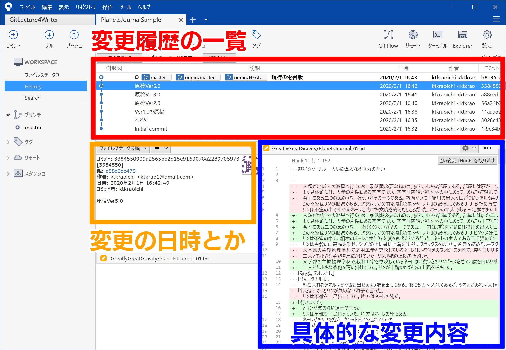
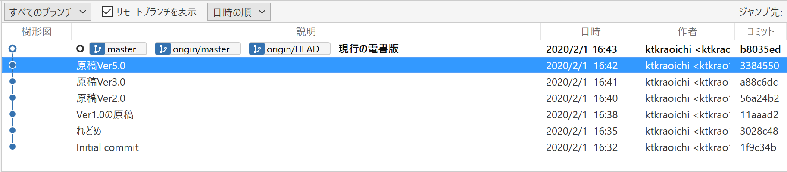
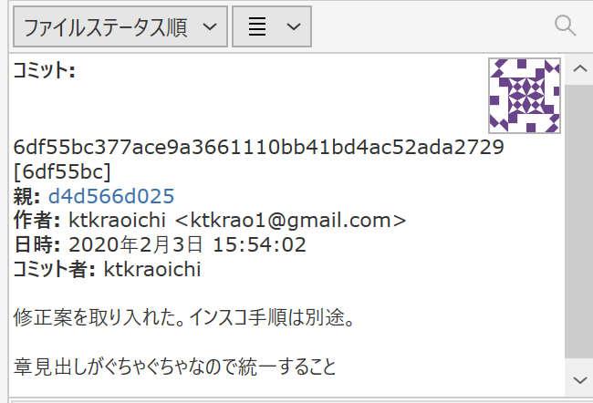
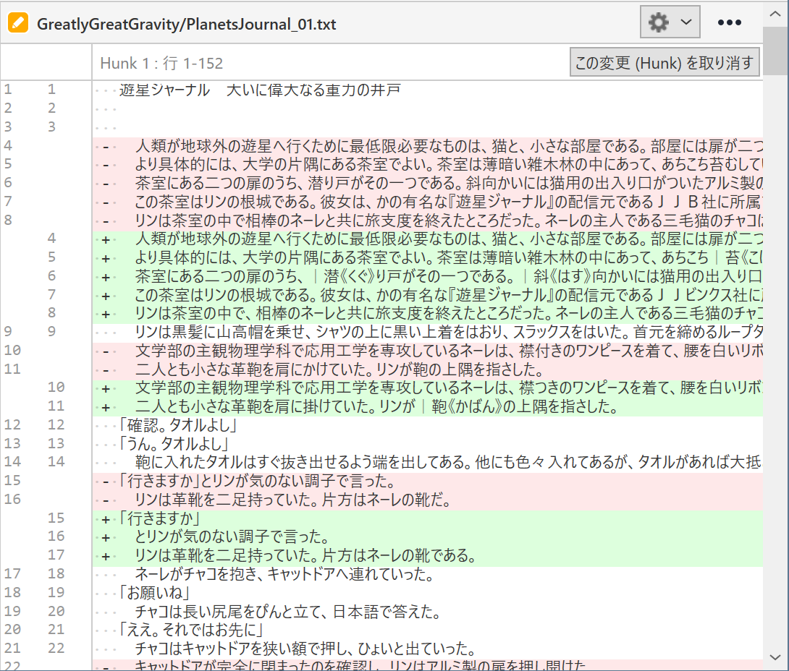

# 文章に関わる全ての人のための Git & GitHub 入門 1-1「Git と GitHub を使うメリット」

この記事はこんな人に向けて書かれています。

- 小説作家さん
- 編集者さん
- 校正さん
- ライターさん
- 発注者さん

つまり文章を書いたり修正したりする全ての人たちですね！

## 1. 今回のゴール

1. GitHub アカウントを取得する
2. SourceTree をインストールする
3. リモートからリポジトリをクローンする

以上です。ここまでできれば、あなたはとてもとてもえらい。

## 2. Git と GitHub って何が便利なの？

メリットがわからないことには使う気になりませんよね。\
わかります。今のままでいいんじゃね？という気持ち。わかります。\
ですが、一度 Git の使い方を覚えてしまうと、 Git を手放せなくなる程度には、コレがとても便利なんですね。\
（ちなみに Git はツール、GitHub はサービスです）

まずはこちらをご覧ください。



これは "PlanetsJournal_01.txt" という原稿がどのように変わっていったのか Git で記録し、 SourceTree というツールで見やすくしたものです。

fixme: この記事の履歴を SourceTree で表示した方がいいかもしれない。

### 2-1. 変更履歴の一覧

「変更履歴の一覧」のエリアでは、変更ポイントを記録した履歴を、樹形図で閲覧できます。



最新の記録ポイントには「原稿の電書版」というタイトルが付いています。\
好きな変更ポイントをダブルクリックすると、その変更ポイントに記録されたファイルを復元することもできます。つまり、好きなタイミングでバックアップを取って、いつでも元に戻せるわけです。\
最新版に戻したいときは、最新版の変更ポイントをダブルクリックするだけ。簡単でしょう？

### 2-2. 変更の日時とか

「変更の日時とか」のエリアでは、誰がいつ変更ポイントを記録したのか、どのような変更をしたのか、といった概要を閲覧できます。



図中に「コミット」とありますね。好きなタイミングで記録した変更ポイントのことを Git では「コミット（commit）」と呼びます。

ここで突然ですがおめでとうございます！\
あなたは Git 用語をひとつ覚えました！えらい！！

そう、コミット（commit）です。\
コミットする（`git commit`）と言ったり、変更ポイントそのものを指してコミット（commit）と言ったりします。

### 2-3. 具体的な変更内容

「具体的な変更内容」のエリアでは、どのように変更したのか、詳細を閲覧できます。赤いハイライトは古い内容、緑のハイライトは新しい内容です。差分を比較する、あるいは diff を取る、とも言います。



……うーん、 SouceTree の表示はちょっとわかりにくいですね。画面端で折り返されていませんし、行単位でしか変更内容がわかりません。\
というわけで、同じ部分を GitHub で表示してみましょう。


薄いハイライトは「変更の行」です。\
濃いハイライトは「変更箇所」です。\
SourceTree に比べるとかなりわかりやすいですね。\
文字単位で変更箇所をピックアップしてくれると最高なのですが、現状は「ある程度の塊」をピックアップしてくれます。

Git と GitHub は本来、ソフトウェアのバージョン管理に使うものです。自然言語、特に日本語で書かれたテキストに対する差分比較機能は、ちょっと弱めです。

さて、ひととおり、原稿を書き終えたとしましょう。\
もちろん終わりではありませんね。文章は推敲して完成するものです。\
推敲するときは、誰かに査読してもらい、指摘してもらうのが一番です。\
そう、校正校閲です。\
GitHub を使うと、校正校閲が爆速になります。体感ですが、10倍くらい速くなります。

fixme: 校正の様子も図示したい。

査読者は原稿を読み、 GitHub 上で片っ端から修正案を挙げていきます。\
筆者は修正案を検討して、片っ端から修正していくことができます。\
この「片っ端から」というところが重要なポイントです。

筆者は査読者が原稿を読み終わるまで待つ必要はありません。\
査読者も筆者が原稿の全てを直し終えるまで待つ必要はありません。

紙で原稿を修正するケースを考えてみてください。\
まず、書き上げた原稿ファイルを筆者が査読者へ送ります。\
査読者が意見を書き込んでいる間、筆者は手持ち無沙汰です。\
待った後、査読の結果が返ってきます。\
筆者が査読の結果を検討・修正している間、査読者は手持ち無沙汰です。\
これを何度も繰り返すと、膨大な時間が無駄になります。

### 2-4 そろそろまとめて

はい、まとめます。

原稿の執筆段階では、 Git を使って好きなタイミングでバックアップを作成できます。\
二人以上で推敲する段階では、 GitHub を使って校正校閲を爆速で進められます。

詳細なメリットを箇条書きにします。

- Git を使うと
  - コミットを積んでいくことで、原稿がどう変わっていったのかわかる。
  - どれが原稿の最新版なのか、ハッキリわかる。
  - いつでも好きなコミットに戻すことができる。
  - 誰がそのコミットを積んだのかわかる。

- さらに GitHub を使うと
  - 変更点に関する議論ができる。
  - 査読者は片っ端から修正案を挙げて、筆者は片っ端から案を検討できる。
  - 議論の内容が原稿ファイルに書き込まれることはない。

### 2-5 Word とか Google Document じゃダメ？

一人で使いこなすぶんには、ぶっちゃけ Word とか Google Document でも何とかなります。\
ですが、二人以上で手を加えるとなると、色々と難点があります。

Word の校閲機能は、確かに便利です。ですが、誰かがファイルを編集している間、もう片方の誰かは同じファイルを編集できません。校正者が修正案を書き込んでいる間、筆者は暇になります。\
One Drive にファイルを放り込んで共同編集すれば、同期の問題は解決できます。ですが、Word の校閲機能は変更履歴をファイルそのものに書き込みます。うっかり「すべての変更を反映し、変更の記録を停止」を忘れてしまうと、変更履歴がファイルに残ったままになります。\
さらに、変更履歴が積み重なっていくと Word の挙動がめちゃくちゃ重くなります。仕事になりません。

Google Document は「編集」「提案」「閲覧」の権限を簡単に振り分けられる、という点で便利です。変更履歴も残っているように見えます。ですが、実のところ Google Document は「操作の履歴」を記録しています。\
例えば、以下の操作をすると、何がどう変わったのか、さっぱり分からなくなります。

1. Google Document から手元のエディタに全文をコピペする
2. 手元のエディタでちょっと手直しする
3. エディタから Google Document に全文をコピペする

これをやってしまうと、 Google Document では具体的な変更内容が分からなくなります。
え、そんなこと誰もするわけがない？\
いいえ、できる以上、やってしまう人は必ずいます。やってしまった後では遅いのです。

え、一太郎のバックアップ機能を使っている？\
ええ、まあ……一太郎のバックアップ機能はわりと頑張っていますが、共同編集となると Word より厳しいですね……そもそも、文章を書く人でも一太郎ユーザーはごく一部という厳しい現実がありますし……もちろん一人で作業が完結するなら良いソフトですし、実際に片倉も使っていましたが……

### 3. さあ Git と GitHub の準備をしよう

まずは GitHub アカウントを取得しましょう。

fixme: GitHub アカウントの取り方を解説

次に Git を PC にインストールしましょう……と言いたいところなのですが、単に Git をインストールして使うとなると、こんな感じの画面とにらめっこすることになります。

```bash
Ktkr@KtkrPC MINGW64 ~/Documents/PlanetsJournalSample (master)
$ git status
On branch master
Your branch is up to date with 'origin/master'.

nothing to commit, working tree clean

Ktkr@KtkrPC MINGW64 ~/Documents/PlanetsJournalSample (master)
$ git fetch

Ktkr@KtkrPC MINGW64 ~/Documents/PlanetsJournalSample (master)
$ git graph
* b8035ed (HEAD -> master, origin/master, origin/HEAD) 現行の電書版
* 3384550 原稿Ver5.0
* a88c6dc 原稿Ver3.0
* 56a24b2 原稿Ver2.0
* 11aaad2 Ver1.0の原稿
* 3028c48 れどめ
* 1f9c34b Initial commit

Ktkr@KtkrPC MINGW64 ~/Documents/PlanetsJournalSample (master)
$
```

「ウッ」となりますね。僕もなりました。\
プログラマな人たちが「カタカタッ、ターンッ」ってやるアレです。

実のところ、慣れてしまえばこの CUI で操作したほうが楽です。\
でも GUI に慣れきった人がいきなり CUI なんて使えるわけがありません。\
というわけで、とっとと GUI で操作できる Git クライアントを導入しましょう。

Git クライアントにも色々ありますが、この記事では SourceTree を使うことにします。\
無料で利用でき、日本語化もスマートで、見た目も綺麗です。 Git の最新版も内蔵しています。

「俺は最初から CUI で Git を操作するぜ！」というやる気勢のあなた。素晴らしい。感動しました。今後は SourceTree の操作と同時に CUI のコマンドも併記します。

fixme: SourceTree のインストール方法を解説。\
fixme: Git 単体のインストール方法を解説。

無事にインストールできましたか？

素晴らしい。実は、ここまでたどり着ける人さえ少数派です。\
「うーん……よくわかんない。今のままでいいや」という人は、とてもとても多いのです。\
最初はよくわからないでしょう。片倉もよくわかりませんでした。\
ですが、大丈夫です。じっくり解説を読んで、手を動かせば、必ず覚えられます。

## 4. リポジトリをクローンしよう

では最後に、リポジトリをクローンしましょう。\
ここまで来たあなたならきっと大丈夫。

fixme: https でリポジトリをクローンする方法を解説。

無事にクローンできたら、 SourceTree にこんな感じの内容が表示されます。

お疲れ様でした。

次回のゴールは

- GitHub に自分のリポジトリを作ってみる
- 自分のリポジトリをクローン（`git clone`）してみる
- コミット（`git commit`）してみる
- プッシュ（`git push`）してみる

の3点です。

焦らず慌てず、ゆっくり勉強していきましょう。
