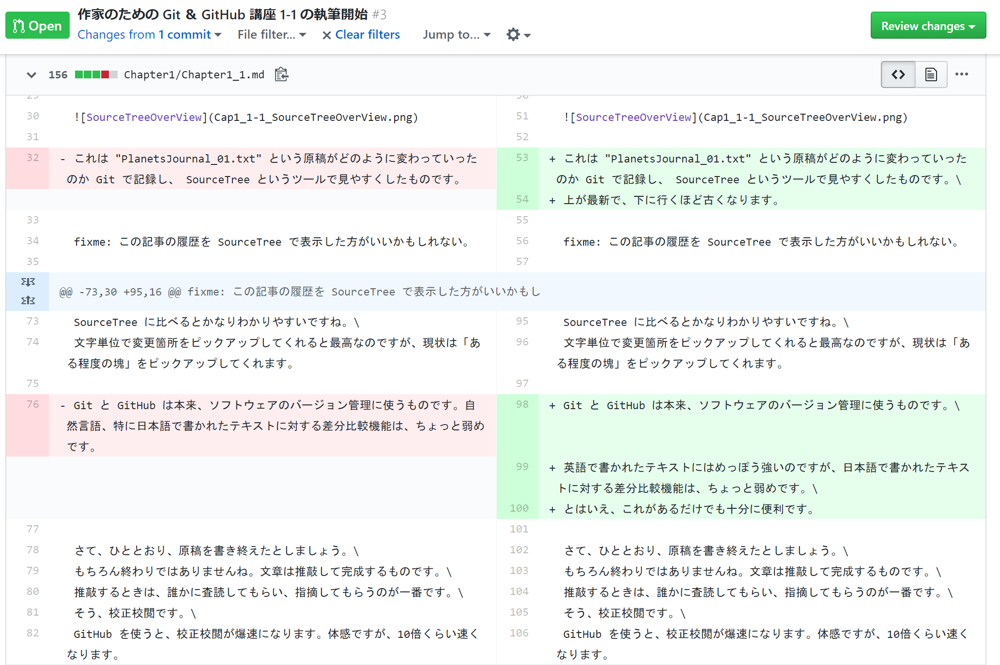

# 文章に関わる全ての人のための Git & GitHub 入門 1-1「Git と GitHub を使うメリット」

この連載はこんな人に向けて書かれています。

- 小説作家さん
- 編集者さん
- 校正さん
- ライターさん
- 発注者さん

つまり文章を書いたり修正したりする全ての人たちですね！

## 0. この連載を始めたきっかけ

僕は片倉青一という筆名で小説を書いています。\
小説だけではご飯を食べられないので、覆面ライターもやっています。せちがらい。

で、覆面ライターの案件で\
「クライアントさん… Git と GitHub 使って仕事したいです…」\
って言ったら、使っていいということになりました。やったぜ。\
でもクライアントさんは Git と GitHub の使い方をあんまり知らないので、片倉が入門書を書くことになりました。なんてこった。\

この連載は、片倉がこれからの仕事で楽をするために始めました。\
目標は、クライアントさんに Git と GitHub の使い方をひととおり覚えてもらい、記事の管理と校正・校閲をお任せできるようになるまでです。

皆さんも、どうせ苦労するなら楽をするための苦労をしましょう。

## 1. 今回のゴール

1. GitHub アカウントを取得する
2. Sourcetree をインストールする
3. リモートからリポジトリをクローンする

以上です。ここまでできれば、あなたはとてもとてもえらい。

とっとと導入して手を動かしたい人はこちら\
[3. さあ Git と GitHub の準備をしよう](#3-さあ-Git-と-GitHub-の準備をしよう)

※ゴールに違和感を覚えた人へ\
具体的には「え、初手で `git clone` なの？」「`git init` とか `git remote add` は？」と思ったあなたへ。\
Git を操作する入り口として「新しく手元に作る（`git init`）」と「すでにあるものを持ってくる（`git clone`）」の2種類があります。\
この記事は、既に動いているプロジェクトへ新たに参加するメンバーへの教育を想定しているため、後者を選びました。

## 2. Git と GitHub って何が便利なの？

メリットがわからないことには使う気になりませんよね。\
わかります。今のままでいいんじゃね？という気持ち。とてもわかります。\
ですが、一度 Git と GitHub の使い方を覚えてしまうと、これらを手放せなくなる程度にはとても便利です。\
（ちなみに Git はツールの名前、GitHub は Web サービスの名前です）

### 2.1 概観：どんなことができるのか

まずはこちらをご覧ください。


これは、いまあなたが読んでいるこの記事が、どのように変わっていったのか Git で記録し、 [Sourcetree](https://www.atlassian.com/ja/software/sourcetree) というツールで見やすくしたものです。

Git で変更履歴を記録する、というのは、ゲームでいうところのセーブデータを作成するような感じです。\
好きなタイミングで作業内容のセーブデータを作ったり、セーブデータをロードできたりします。

### 2.2. セーブデータの一覧

「セーブデータの一覧」のエリアでは、セーブデータがどのように作られてきたのか、樹形図で閲覧できます。\
上が最新で、下に行くほど古くなります。


最新のセーブデータには「修正案を取り入れた」という見出しが付いています。\
任意のセーブデータをダブルクリックすると、そのセーブデータに記録されたファイルを復元することもできます。つまり、好きなタイミングでバックアップを取って、いつでも元に戻せるわけです。\
最新版に戻したいときは、最新版のセーブデータをダブルクリックするだけ。簡単でしょう？

### 2.3. 変更の日時とか

「変更の日時とか」のエリアでは、誰がいつセーブデータを作成したのか、どのセーブデータから内容を変えたのか、といった概要を閲覧できます。


図中に「コミット」とありますね。誰かが好きなタイミングで作ったセーブデータのことを Git では「コミット（commit）」と呼びます。

突然ですが、おめでとうございます！\
あなたは Git 用語をひとつ覚えました！えらい！！

そう、コミット（commit）です。\
セーブデータを作るときはコミットする（`git commit`）と言います。また、セーブデータそのものを指してコミット（commit）と言います。

### 2.4. 具体的な変更内容

「具体的な変更内容」のエリアでは、選択したセーブデータとその直前のセーブデータとで、ファイルがどのように変わっているのか、詳細を閲覧できます。赤いハイライトは古い内容、緑のハイライトは新しい内容です。差分を比較する、あるいは diff を取る、とも言います。


… SouceTree の表示はちょっとわかりにくいですね。画面端で折り返されていませんし、行単位でしか変更箇所がわかりません。\
というわけで、同じ部分を GitHub で表示してみましょう。



薄いハイライトは「変更の行」です。\
濃いハイライトは「変更箇所」です。\
Sourcetree に比べるとかなりわかりやすいですね。\
文字単位で変更箇所をピックアップしてくれると最高なのですが、現状は「ある程度の塊」をピックアップしてくれます。

Git と GitHub は本来、ソフトウェアのバージョン管理に使うものです。\
英語で書かれたテキストにはめっぽう強いのですが、日本語で書かれたテキストに対する差分比較機能は、ちょっと弱めです。\
もちろん、あると無いとでは大違いですけれど。

### 2.5. GitHub での校正校閲についてもちょっとだけ

さて、ひととおり、原稿を書き終えたとしましょう。\
もちろん終わりではありませんね。文章は推敲して完成するものです。\
推敲するときは、誰かに査読してもらい、指摘してもらうのが一番です。\
そう、校正校閲です。\
GitHub を使うと、校正校閲が爆速になります。体感ですが、10倍くらい速くなります。

こんな感じで、原稿の内容を議論します。\
（議論相手の acple は片倉に Git を教えてくれた物好きです）


### 2.6. そろそろまとめて

はい、まとめます。

原稿の執筆段階では、 Git を使って好きなタイミングでバックアップを作成できます。\
二人以上で推敲する段階では、 GitHub を使って校正校閲を爆速で進められます。

詳細なメリットを箇条書きにします。

- Git を使うと
  - コミットを積んでいくことで、原稿がどう変わっていったのかわかる。
  - どれが原稿の最新版なのか、ファイル名に日付を入れなくてもハッキリわかる。 **<- 超重要！**
  - いつでも好きなコミットの状態に戻すことができる。
  - 誰がそのコミットを積んだのかわかる。
  - 結果、バージョン管理がめちゃくちゃ楽になる。

具体的な例を挙げると

> Qiita記事1-1_Ver1.2_片倉_最新版_Final_★これで最後★_2月6日acple指摘反映.docx\
> Qiita記事1-1_Ver1.2_片倉_最新版_Final_★これで最後★_2月6日片倉修正.docx\
> Qiita記事1-1_Ver1.2_片倉_最新版_Final_2月6日Final_ Final_23時50分版.docx

みたいな地獄から解放されます。

- さらに GitHub を使うと
  - 変更点に関して、必要に応じた濃さで議論できる。
  - 査読者は片っ端から修正案を挙げて、筆者は片っ端から案を検討できる。
  - 互いの待ち時間が圧倒的に圧縮された結果、校正校閲が爆速になる。
  - 議論の内容が原稿ファイルに書き込まれることはない。

どうでしょう？覚えたら便利だと思いませんか？

### 2.7. Word とか Google Document じゃダメ？

一人で執筆するだけなら、 Word や Google Document で何も問題はありません。\
一太郎も良いエディタです。片倉も一太郎をときどき使います。\
ですが、バージョン管理と共同編集作業までこなすとなると、 Word や Google Document だけでは厳しくなります。

もう一度言います。\
**執筆するだけなら、何を使っても問題ありません。**\
ただし、バージョン管理や共同編集作業にあたっては、それに適したツールを使いましょう、というお話しをしています。

Word やら Google Document やら一太郎やらをさんざん使い倒してきた片倉が断言します。\
テキストファイルのバージョン管理は Git を使いましょう。あなたが楽になります。\
テキストファイルの共同編集作業は GitHub を使いましょう。みんなが楽になります。

## 3. さあ Git と GitHub の準備をしよう

お待たせしました。\
いよいよ実際に手を動かして、 Git と GitHub の世界に足を踏み入れましょう。

### 3.1. GitHub アカウントを取得する

まずは GitHub アカウントを取得するところから始めましょう。\
英語サイトだからといって怖がらないでくださいね。\
以下の3つがあれば大丈夫です。

- Username（ユーザーネーム）
- Email address（メールアドレス）
- Password（英数字記号を含めた15文字以上のパスワード）

以下のリンクからアカウントを取得してください。\
[Join GitHub · GitHub](https://github.com/join)

よくあるアカウント取得の手順なので、詳細は割愛します。\
画面の指示にしたがって進めてください。\
ブラウザの翻訳機能を使ってもいいでしょう。

なお、 GitHub にはいくつか料金プランがあります。\
今回はフリープランを選びましょう。

**Complete Setup** ボタンを押すと、認証用のメールが届きます。\
メールに記載された **Verify email address** リンクを踏むことで、認証が完了します。

「新しくリポジトリを作るかい？」と聞かれますが、今回は作らなくてOKです。

最後に、プロフィールのアイコンだけ設定しておきましょう。

GitHub ページの右上に、自動生成されたアイコンが表示されています。


ユニークなアイコンなのですが、誰なのかちょっとわかりづらいです。


アイコンを選択して、プルダウンメニューから **Settings** を選びましょう。\
こんな画面になるはずです。


画面右に表示されたアイコンの **Edit** ボタンをクリックして **Upload a Photo** を選択します。\
ご自身だとわかる画像を選択してください。\
画像の選択が終わったら、画面のちょっと下のほうにある **Update profile** ボタンをクリックして終了です。

2要素認証（Two-factor authentication）の設定は、必須ではありませんが、強く推奨します。\
設定方法については\
[2 要素認証を設定する - GitHub ヘルプ](https://help.github.com/ja/github/authenticating-to-github/configuring-two-factor-authentication)\
をご覧下さい。

以降、もっと細かい設定が必要になるときは、その都度記載します。

### 3.2. Sourcetree をインストールする

次は Git を PC にインストールしましょう！\
…と言いたいところなのですが、単に Git をインストールして使うとなると、こんな感じの画面とにらめっこすることになります。

```bash
Ktkr@KtkrPC MINGW64 ~/Documents/GitLecture4Writer (chapter1_1)
$ git status
On branch chapter1_1
Your branch is ahead of 'origin/chapter1_1' by 1 commit.
  (use "git push" to publish your local commits)

Changes not staged for commit:
  (use "git add <file>..." to update what will be committed)
  (use "git restore <file>..." to discard changes in working directory)
        modified:   Chapter1/Chapter1_1.md

no changes added to commit (use "git add" and/or "git commit -a")

Ktkr@KtkrPC MINGW64 ~/Documents/GitLecture4Writer (chapter1_1)
$ git fetch

Ktkr@KtkrPC MINGW64 ~/Documents/GitLecture4Writer (chapter1_1)
$ git log --oneline --graph --decorate --all
* 6df55bc (origin/chapter1_1) 修正案を取り入れた。インスコ手順は別途。
* d4d566d 最初の1歩を途中まで執筆。
| * 351f258 (origin/overview, overview) 最初に最低限のインストールを書きます
| * c19468a 全体構成の叩き台を作りました
|/
* a195fd3 (origin/master, origin/chapter1, origin/HEAD, master, chapter1) れどめを作成しました
* 95b1576 Initial commit
```

「ウッ」となりますね。片倉もなりました。\
プログラマな人たちが「カタカタッ、ターンッ」ってやるアレです。 CLI（コマンド・ライン・インタフェース）といいます。\
普段使っているアプリケーションはだいたい GUI（グラフィカル・ユーザ・インタフェース）です。

GUI に慣れきった人が、いきなり CLI なんて使えるわけがありません。\
とっとと GUI で操作できる Git クライアントを導入しましょう。

GUI な Git クライアントは色々ありますが、この連載では Atlassian が提供している Sourcetree を利用していきます。


コレです。\
無料で利用でき、 Windows と Mac OS X の両方に対応していて、日本語化もスマートで、見た目も綺麗です。 Git の最新版も内蔵しています。

もちろん、別の Git クライアントを使っても問題ありません。\
オススメの GUI な Git クライアントがあったら教えてください。

以下のリンクから Sourcetree のインストーラーをダウンロードしてください。\
[Sourcetree - 無料の Git &amp; Mercurial クライアント | Atlassian](https://www.atlassian.com/ja/software/sourcetree)

インストーラーを起動すると、 **Bitbucket Server** か **Bitbucket** のどちらかにログインしてください、と言われます。\


**Bitbucket** を選択してください。\
ブラウザが起動し、 Atlassian アカウントの取得画面が出てきます。\
Sourcetree の利用には Atlassian アカウントが必要です。


画面下部の **Sign up for an account** から、 Atlassian アカウントを取得してください。\
Google アカウントあるいは Microsoft アカウントでログインしてもOKです。

ログインが完了すると、インストーラーの画面がこんな感じになります。


**次へ** をクリックすると、ツールを選択したり設定したりする画面になります。


- Mercurial は使わないのでチェックを外します。
- 改行の自動処理を設定する（**推奨**）とあります。これはチェックを入れます（でも LF -> CRLF って…逆だろjk…）。
- Configure Global Ignore もチェックを外します。

**次へ** をクリックすると、 Git を操作するときの名前とメールアドレスを登録する画面になります。


**GitHub に登録している名前・メールアドレスと一致させましょう。**\
後から変更できますが、ここで一致させておいたほうが面倒が少なくて楽です。

**次へ** をクリックすると、SSHキーを読みこむかどうか、というよくわからない質問ダイアログが出てきます。


**いいえ** で問題ありません。\
（※SSH 周りは次回解説します）


この画面が出てくれば、 Sourcetree のインストールは完了です。

どうですか？

ほほう、無事にインストールできましたか。

**素晴らしい。**

実は、ここまでたどり着ける人さえ少数派です。\
「うーん…よくわかんない。やーめた。今のままでいいや」\
という人は、とてもとても多いのです。\
最初はよくわからないでしょう。片倉もよくわかりませんでした。\
ですが、大丈夫です。じっくり解説を読んで、手を動かせば、必ず覚えられます。

## 4. リポジトリをクローンしよう

では最後に、リモートからローカルへ、リポジトリをクローン（`git clone`）しましょう。\
いきなり4つも新しい言葉が出てきましたね。\
安心してください。ちゃんと説明します。

まず、リポジトリ（Repository）とは、 Git が管理対象にしているフォルダとファイルのことです。\
多くの場合、リポジトリは2箇所にあります。

- ローカルリポジトリ：あなたが編集するファイルとフォルダ
- リモートリポジトリ：ローカルのデータを転送し、複数人で共有できる場所

※ 厳密ではありませんが、理解の促進を優先しています。

「リモートからローカルへ、リポジトリをクローンする」\
というのは、\
「共有場所にあるファイルとフォルダを、あなたが作業する場所へ丸ごと複製する」\
という作業のことです。

fixme: 作図しましょう

あまり難しいことではありませんね。\
だったらどうしてこんな言葉を使うのかというと、 Git の操作そのものがこれらの言葉で表現されるからです。\
「結果にコミットする」とか、そんな感じのあいまいな意識高い系レトリックではありません。\
Git でコミットする（`git commit`）と言ったら、作業した内容をセーブデータとして記録する、という具体的な操作を意味します。

では、実際にクローンしましょう。

Sourcetree の `clone` ボタンをクリックしてください。\
こんな画面になります。


元のパス/URL:\
という入力欄に、以下のURLをコピペしてください。\
https://github.com/ktkraoichi/GitLecture4Writer.git

コピペしたら、入力欄の外側を適当にクリックしてください。\
なにやら Sourcetree がぐるぐる動き始めます。\
じきに、 GitHub にログインするためのダイアログが出てきます。


Sourcetree はあなたが取得した GitHub アカウントの情報を知りません。\
さきほど取得したアカウントのメールアドレスとパスワードを教えてあげましょう。

2要素認証を設定した人は、こんな画面も出てきます。


ワンタイムパスワードを入力してください。

GitHub の認証が通れば、次のような画面になります。


**クローン** ボタンを押しましょう。\
Sourcetree がリモートからローカルへ、リポジトリをクローンし始めます。

無事にクローンできたら、 Sourcetree にこんな感じの内容が表示されます。


※この画像は連載が進行すると変化します

どうでしょう。できましたか？

無事にクローンできたなら、とてもとても素晴らしいことです。\
ご自分を褒めてあげてください。

さん、はい

**「俺、よくやった！」**

リピート・アフター・ミー

**「俺、よくやった！！」**

本当にご自分を褒めてあげてくださいね。\
「Git をやってみよう」と思って勉強を始めた物書きさんのうち、おそらく100人中70人くらいは、ここまでで心が折れます（多めに見積もっています）。

この連載は、片倉がクライアントさんに Git と GitHub の使い方を覚えてもらえるまで終われません。\
ここまでの解説で分からないことがあったら、コメントや Twitter で[@片倉青一](https://twitter.com/KanbaraKasa)に聞いてください。

片倉のクライアントさんは仕事用のチャットツールで連絡してください。

## 5. 次回予告

次回のゴールは

- GitHub に自分のリモートリポジトリを作ってみる
- 自分のリポジトリをクローン（`git clone`）してみる
- ローカルでコミット（`git commit`）してみる
- ローカルの内容をリモートにプッシュ（`git push`）してみる
  - プッシュするために SSH の設定をする

の4点（5点）です。

焦らず慌てず、ゆっくり勉強していきましょう。

## 6. 付録

### 6.1. コマンドでやりたい人へ

「せっかくだから俺は最初から CLI で Git を操作するぜ！」\
というやる気勢のあなた。素晴らしい。感動しました。今後は Sourcetree の操作と同時に CLI のコマンドも併記します。

以下から、ご利用の OS に合わせて Git をインストールしてください。\
[Git - Git のインストール](https://git-scm.com/book/ja/v2/%E4%BD%BF%E3%81%84%E5%A7%8B%E3%82%81%E3%82%8B-Git%E3%81%AE%E3%82%A4%E3%83%B3%E3%82%B9%E3%83%88%E3%83%BC%E3%83%AB)

Git と GitHub の設定については以下のドキュメントを参考にしてください。\
[Git のセットアップ - GitHub ヘルプ](https://help.github.com/ja/github/getting-started-with-github/set-up-git)

あなたなら Git と GitHub の設定までは、上記のドキュメントにしたがって進めていけるでしょう。

設定が終わったら Git Bash を起動して、

`cd "ローカルリポジトリの作成先"`

と入力してください。\
Windows なら `cd Documents` あたりでいいでしょう。

次に

`git clone https://github.com/ktkraoichi/GitLecture4Writer.git`

と入力してください。\
リポジトリのクローンが始まります。

```bash
$ git clone https://github.com/ktkraoichi/GitLecture4Writer.git
Cloning into 'GitLecture4Writer'...
remote: Enumerating objects: 25, done.
remote: Counting objects: 100% (25/25), done.
remote: Compressing objects: 100% (19/19), done.
remote: Total 25 (delta 3), reused 19 (delta 3), pack-reused 0
Unpacking objects: 100% (25/25), done.
```

このように表示されればクローンは成功です。

念のため、ローカルリポジトリの中身を見てみましょう。\
ファイルエクスプローラで目視してもいいのですが、コマンドでも確認してみましょう。

`cd GitLecture4Writer`\
`ls -a`

と入力してください。

```bash
Ktkr@KtkrPC MINGW64 ~/Documents
$ cd GitLecture4Writer/

Ktkr@KtkrPC MINGW64 ~/Documents/GitLecture4Writer (master)
$ ls -a
.  ..  .git  Chapter1  README.md

Ktkr@KtkrPC MINGW64 ~/Documents/GitLecture4Writer (master)
$
```

`ls -a` は「現在のディレクトリに存在する全てのファイルとフォルダを表示する」というコマンドです。\
少なくとも **.git** という隠しフォルダ、 **Chapter1** というフォルダ、**README.md** というファイルがあるはずです。\
※連載が進むと、主にChapter●●というフォルダが増えていきます。

せっかくなので **Chapter1** というフォルダも見てみましょう。

`cd Chapter1`\
`ls`

と入力してください。

```bash
Ktkr@KtkrPC MINGW64 ~/Documents/GitLecture4Writer (master)
$ cd Chapter1/

Ktkr@KtkrPC MINGW64 ~/Documents/GitLecture4Writer/Chapter1 (master)
$ ls
Cap1_1-1_SourcetreeOverView.png    Cap1_1-21_Clone3.png
Cap1_1-10_GitHubSettings2.png      Cap1_1-22_Clone4.png
Cap1_1-11_SourcetreePlainView.png  Cap1_1-23_Clone5.png
Cap1_1-12_Setup1.png               Cap1_1-24_Clone6.png
Cap1_1-13_Setup2.png               Cap1_1-25_Clone7.png
Cap1_1-14_Setup3.png               Cap1_1-3_SourcetreeCommitInfo.png
Cap1_1-15_Setup4.png               Cap1_1-4_SourcetreeDiffView.png
Cap1_1-16_Setup5.png               Cap1_1-5_GitHubDiffView.png
Cap1_1-17_Setup6.png               Cap1_1-6_GitHubConversation.png
Cap1_1-18_Setup7.png               Cap1_1-7_Welcome2GitHub.png
Cap1_1-19_Clone1.png               Cap1_1-8_GravatarIcon.png
Cap1_1-2_SourcetreeCommitLog.png   Cap1_1-9_GitHubSettings1.png
Cap1_1-20_Clone2.png               Chapter1_1.md
```

**Chapter1_1.md** は、いまあなたが読んでいる記事そのものです。\
ちょっと不思議な感じがしますね。\
（画像ファイルの管理がガバです。じきに修正します）

どうですか？ありましたか？

素晴らしい！

### 6.2. Git の操作方法について

この連載では GUI な Git クライアントとして Sourcetree を使うことにしています。\
過去に片倉は GitKraken という GUI Git クライアントを使って Git を操作していました。

GitKraken\
[Free Git GUI Client - Windows, Mac & Linux | GitKraken](https://www.gitkraken.com/)

UI は全部英語ですが、英語力ほぼゼロの片倉でも直感的に使えたくらいには洗練されています。\
Windows, Mac OS X, Linux で動作します。\
2019年6月から無償プランでは[プライベートリポジトリを利用できなくなってしまいました](https://forest.watch.impress.co.jp/docs/news/1191048.html)。\
ザンネン。

Git への理解を深めたら、折りを見て CLI に移行したほうがいいと思います。\
慣れさえすれば、 Git の操作は CLI が最適です。\
現在は Visual Studio Code の Source Control を使ったり、ターミナルで GitBash を開いてコマンドを叩いています。
