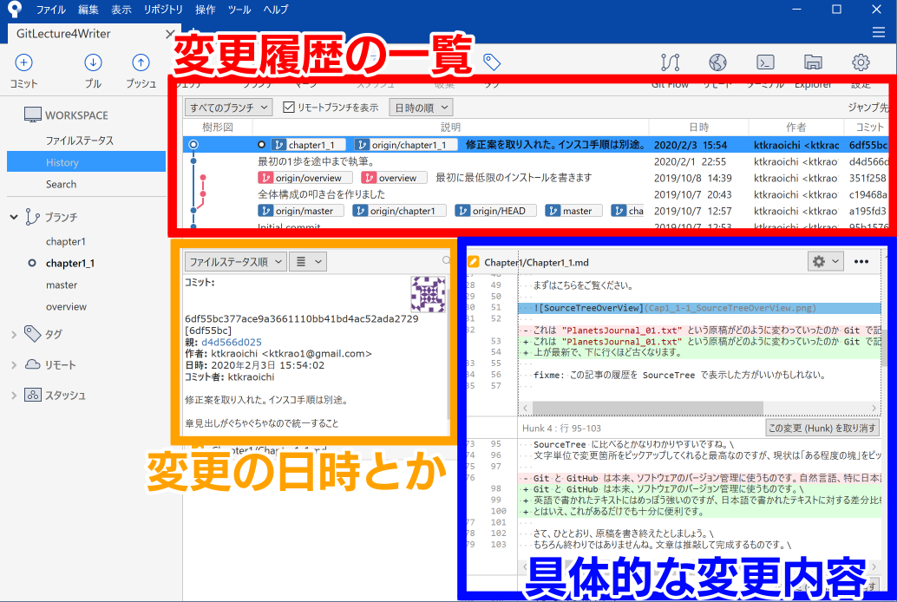

# 文章に関わる全ての人のための Git & GitHub 入門 1-1「Git と GitHub を使うメリット」

この連載はこんな人に向けて書かれています。

- 小説作家さん
- 編集者さん
- 校正さん
- ライターさん
- 発注者さん

つまり文章を書いたり修正したりする全ての人たちですね！

## 0. この連載を始めたきっかけ

僕は片倉青一という筆名で小説を書いています。\
小説だけではご飯を食べられないので、覆面ライターもやっています。せちがらい。

で、覆面ライターの案件で\
「元請さん…… Git と GitHub 使って仕事したいです……」\
って言ったら、使っていいということになりました。やったぜ。\
でも元請さんは Git と GitHub の使い方をあんまり知らないので、片倉が入門書を書くことになりました。なんてこった。\

この連載は、片倉がこれからの仕事で楽をするために始めました。\
目標は、元請さんに Git と GitHub の使い方をひととおり覚えてもらい、記事の管理と校正・校閲をお任せできるようになるまでです。

皆さんも、どうせ苦労するなら楽をするための苦労をしましょう。

## 1. 今回のゴール

1. GitHub アカウントを取得する
2. SourceTree をインストールする
3. リモートからリポジトリをクローンする

以上です。ここまでできれば、あなたはとてもとてもえらい。

導入しようかどうか迷っている人はこちら\
[2. Git と GitHub って何が便利なの？](#2-Git-と-GitHub-って何が便利なの？)

とっとと導入して手を動かしたい人はこちら\
[3. さあ Git と GitHub の準備をしよう](#3-さあ-Git-と-GitHub-の準備をしよう)

## 2. Git と GitHub って何が便利なの？

メリットがわからないことには使う気になりませんよね。\
わかります。今のままでいいんじゃね？という気持ち。とてもわかります。\
ですが、一度 Git の使い方を覚えてしまうと、 Git を手放せなくなる程度には、コレがとても便利なんですね。\
（ちなみに Git はツールの名前、GitHub はサービスの名前です）

まずはこちらをご覧ください。



これは "PlanetsJournal_01.txt" という原稿がどのように変わっていったのか Git で記録し、 SourceTree というツールで見やすくしたものです。\
上が最新で、下に行くほど古くなります。

fixme: この記事の履歴を SourceTree で表示した方がいいかもしれない。

### 2-1. 変更履歴の一覧

「変更履歴の一覧」のエリアでは、変更ポイントを記録した履歴を、樹形図で閲覧できます。


最新の記録ポイントには「原稿の電書版」というタイトルが付いています。\
好きな変更ポイントをダブルクリックすると、その変更ポイントに記録されたファイルを復元することもできます。つまり、好きなタイミングでバックアップを取って、いつでも元に戻せるわけです。\
最新版に戻したいときは、最新版の変更ポイントをダブルクリックするだけ。簡単でしょう？

### 2-2. 変更の日時とか

「変更の日時とか」のエリアでは、誰がいつ変更ポイントを記録したのか、どのような変更をしたのか、といった概要を閲覧できます。


図中に「コミット」とありますね。好きなタイミングで記録した変更ポイントのことを Git では「コミット（commit）」と呼びます。

ここで突然ですがおめでとうございます！\
あなたは Git 用語をひとつ覚えました！えらい！！

そう、コミット（commit）です。\
コミットする（`git commit`）と言ったり、変更ポイントそのものを指してコミット（commit）と言ったりします。

### 2-3. 具体的な変更内容

「具体的な変更内容」のエリアでは、どのように変更したのか、詳細を閲覧できます。赤いハイライトは古い内容、緑のハイライトは新しい内容です。差分を比較する、あるいは diff を取る、とも言います。


……うーん、 SouceTree の表示はちょっとわかりにくいですね。画面端で折り返されていませんし、行単位でしか変更内容がわかりません。\
というわけで、同じ部分を GitHub で表示してみましょう。


薄いハイライトは「変更の行」です。\
濃いハイライトは「変更箇所」です。\
SourceTree に比べるとかなりわかりやすいですね。\
文字単位で変更箇所をピックアップしてくれると最高なのですが、現状は「ある程度の塊」をピックアップしてくれます。

Git と GitHub は本来、ソフトウェアのバージョン管理に使うものです。\
英語で書かれたテキストにはめっぽう強いのですが、日本語で書かれたテキストに対する差分比較機能は、ちょっと弱めです。\
とはいえ、これがあるだけでも十分に便利です。

さて、ひととおり、原稿を書き終えたとしましょう。\
もちろん終わりではありませんね。文章は推敲して完成するものです。\
推敲するときは、誰かに査読してもらい、指摘してもらうのが一番です。\
そう、校正校閲です。\
GitHub を使うと、校正校閲が爆速になります。体感ですが、10倍くらい速くなります。

### 2-4 そろそろまとめて

はい、まとめます。

原稿の執筆段階では、 Git を使って好きなタイミングでバックアップを作成できます。\
二人以上で推敲する段階では、 GitHub を使って校正校閲を爆速で進められます。

詳細なメリットを箇条書きにします。

- Git を使うと
  - コミットを積んでいくことで、原稿がどう変わっていったのかわかる。
  - どれが原稿の最新版なのか、日付管理しなくてもハッキリわかる。 **<- 超重要！**
  - いつでも好きなコミットの状態に戻すことができる。
  - 誰がそのコミットを積んだのかわかる。
  - 結果、バージョン管理がめちゃくちゃ楽になる。

コミット、覚えてますか？好きなタイミングで変更を記録したポイントです。

- さらに GitHub を使うと
  - 変更点に関して、必要に応じた濃さで議論できる。
  - 査読者は片っ端から修正案を挙げて、筆者は片っ端から案を検討できる。
  - 議論の内容が原稿ファイルに書き込まれることはない。
  - 結果、校正校閲が爆速になる。

どうでしょう？覚えたら便利だと思いませんか？

### 2-5 Word とか Google Document じゃダメ？

一人で執筆するだけなら、 Word や Google Document で何も問題はありません。\
一太郎も良いツールです。\
ですが、バージョン管理と共同編集作業を同時にこなすとなると、 Word や Google Document では厳しくなります。

もう一度言います。\
執筆するだけなら、何を使っても問題ありません。\
ただし、バージョン管理や共同編集作業にあたっては、それに適したツールを使いましょう、というお話しをしています。

Word やら Google Document やら一太郎やらをさんざん使い倒してきた片倉が断言します。\
テキストファイルのバージョン管理は Git を使いましょう。あなたが楽になります。\
テキストファイルの共同編集作業は GitHub を使いましょう。みんなが楽になります。

## 3. さあ Git と GitHub の準備をしよう

お待たせしました。\
実際に手を動かして、 Git と GitHub の世界に足を踏み入れましょう。

### 3-1 GitHub アカウントを取得する

まずは GitHub アカウントを取得するところから始めましょう。

fixme: GitHub アカウントの取り方を解説

### 3-2 SourceTree をインストールする

次は Git を PC にインストールしましょう！\
……と言いたいところなのですが、単に Git をインストールして使うとなると、こんな感じの画面とにらめっこすることになります。

```bash
Ktkr@KtkrPC MINGW64 ~/Documents/PlanetsJournalSample (master)
$ git status
On branch master
Your branch is up to date with 'origin/master'.

nothing to commit, working tree clean

Ktkr@KtkrPC MINGW64 ~/Documents/PlanetsJournalSample (master)
$ git fetch

Ktkr@KtkrPC MINGW64 ~/Documents/PlanetsJournalSample (master)
$ git graph
* b8035ed (HEAD -> master, origin/master, origin/HEAD) 現行の電書版
* 3384550 原稿Ver5.0
* a88c6dc 原稿Ver3.0
* 56a24b2 原稿Ver2.0
* 11aaad2 Ver1.0の原稿
* 3028c48 れどめ
* 1f9c34b Initial commit

Ktkr@KtkrPC MINGW64 ~/Documents/PlanetsJournalSample (master)
$
```

「ウッ」となりますね。僕もなりました。\
プログラマな人たちが「カタカタッ、ターンッ」ってやるアレです。

実のところ、慣れてしまえばこの CUI で操作したほうが楽です。\
でも GUI に慣れきった人がいきなり CUI なんて使えるわけがありません。\
というわけで、とっとと GUI で操作できる Git クライアントを導入しましょう。

Git クライアントにも色々ありますが、この連載では SourceTree を使うことにします。\
無料で利用でき、日本語化もスマートで、見た目も綺麗です。 Git の最新版も内蔵しています。

「せっかくだから俺は最初から CUI で Git を操作するぜ！」というやる気勢のあなた。素晴らしい。感動しました。今後は SourceTree の操作と同時に CUI のコマンドも併記します。

fixme: SourceTree のインストール方法を解説。\
fixme: Git 単体のインストール方法を解説。

無事にインストールできましたか？

素晴らしい。実は、ここまでたどり着ける人さえ少数派です。\
「うーん……よくわかんない。今のままでいいや」という人は、とてもとても多いのです。\
最初はよくわからないでしょう。片倉もよくわかりませんでした。\
ですが、大丈夫です。じっくり解説を読んで、手を動かせば、必ず覚えられます。

## 4. リポジトリをクローンしよう

では最後に、リモートからローカルへ、リポジトリをクローン（`git clone`）しましょう。\
いきなり4つも新しい言葉が出てきましたね。\
安心してください。ちゃんと説明します。

まず、リポジトリ（Repository）とは、 Git が管理対象にしているフォルダとファイルのことです。\
多くの場合、リポジトリは2箇所にあります。

- ローカルリポジトリ：あなたが編集するファイルとフォルダ
- リモートリポジトリ：ローカルのデータを転送し、複数人で共有できる場所

※ Git 警察の皆様およびリーナス様、ご着席ください。理解の促進を優先しています。

「リモートからローカルへ、リポジトリをクローンする」\
というのは、\
「共有場所にあるファイルとフォルダを、あなたが作業する場所へ丸ごと複製する」\
という作業のことです。

あまり難しいことではありませんね。\
だったらどうしてこんな言葉を使うのかというと、 Git の操作そのものがこれらの言葉で表現されるからです。\
「結果にコミットする」とか、そんな感じのあいまいな意識高い系レトリックではありません。\
Git でコミットする（`git commit`）と言ったら、作業した内容を変更ポイントとして記録する、という具体的な操作を意味します。

では実際にクローンしましょう。

fixme: https でリポジトリをクローンする方法を解説。
fixme: コマンドの場合も併記

無事にクローンできたら、 SourceTree にこんな感じの内容が表示されます。

fixme: クローンした内容を表示。
fixme: コマンドの場合も併記

どうでしょう。できましたか？

fixme: できないケースを想定して書く

無事にクローンできたなら、とてもとても素晴らしいことです。\
ご自分を褒めてあげてください。俺、よくやった！

「Git をやってみよう」と思って勉強を始めた物書きさんのうち、おそらく100人中50人くらいはここまでで心が折れます。\
ブラッドボーンのガスコイン神父くらいには初見殺しのハードルです（伝わらないモノの例え選手権一位）。\
ですが、初見殺しは、しょせん初見殺しです。\
ひとつずつ理解していけば撃破できます。

この連載は、片倉が元請さんに Git と GitHub の使い方を覚えてもらえるまで終われません。\
ここまでの解説で分からないことがあったら、コメントや Twitter で片倉宛に聞いてください。\
元請さんは仕事用のチャットツールで僕に連絡してください。

## 5. 次回の記事予告

次回のゴールは

- GitHub に自分のリモートリポジトリを作ってみる
- 自分のリポジトリをクローン（`git clone`）してみる
- ローカルでコミット（`git commit`）してみる
- ローカルの内容をリモートにプッシュ（`git push`）してみる

の3点です。

焦らず慌てず、ゆっくり勉強していきましょう。
