# 文章に関わる全ての人のための Git & GitHub 入門 1-2「コミットを積み上げる」

この連載はこんな人に向けて書かれています。

- 小説作家さん
- 編集者さん
- 校正さん
- ライターさん
- 発注者さん

要するに、文章を扱う全ての人々です。

## 1. 今回のゴール

1. GitHub にプライベートリポジトリを作ってクローンする
2. ローカルリポジトリにコミットを積み上げる
3. プライベートリポジトリにローカルリポジトリの内容をプッシュする

以上です。ここまでできれば、あなたはとてもとてもスゴい。

どんどんローカルリポジトリにコミットしていきましょう。\
あのときに戻りたくなったらいつでも戻れるようにしましょう。

プライベートリポジトリにプッシュしておけば PC が爆発しても大丈夫。\
卒論とか修論とかを書いているそこのあなた、いまからでも遅くないですよ。\
いやマジでマジで。

## 2. GitHub にプライベートリポジトリを作ってクローンする

これから「プライベートリポジトリ」というリモートリポジトリを作成します。

プライベートリポジトリは、**あなただけ**がアクセスできるリモートリポジトリです。\
外部の誰かに見られることはありません。安心して使ってください。

まず、プライベートリポジトリにどんなファイルを置くか決めましょう。\
Git を利用した管理に向くのは、何度も変更がかかるテキストデータです。

書きかけの原稿がある？　**それです**。それを置くことにしましょう。書きかけの原稿は Git で管理したいテキストデータ第一位です。

特に決まっていない？　では、試しに議事録を置いてみてはどうでしょうか。議事録を回覧すると「そういう意図じゃない」ということで元の内容から変更がかかることがあります。誰の意図で変更がかかったのかも含めて残しておくと、責任の所在を明確にできます。

プライベートリポジトリに置くものが決まったら、 [GitHub のトップページ](https://github.com/)にアクセスしましょう。

「Repositories」のすぐ隣にある「**New**」をクリックします。


新しいリポジトリの作成画面が表示されます。


- Repository name\
  適切なリポジトリ名を入力してください。
- Description\
  簡単な説明を入れておくと「何のリポジトリだっけ」を防げます。
- Public or Private\
  **Private にしてください**。デフォルトでは Public になっています。
- Initialize this repository with a README\
  「クローンして使うならここにチェック入れてね」と書いてあります。**今回は必ずチェックを入れてください**。

もういちど入力内容をチェックしてください。\
大丈夫そうなら **Create repository** ボタンをクリックしてください。

じきにこんな画面が出てきます。

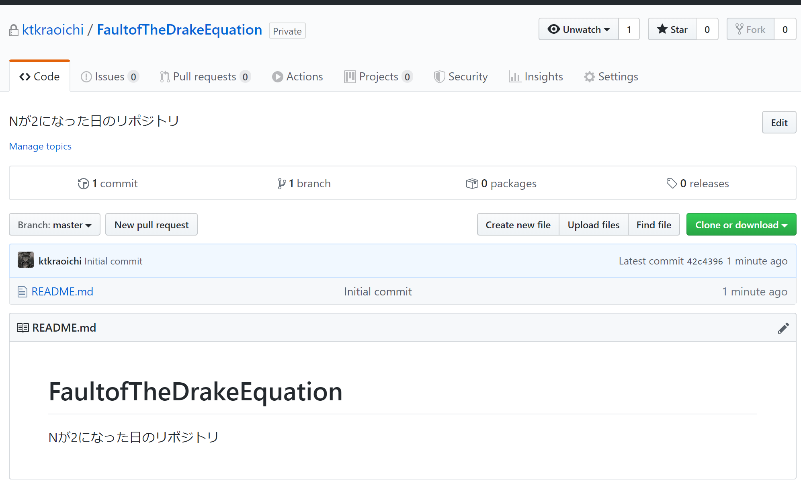

上図のリポジトリは、片倉だけがアクセスできるリポジトリです。\
試しに\
[https://github.com/ktkraoichi/FaultofTheDrakeEquation](https://github.com/ktkraoichi/FaultofTheDrakeEquation)\
へアクセスしてみてください。


「お探しのページは見つかりませんでした」と言われます。\
あなたのプライベートリポジトリも、あなただけがアクセスできます。他の人からは見えません。

それではあなたのプライベートリポジトリをローカルリポジトリにクローンしましょう。\
ブラウザはそのままにしておいてくださいね。

Sourcetree で操作する人はそのまま進んでください。

CLI で操作する人は以下まで飛んでください。\
[2.2. CLI で操作する人](#22-cli-で操作する人)

### 2.1. Sourcetree で操作する人

Sourcetree を起動してください。

新しいタブを作成します。\
下図の「＋」ボタンをクリックしてください。


新しいリポジトリを登録する画面が出てきます。\
Clone ボタンをクリックすると、見覚えのある画面になります。


「元のパス/URL:」の欄に、先ほど作成したプライベートリポジトリの URL を貼りつけます。\
ブラウザに切り替えて、先ほど作成した GitHub のプライベートリポジトリのページに行きましょう。


緑色のボタン、 **Clone or download** をクリックすると、プライベートリポジトリの URL が表示されます。\
**Clone with HTTPS** になっていることを確認してください。\
もし **Clone with SSH** になっていたら、 Use HTTPS と書かれたリンクをクリックしてください。

青色でハイライトされた文字列がプライベートリポジトリの URL です。\
クリップボードにコピーするボタンをクリックするか、ハイライトを選択して `Ctrl + C` でクリップボードにコピーしてください。

「元のパス/URL:」の欄に、コピーしたプライベートリポジトリの URL を貼りつけます。


適当に欄外をクリックすると Sourcetree がぐるぐる動き始め…


GitHub の認証画面が出てきます。\
※環境によって画面の細部が違う可能性があります。片倉は Windows10 Pro 64bit と Google Chrome を使用しています。

GitHub に登録したユーザー名とパスワードを入力しましょう。\
プライベートリポジトリへアクセスするためには、 GitHub アカウントの認証を通す必要があります。

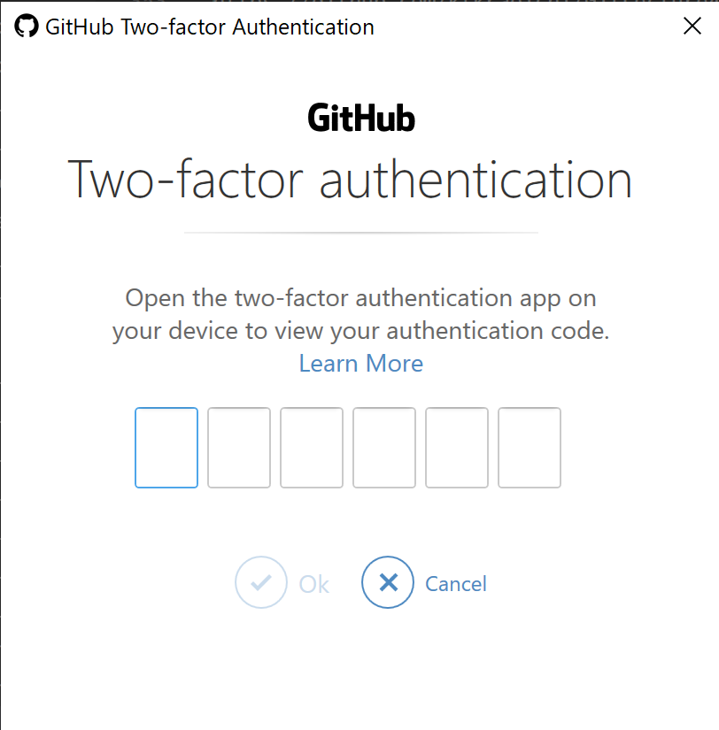

2要素認証を設定している人は、ワンタイムパスワードを入力する画面も出てきます。2要素認証、設定しましょうね。

無事に認証が通るとこんな画面になります。


「クローン」ボタンを押しましょう。

無事にクローンが完了すると、こんな画面になります。


クローンしたばかりでファイルを編集したりしていないので、なにもありません。

左側のカラムにある「History」をクリックすると、こんな画面になります。


**Initial commit** （最初のコミット）があることを確認できましたか？

README.md の内容を、画面右下の「ファイルの内容」で確認してください。\
"#" 以降のテキストはリポジトリの名前と一致していますか？\
2行目のテキストはリポジトリの Description と一致していますか？

無事に一致していたなら、おめでとうございます！\
これでリモートリポジトリとローカルリポジトリを繋ぐことができました。

**Initial commit** は、あなたがリモートリポジトリを作成したとき、自動的に生成されたセーブデータです。 README.md だけが存在します。\
リモートリポジトリにあった **Initial commit** というセーブデータがローカルリポジトリにも存在し、リモートリポジトリに登録した内容が README.md に書かれていた。\
これは無事にリモートリポジトリからローカルリポジトリにクローンできた、ということです。

Sourcetree の右上にある `Explore` ボタンを押すと、クローンしたフォルダとファイルを直接確認できます。今のところは README.md というファイルだけが存在します。

前回、リモートリポジトリは「ローカルのデータを転送し、複数人で共有できる場所」と説明しました。\
一人で運用する場合、リモートリポジトリは「オンライン上にローカルのバックアップを作成する場所」と考えてください。\
ディスクが壊れてしまったり、お使いのパソコンが爆発したりしても、リモートリポジトリが残っていれば大丈夫。もういちどクローンすれば元通りになります。

それでは次の\
[3. ローカルリポジトリにコミットを積み上げる](#3-ローカルリポジトリにコミットを積み上げる)\
まで飛びましょう。

### 2.2. CLI で操作する人

ここまで CLI で操作しようという人はマジのやる気勢ですね。\
CLI は Linux 系のコマンドで操作します。\
この連載では標準コマンドについては特に解説しませんが、以下の記事が参考になるでしょう。\
[駆け出しエンジニアの頃に知ってたら超捗ってたlinux系コマンド・テクニックまとめ](https://qiita.com/sukebeeeeei/items/a07743279ae86effe1ca)

GitBash かターミナルを起動して、リポジトリをクローンするフォルダへ移動してください。\
移動したら、ブラウザに切り替えて先ほど作成した GitHub のプライベートリポジトリのページに行きましょう。


緑色のボタン、 **Clone or download** をクリックすると、プライベートリポジトリの URL が表示されます。\
**Clone with HTTPS** になっていることを確認してください。\
もし **Clone with SSH** になっていたら、 Use HTTPS と書かれたリンクをクリックしてください。

青色でハイライトされた文字列がプライベートリポジトリの URL です。\
クリップボードにコピーするボタンをクリックするか、ハイライトを選択して `Ctrl + C` でクリップボードにコピーしてください。

以下のコマンドでクローンします。

`git clone "さっきコピーしたURL"`

例： `git clone https://github.com/ktkraoichi/FaultofTheDrakeEquation.git`\
※この例をコピペしてもエラーになりますよ

クローン作業が始まり…


GitHub の認証画面が出てきます。\
※環境によって画面の細部が違う可能性があります。片倉は Windows10 Pro 64bit と Google Chrome を使用しています。

GitHub に登録したユーザー名とパスワードを入力しましょう。\
プライベートリポジトリへアクセスするためには、 GitHub アカウントの認証を通す必要があります。


2要素認証を設定している人は、ワンタイムパスワードを入力する画面も出てきます。2要素認証、設定しましょうね。

無事に認証が通ると、ターミナルの表示はこんな感じになります。

```bash
Ktkr@KtkrPC MINGW64 ~/Documents
$ git clone https://github.com/ktkraoichi/FaultofTheDrakeEquation.git
Cloning into 'FaultofTheDrakeEquation'...
remote: Enumerating objects: 3, done.
remote: Counting objects: 100% (3/3), done.
remote: Compressing objects: 100% (2/2), done.
remote: Total 3 (delta 0), reused 0 (delta 0), pack-reused 0
Unpacking objects: 100% (3/3), done.

Ktkr@KtkrPC MINGW64 ~/Documents
$
```

クローンしたリポジトリに移動して、内容を確認しましょう。

`git show` というコマンドで、最新のコミットに関する詳細を確認できます。

```bash
$ git show
commit 42c439617602dc971755af17aa3022da4b72d58e (HEAD -> master, origin/master, origin/HEAD)
Author: ktkraoichi <ktkrao1@gmail.com>
Date:   Fri Feb 21 14:30:35 2020 +0900

    Initial commit <- コミットメッセージ

diff --git a/README.md b/README.md
new file mode 100644
index 0000000..515c34d
--- /dev/null
+++ b/README.md
@@ -0,0 +1,2 @@
+# FaultofTheDrakeEquation <- リポジトリの名前
+Nが2になった日の原稿管理リポジトリ <- Description
```

Date の次、空行に挟まれている行にご注目。\
これはコミットメッセージです。\
コミットメッセージは **Initial commit** になっていますか？

表示された詳細のうち、最後の二行にもご注目。\
今回は「README.md」に書かれたテキストが表示されます。\
"#" 以降のテキストはリポジトリの名前と一致していますか？\
2行目のテキストはリポジトリの Description と一致していますか？

無事にクローンできたなら、素晴らしい！\
これでリモートリポジトリとローカルリポジトリを繋ぐことができました。

**Initial commit** は、あなたがリモートリポジトリを作成したとき、自動的に生成されたセーブデータです。 README.md だけが存在します。\
リモートリポジトリにあった **Initial commit** というセーブデータがローカルリポジトリにも存在し、リモートリポジトリに登録した内容が README.md に書かれていた。\
これは無事にリモートリポジトリからローカルリポジトリにクローンできた、ということです。

前回、リモートリポジトリは「ローカルのデータを転送し、複数人で共有できる場所」と説明しました。\
一人で運用する場合、リモートリポジトリは「オンライン上にローカルのバックアップを作成する場所」と考えてください。\
ディスクが壊れてしまったり、お使いのパソコンが爆発したりしても、リモートリポジトリが残っていれば大丈夫。もういちどクローンすれば元通りになります。

それでは次に進みましょう！

## 3. ローカルリポジトリにコミットを積み上げる

リモートリポジトリとローカルリポジトリの準備ができたら、ローカルリポジトリに作業内容をコミットしていきます。\
コミット、覚えてますか？

コミット（`commit`）とは、ある時点におけるフォルダとファイルのセーブデータです。\
セーブデータを作ることを「コミットする（`git commit`）」と言います。

初稿の執筆段階では、書き進めた原稿をコミットしていくことで進捗状況を記録できます。

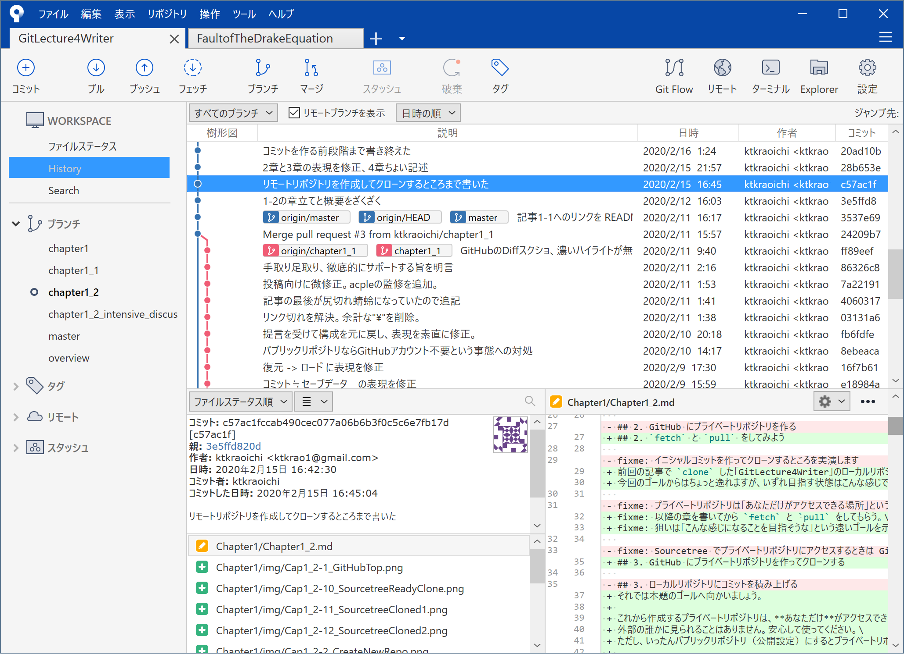

こんな感じです。\
**この記事**の執筆履歴です。\
図の右下、赤いハイライトは削った部分、緑のハイライトは書き加えた部分です。\
fixme が消えて、本文が書かれています。

図の真ん中、樹形図のエリアも見てみましょう。\
「説明」という列に書かれているテキストを「コミットメッセージ」と呼びます。\
コミットメッセージは、セーブデータに付け加えるメモです。どんな作業をしたのかを書いておくと、履歴を見渡すときに便利です。

必要に応じて「何をした」「何字書いた」とコミットメッセージに書けば、より具体的な進捗状況を記録できます。\
※スクリプトを利用すればコミットメッセージに字数まで自動的に記録するような芸当もできますが、この連載ではやりません。

校正・校閲の段階では、修正の概要と理由をコミットメッセージに記載しておくと、後で修正内容を再検討したり、元に戻したりするときの目印になるため便利です。

### 3.1 そのファイル、テキストですか？

それでは、あなたの手でコミットを作成しましょう。

…と言いたいところなのですが、まず確認したいことがひとつ。\
あなたが準備した原稿ファイルは、広義のテキストファイルですか？

Git は中身がテキストであるファイル（広義のテキストファイル）を扱うのに向いています。\
中身がテキストではないファイル（バイナリファイル）を扱うのは苦手です。具体的には拡張子が .docx とか .jtd とか .pages とかになっているファイルです。

特に理由がない限り、まずは原稿ファイルの形式をプレーンテキストファイル（.txt）にするのがいいでしょう。\
もちろんレイアウトや書式情報（メタデータ）は持てませんが、レイアウトや書式は組版の段階で考えればいいことです。\
原稿本文を執筆するときは本文の内容、つまりテキストに集中しましょう。

「それでも執筆段階から書式を意識したい」という人へ。\
テキストファイルでも装飾ができないわけではありません。\
本文に目印を書き込んでおけばいいのです。いままでは書式として設定していた内容を、あなたの手で明示的に書き込みます。

例えば、日本語の小説では、ルビ、圏点、縦中横といった装飾は執筆段階でも必要になりますね。\
「青空文庫記法」か「でんでんマークダウン」を利用して、装飾に必要な目印を付けましょう。\
例えば、青空文庫記法でルビを振る場合は

> 長女の髪は｜山吹《やまぶき》色だった。

と書くことで、山吹に《やまぶき》というルビを付けられます。

青空文庫記法はカクヨムや小説家になろうといった WEB 小説投稿サイトと似たような装飾方法なので、これを期に覚えてしまいましょう。\
[青空文庫作業マニュアル【入力編】](https://www.aozora.gr.jp/aozora-manual/index-input.html#markup)\
[電書ちゃんのでんでんマークダウン - でんでんマークダウン](https://conv.denshochan.com/markdown)

ライターの人には見出しやリストが必要でしょう。\
見出しやリストを含む記事を執筆するなら、マークダウン記法（.md）で記述するのがオススメです。\
マークダウン記法とは、手軽に文章を装飾できる書き方です。\
参考：[Markdown記法 &middot; 日本語Markdownユーザー会](https://www.markdown.jp/syntax/)

ちなみに、この記事もマークダウン記法で書いています。\
片倉は Visual Studio Code というエディタで、本文の横にプレビューを表示する機能を使っています。便利ですよ。


### 3.2 実際にコミットを作ろう

それでは、クローンしたリポジトリのフォルダで、新しいテキストファイルを作りましょう。\
既に準備してあるテキストファイルがあるなら、クローンしたリポジトリのフォルダに放り込みましょう。


今回の例では、 **StoryText.txt** と **MemoText.txt** を、 Git でバージョン管理するファイルとします。\
（厳密には .git フォルダがあるフォルダ以下、全てが Git の管理下に入ります）

ここからは Sourcetree の操作と CLI の操作を併記します。\
Sourcetree で行っている操作は、 CLI の操作で再現できるからです。

Sourcetree を使っている人は、Sourcetree を起動しましょう。\
CLI 操作の人は、 GitBash かターミナルを開きましょう。

Sourcetree を使っている人は、この記事の最初に作ったリポジトリのタブを選択しましょう。\
CLI 操作の人は、この記事の最初に作ったリポジトリの内部へ移動しましょう。

Sourcetree を使っている人は、樹形図にて **コミットされていない変更があります**というメッセージを「確認」できます。\
樹形図が表示されていない場合、左側のカラムにある「History」をクリックしてください。


**コミットされていない変更があります** というのは、 Git の管理下にあるファイルが、最新のセーブデータ（コミット）から何かしらの変更があった、という意味です。

CLI 操作の人は、 `git status` で現在の状態を「確認」できます。

前提としてファイルやフォルダが何も変更されていないときは、次のように表示されます。

```bash
Ktkr@KtkrPC MINGW64 ~/Documents/FaultofTheDrakeEquation (master)
$ git status
On branch master
Your branch is up to date with 'origin/master'.

nothing to commit, working tree clean
```

**nothing to commit, working tree clean** は、コミットするべきものは無い（＝変更が無い）ということです。\
Sourcetree の画面に置きかえると「何も起きていない」状態と同じです。

今後、 `git status` は何かにつけて叩くコマンドです。\
Sourcetree を含む多くの GUI ツールは常に最新の状態を表示しますが、 CLI ではユーザーが明示的に状態（ステータス）を確認する必要があります。\
何かやる前に、とりあえず `git status` です。 Sourcetree を起動したりウィンドウを切り替えてアクティブにすることと、 `git status` を打つことは等価です。**手癖にしましょう**。

今回はファイルをリポジトリに追加したので、次のように表示されます。

```bash
Ktkr@KtkrPC MINGW64 ~/Documents/FaultofTheDrakeEquation (master)
$ git status
On branch master
Your branch is up to date with 'origin/master'.

Untracked files:
  (use "git add <file>..." to include in what will be committed)
        MemoText.txt
        StoryText.txt

nothing added to commit but untracked files present (use "git add" to track)
```

メッセージを意訳すると

- コミットに向けて追加されたファイルはないよ
- Git の追跡対象になってないファイルがあるよ
  - MemoText.txt
  - StoryText.txt

と言っています。\
先ほどリポジトリに放り込んだ新しいファイルが検出され、追跡対象にするなら `git add` という操作をするように求められています。\
新しいファイルが検出されたということは、前回のセーブからフォルダの状態に変化（＝変更）があった、ということです。

Git は .git フォルダが存在するフォルダより下の階層にあるフォルダとファイルを「管理対象」としますが、コミットしなければ「追跡対象」にはしません。追跡対象になっていないファイルはコミット（セーブデータ）に含まれません。\
意図的に特定のファイルを追跡対象に含めないこともありますが、今回は全てのファイルを追跡対象にしましょう。

状態を確認したら、次にコミットするファイルを選択します。\
Sourcetree なら画面下部にある「作業ツリーのファイル」からコミットするファイルを選びます。変更内容が右下の差分比較画面で見られます。\
コミットしていいと判断したら、「選択をインデックスに追加」します。

「作業ツリー」とは、 Git の管理下にある、いま編集しているディレクトリのことです。\
「インデックス」とは、セーブデータ（コミット）を作る準備をするための場所です。\
「作業ツリーのファイル」を「インデックス」に「追加（`add`）」することで「ステージング」というセーブ待ちの状態になります。セーブ待ちの状態になったファイルは「ステージしたファイル」と呼びます。\
※厳密ではありませんが理解の促進を優先しています。

つまり、この段階ではセーブデータ（コミット）を作る準備をしています。\
セーブデータ（コミット）に含めるものはユーザーが自由に選べます。

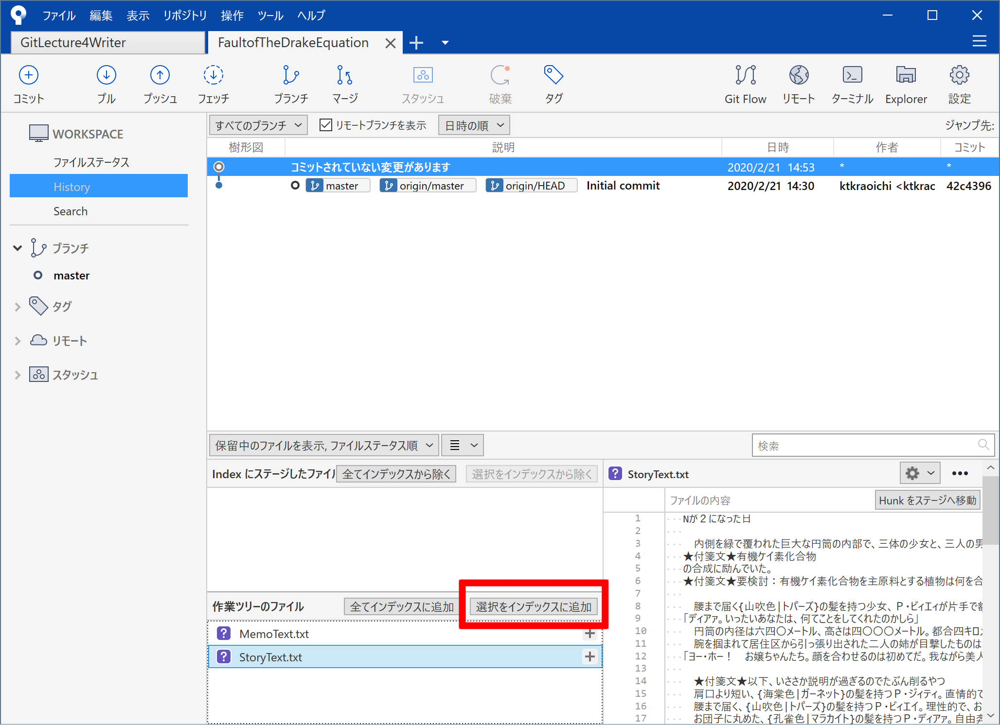

CLI なら `git add` コマンドで、作業ツリーのファイルのうち、インデックスに追加（`add`）するファイルを選択します。\
つまり変更したファイルのうち、コミットするファイルを選択します。\
Sourcetree で実施した操作と同じですね。

`git add "ファイルパス" "ファイルパス" ... "ファイルパス"`

```bash
Ktkr@KtkrPC MINGW64 ~/Documents/FaultofTheDrakeEquation (master)
$ git add StoryText.txt
```

Sourcetree の場合、インデックスに追加されたファイルは「Index にステージしたファイル」へ移動します。

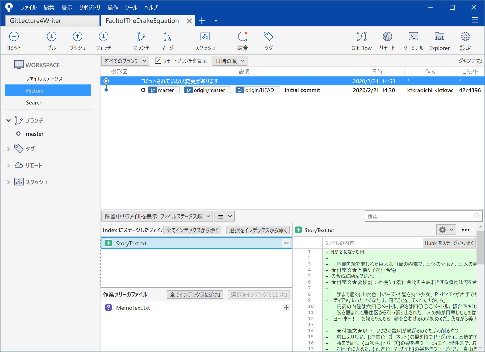

CLI の場合、インデックスに追加されたファイルは「Changes to be committed:」の所に表示されます。

```bash
Ktkr@KtkrPC MINGW64 ~/Documents/FaultofTheDrakeEquation (master)
$ git status
On branch master
Your branch is up to date with 'origin/master'.

Changes to be committed:
  (use "git restore --staged <file>..." to unstage)
        new file:   StoryText.txt

Untracked files:
  (use "git add <file>..." to include in what will be committed)
        MemoText.txt
```

意訳すると

- 以下のファイルがコミットに向けて追加されたよ
  - 新しいファイル：StoryText.txt
- 以下のファイルは Git の追跡対象になっていないよ
  - MemoText.txt

と言っています。

全てのファイルをコミットへ追加する対象に選ぶなら、 Sourcetree の「全てインデックスに追加」ボタンを押せば一発です。


CLI の場合、 .git フォルダがある場所で `git add .` と入力すれば一発です。\
`.` （ドット）を指示すると、 Git は「カレントディレクトリ以下の、全ての変更をコミットへ追加する対象にする」と解釈します。

```bash
Ktkr@KtkrPC MINGW64 ~/Documents/FaultofTheDrakeEquation (master)
$ git add .
```

全てのファイルを追加すると、 Sourcetree ではこんな画面になります。


CLI の場合、 `git status` で同等の状態になっているかどうか確認します。

```bash
Ktkr@KtkrPC MINGW64 ~/Documents/FaultofTheDrakeEquation (master)
On branch master
Your branch is up to date with 'origin/master'.

Changes to be committed:
  (use "git restore --staged <file>..." to unstage)
        new file:   MemoText.txt
        new file:   StoryText.txt
```

今回のサンプルで用意した全てのテキストファイルがコミットへ追加する対象になっていますね。

ファイルごとにコミットを分けることもできますが、ひとまずは全ての変更をセーブデータ（コミット）にまとめるのがよいでしょう。\
Sourcetree なら「全てのファイルを追加」、 CLI 操作なら .git フォルダがある場所で `git add .` と覚えておきましょう。

それでは、いよいよコミットしましょう。\
Sourcetree の場合、左上の、丸に十字の「コミット」ボタンをクリックします。\
画面下部にコミットメッセージを書きこむ欄が出現します。

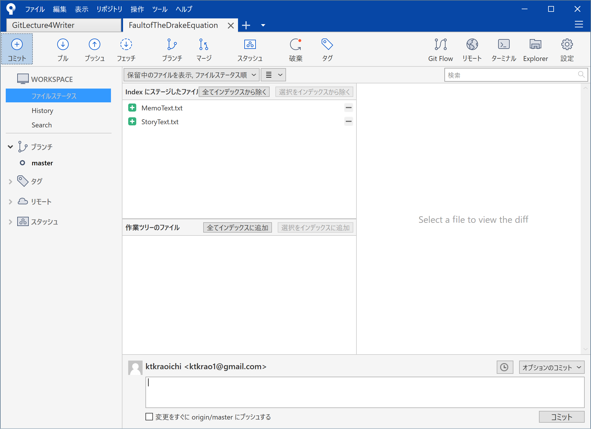

**1行目は樹形図の一覧に掲載されます**。簡潔に作業内容を記載しましょう。\
**2行目は空行にしてください**。\
2行目を空行にすると、3行目以降は補足的なメッセージと認識されます。

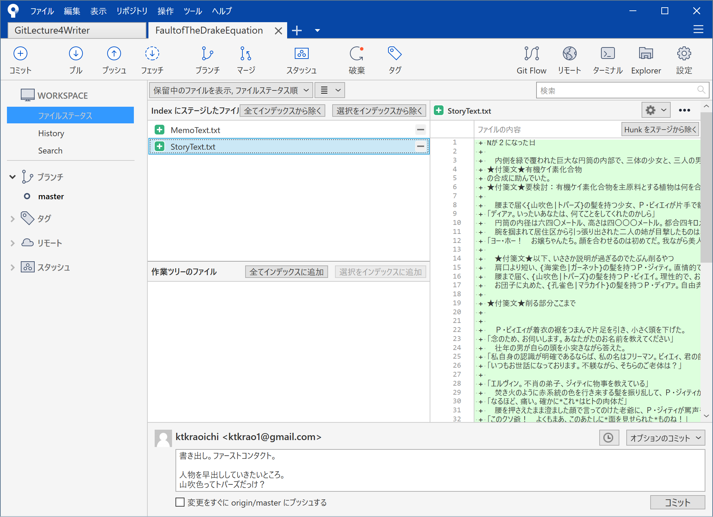

コミットメッセージを確認して、内容に間違いがなければ右下の「コミット」ボタンをクリックします。

無事にコミットの作成が終わると、樹形図に新たなコミットが現れます。


CLI の場合、 `git commit` と入力すると、自動的にテキストエディタが立ち上がり、コミットメッセージの入力を求められます。\
コミットメッセージを記入してエディタを閉じると、コミットが作成されます。

ですが**入力はちょっとだけ待ってください**。

何も設定しないままだと、シェルのデフォルトエディタか、 vim というプログラマ御用達なエディタが起動してコミットメッセージの編集が始まります。どちらも、たぶん使い慣れていない人のほうが多いエディタです。

Git の設定を変えれば、 Git の操作に関連して起動するエディタを好きなものに設定できます。\
これからコミットメッセージは何度も書くことになります。使いやすいテキストエディタでコミットメッセージを編集するのが一番です。

個人的には Visual Studio Code がオススメです。 Git との連携が強力で、有志が多くの拡張機能を提供しています。

Git とテキストエディタの関連付けについては他の記事に譲ります。\
以下の記事あたりが参考になるでしょう。

- [Git とのテキストエディタの関連付け](https://help.github.com/ja/github/using-git/associating-text-editors-with-git)\
  最大手 GitHub のヘルプ記事。 Windows なら軽量な Notepad++ も悪くないと思います。
- [初git commit時にエディタが開かない（Pathエラー）解決方法。【VSCodeとGitHubの設定】](https://qiita.com/grca3/items/0771099a6750840721b1)\
  VSCode を Git 用のエディタに設定する方法と、エディタが開かない場合の原因・対処が簡潔に書かれています。

一応、今回は vim を使ってコミットを作る場合の操作を必要最低限だけ書きます。\
設定したエディタが開いたらコミットメッセージを書いて、保存して、閉じれば、コミットが完了します。

では、 `git commit` と入力してください。\
テキストエディタを設定した人はそのテキストエディタが、設定していない人はおそらく vim が起動します。

```vim

# Please enter the commit message for your changes. Lines starting
# with '#' will be ignored, and an empty message aborts the commit.
#
# On branch master
# Your branch is up to date with 'origin/master'.
#
# Changes to be committed:
#       new file:   MemoText.txt
#       new file:   StoryText.txt
#
~
~
~
~
~
~
~
~
~
~
~
<FaultofTheDrakeEquation/.git/COMMIT_EDITMSG [unix] (15:10 21/02/2020)1,0-1 全て
<ments/FaultofTheDrakeEquation/.git/COMMIT_EDITMSG" [unix] 11L, 293C
```

vim が起動しただけではコミットメッセージを編集できません。\
`i` キーを押すと `--挿入--` モードになります。

```vim

# Please enter the commit message for your changes. Lines starting
# with '#' will be ignored, and an empty message aborts the commit.
#
# On branch master
# Your branch is up to date with 'origin/master'.
#
# Changes to be committed:
#       new file:   MemoText.txt
#       new file:   StoryText.txt
#
~
~
~
~
~
~
~
~
~
~
~
<s/FaultofTheDrakeEquation/.git/COMMIT_EDITMSG [unix] (15:10 21/02/2020)1,1 全て
-- 挿入 --
```

画面下部に「--挿入--」と出たら、編集できます。\
コミットメッセージを入力しましょう。

**1行目がメインのコミットメッセージと見なされます**。簡潔に作業内容を記載しましょう。\
**2行目は空行にしてください**。\
2行目を空行にすると、3行目以降は補足的なメッセージと認識されます。

```vim
書き出し。ファーストコンタクト。

人物を早出ししていきたいところ。
山吹色ってトパーズだっけ？
# Please enter the commit message for your changes. Lines starting
# with '#' will be ignored, and an empty message aborts the commit.
#
# On branch master
# Your branch is up to date with 'origin/master'.
#
# Changes to be committed:
#       new file:   MemoText.txt
#       new file:   StoryText.txt
#
~
~
~
~
~
~
~
~
<ofTheDrakeEquation/.git/COMMIT_EDITMSG[+] [unix] (15:10 21/02/2020)4,40-27 全て
-- 挿入 --
```

コミットメッセージを書き終えたら、 `ESC` キーで挿入モードを終了します。\
`:w` と入力すると入力内容を保存します。\
`:q` と入力するとエディタが閉じられます。

エディタが閉じられ、無事にコミットの作成が終わると、こんな感じのログになります。

```bash
Ktkr@KtkrPC MINGW64 ~/Documents/FaultofTheDrakeEquation (master)
$ git commit
[master cae2f6f] 書き出し。ファーストコンタクト。
 2 files changed, 67 insertions(+)
 create mode 100644 MemoText.txt
 create mode 100644 StoryText.txt
```

最後に、リポジトリの状態を確認しましょう。

```bash
Ktkr@KtkrPC MINGW64 ~/Documents/FaultofTheDrakeEquation (master)
$ git status
On branch master
Your branch is ahead of 'origin/master' by 1 commit.
  (use "git push" to publish your local commits)

nothing to commit, working tree clean
```

**nothing to commit, working tree clean** と表示されていれば、コミットするべき変更はありません。\
コミットするべき変更がないということは、先ほどのコミットによって今のフォルダとファイルの状態が全てセーブされた、ということです。\
つまり、何かの手違いでファイルを削除してしまったり、ファイルの内容を下手に変更してしまったりしても、 Git のコミット（＝セーブデータ）から復元（ロード）できる、ということです。

セーブデータを作ってゲームを進め、失敗したらセーブデータからロードしてやり直す。\
どうでしょう？　Git って、実はそんなに難しくないと思いませんか？

### 3.2 コミットをどんどん積んでいく

コミットの作り方は分かりましたね？\
ざっと手順を箇条書きにします。

1. 原稿を編集して上書き保存する
2. Sourcetree で状態を確認する（`git status`）
3. 変更したファイルを全てステージする（`git add .`）
4. ステージした内容を確認する（`git status`）
5. コミットする（`git commit`）

当面は、これらの作業を繰り返すだけで十分です。\
コミットメッセージをちゃんと書いておけば、以下のような疑問が浮かんだときにも、樹形図（コミットログ）を追いかけることでだいたい解決します。

> 「どのくらい進んだんだっけ」\
> 「あのときどんな文章を書いたっけ」\
> 「あの変更ってどこだったっけ」\
> 「どうして変更したんだっけ」

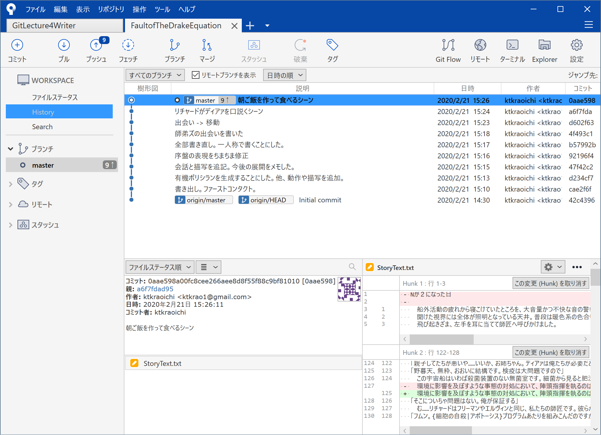

こんな感じです。

CLI で操作している人は `git log` コマンドでコミットログを確認できます。

```bash
Ktkr@KtkrPC MINGW64 ~/Documents/FaultofTheDrakeEquation (master)
$ git log
commit 0aae598a00fc8cee266aee8d8f55f88c9bf81010 (HEAD -> master)
Author: ktkraoichi <ktkrao1@gmail.com>
Date:   Fri Feb 21 15:26:11 2020 +0900

    朝ご飯を作って食べるシーン

commit a6f7fdad9546b0dbe9d2fcc728d662947f9acc13
Author: ktkraoichi <ktkrao1@gmail.com>
Date:   Fri Feb 21 15:24:58 2020 +0900

    リチャードがディアァを口説くシーン

commit d602f63dd1dcebe39793ccba89a400d8fa7b02c5
Author: ktkraoichi <ktkrao1@gmail.com>
Date:   Fri Feb 21 15:23:47 2020 +0900

    出会い -> 移動
```

スマートに表示したいときは、次のようなオプションを付けましょう。

`git log --oneline`

```bash
Ktkr@KtkrPC MINGW64 ~/Documents/FaultofTheDrakeEquation (master)
$ git log --oneline
0aae598 (HEAD -> master) 朝ご飯を作って食べるシーン
a6f7fda リチャードがディアァを口説くシーン
d602f63 出会い -> 移動
4f493c1 師弟ズの出会いを書いた
b57992b 全部書き直し。一人称で書くことにした。
92196f4 序盤の表現をちまちま修正
47f42c2 会話と描写を追記。今後の展開をメモした。
d234cf7 有機ポリシランを生成することにした。他、動作や描写を追加。
cae2f6f 書き出し。ファーストコンタクト。
42c4396 (origin/master, origin/HEAD) Initial commit
```

### 3.3 いつコミットすればいいのか（コミット粒度）

コミットをどんどこ積んでいくと、そのうち「いつコミットすればいいんだろう？」という疑問が浮かぶことでしょう。\
これは「コミット粒度」といって、プログラマな人たちの間でもわりと話題になります。ときどき戦争が起こります。

文章の執筆に限れば、片倉は次のような感じでいいのではないかと考えています。

- 基本思想：元に戻したくなるタイミングでコミットする
  - 例1：その日の執筆分をコミットする
  - 例2：シーンやエピソードの区切りがついたらコミットする
  - 例3：表記揺れをひとつ統一したらコミットする

コミットは作業内容のセーブデータです。\
ゲームをプレイするとき、セーブデータは「ここからリスタートしたいな」というタイミングでセーブしますよね？\
具体的には、ボス直前だったり、なにかのギミックをクリアしたり、ゲームに疲れて中断するときだったり。

ソースコードの場合は、プログラムの挙動に影響を与えるのでコミット粒度をよくよく考えなければいけません。

ですが、文章執筆におけるコミット粒度は人それぞれ。\
慎重な人はこまめにセーブするでしょうし、面倒くさがる人はプレイを終える前だけセーブするでしょう。\
いずれにせよ、後悔しないタイミングでコミットすればよい、と片倉は思います。\
ただし、コミットメッセージは後から探しやすいようにしましょうね。

「文章執筆ならこんなコミット粒度がいいよ！」というご意見がありましたら、ぜひコメントに書き込んでください。参考にします。

### 3.4 コミット間の差分を確認する

あるコミットと別のコミットの差分を見たいときは `git diff` コマンドを使います。

`git diff <コミットID> <コミットID>`

コミット ID は `git log --oneline` で表示した "a6f7fda" とか "4f493c1" とかの、16進数で表記された番号のことです。

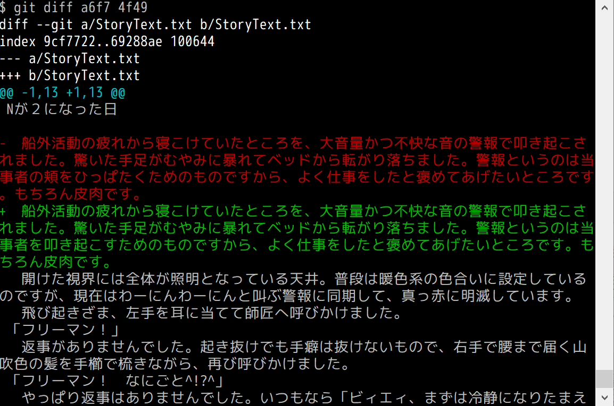

`q` キーで diff の確認を打ち切れます。

…これは…ちょっと分かりづらいですね。\
Git が最初から持っている差分比較機能は、日本語の文章に対しては弱めです。

Sourcetree の場合、 `Ctrl` キーを押しながら、比べたいコミットを選択することで、差分を確認できます。

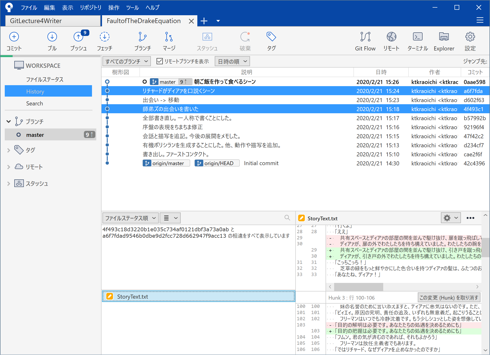

…これも Git 標準の差分比較機能と大差ないですね。

もっとイケてる感じの差分比較ツールを利用することもできますが、これは次回に譲ります。

ひとまず、どんどんコミットを積みましょう。

## 4. プライベートリポジトリにローカルリポジトリの内容をプッシュする

長くなりましたが、やっと最後です。\
もうちょっと頑張りましょう。

コミットは、ローカルリポジトリに積まれていきます。\
ディスクが壊れてしまったり、お使いのパソコンが爆発したりすると、いままで積み上げてきたコミットはオシャカになります。ご破算です。頑張って書いてきた卒論や修論はイチから書き直しです。

Q. どうすればいい？\
A. ローカル以外にもリポジトリの保管場所を確保する

そうです。セーブデータお預かりサービスを利用します。 Switch オンラインとか PS Plus とかでよく使うアレです。\
え、ゲームしないからピンとこない？　では iCloud とか Google フォトのバックアップ機能あたりを想像してください。アレです。

というわけで、冒頭で作成した GitHub のプライベートリポジトリにプッシュしましょう。\
ローカルにあるセーブデータのバックアップを GitHub にも複製する、ということです。

Git では、セーブデータのバックアップをインターネットへ送信することを「プッシュ（push）」と呼びます。\
※厳密ではありませんが理解の促進を優先しています。

まずは状態を確認しましょう。\
Sourcetree の画面はこんな感じです。


CLI で操作している人は `git log --oneline` で確認しましょう。

```bash
Ktkr@KtkrPC MINGW64 ~/Documents/FaultofTheDrakeEquation (master)
$ git log --oneline
0aae598 (HEAD -> master) 朝ご飯を作って食べるシーン
a6f7fda リチャードがディアァを口説くシーン
d602f63 出会い -> 移動
4f493c1 師弟ズの出会いを書いた
b57992b 全部書き直し。一人称で書くことにした。
92196f4 序盤の表現をちまちま修正
47f42c2 会話と描写を追記。今後の展開をメモした。
d234cf7 有機ポリシランを生成することにした。他、動作や描写を追加。
cae2f6f 書き出し。ファーストコンタクト。
42c4396 (origin/master, origin/HEAD) Initial commit
```

`master` というラベルが、樹形図の先頭にある「朝ご飯を食べるシーン」というコミットにくっついていますね。\
これはローカルリポジトリの先頭にあるコミットです。

`origin/master` というラベルはというと「Initial commit」というコミットにくっついています。\
`origin` というのはリモートリポジトリのことです。\
つまり、今のリモートリポジトリには**まだ「Initial commit」というコミットしか存在しません**。\
いまこの状態では、リモートリポジトリはローカルリポジトリに比べて「遅れて」います。

ローカルリポジトリのコミットをリモートリポジトリにプッシュすることで、ローカルリポジトリとリモートリポジトリの内容が一致します。

※ Git 分かる人へ\
今回は `fetch` には触れません。ブランチの概念を理解する必要があること、一人が一つの端末から `commit` と `push` を繰り返す分には `fetch` しなくても問題は起きないこと、などが理由です。

Sourcetree を使っている人は丸に↑の字の「プッシュ」ボタンをクリックしてください。


今のところ `master` というブランチだけのはずなので、諸々の項目は特に気にしなくて大丈夫です。\
「プッシュ」ボタンをクリックしましょう。

Sourcetree がぐるぐる動き…

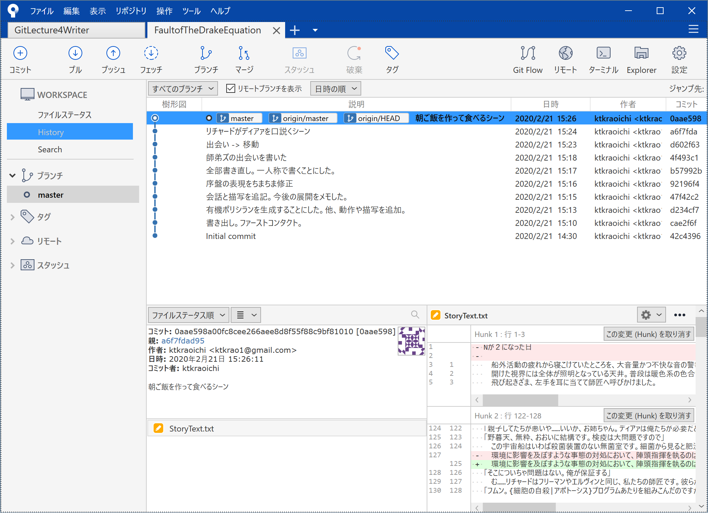

完了したら、変化した樹形図にご注目。\
`master` と `origin/master` というラベルが同じコミットに付いていたら、プッシュは無事に完了です。

CLI で操作している人は、 `git push` と打ちます。

```bash
Ktkr@KtkrPC MINGW64 ~/Documents/FaultofTheDrakeEquation (master)
$ git status
On branch master
Your branch is ahead of 'origin/master' by 9 commits.
  (use "git push" to publish your local commits)

nothing to commit, working tree clean

Ktkr@KtkrPC MINGW64 ~/Documents/FaultofTheDrakeEquation (master)
$ git push
Enumerating objects: 29, done.
Counting objects: 100% (29/29), done.
Delta compression using up to 4 threads
Compressing objects: 100% (28/28), done.
Writing objects: 100% (28/28), 29.07 KiB | 676.00 KiB/s, done.
Total 28 (delta 14), reused 0 (delta 0)
remote: Resolving deltas: 100% (14/14), done.
To https://github.com/ktkraoichi/FaultofTheDrakeEquation.git
   42c4396..0aae598  master -> master

Ktkr@KtkrPC MINGW64 ~/Documents/FaultofTheDrakeEquation (master)
$
```

`git status` は手癖ですよ、手癖。

これで、ディスクが壊れてしまったり、お使いの PC が爆発してしまっても大丈夫。\
リモートからリポジトリを引っ張ってくれば元通りになります。

無事にプッシュまで完了しましたか？\
ローカルの `master` と、リモートの `origin/master` のラベルは同じ位置にありますか？

大丈夫なことを確認できたら、あなたはとてもとても凄い！\
自分を褒めましょう！　なにせここまでで2万字くらいあります！\
読破して、手を動かしただけでも凄い！\
無事に終えられたなら、もっともっと凄い！

これで変更履歴を確認できますし、いきなりPCが爆発しても大丈夫です。\
誰が何を変更したのか分かりますし、手元のファイルが壊れてもリモートから引っ張ってくれば元通りです。

Git と GitHub の威力が本当に発揮されるのはもう少し先ですが、

- リモートリポジトリを作り
- コミットして
- プッシュする

という基本ができるようになったことはとても喜ばしいことです。\
どんどんコミットして、どんどんプッシュしましょう！\
（`git status` はターミナル開いたらとりあえず打ちましょう）

ここまでの解説で分からないことがあったら、コメントや Twitter で[@片倉青一](https://twitter.com/KanbaraKasa)まで気軽に聞いてくださいね。\
ツッコミも歓迎です。

### 4.1 Sourcetree に「コミットをすぐにプッシュする」ってあるけど…

これのことですね？


やめておきましょう。

理由は色々あります。\
コミットやプッシュに失敗することは結構あります。\
慣れないうちは失敗の原因がコミットなのかプッシュなのか、よく分からないでしょう。\
特にリモートの操作には危険な内容もあるので、よく分からないまま触るのは厳禁です。\
意識的に「コミットする」と「プッシュする」を分けて操作しましょう。\
エラーメッセージを落ち着いて読めば、解決手段をネットで検索することも難しくはありません。

また、「すぐにプッシュしない」ことにはメリットもあります。\
すぐにプッシュしない場合、「コミット内容の確認」という手順を明示的に確保できます。

コミットしてから\
「あ、誤字ひとつ見つけた」\
のような、ごく軽微な修正をしたくなるケースは、しばしばあります。\
軽微な修正のためだけにコミットをひとつ作ってしまうと、コミットログをざっと眺めるときに邪魔になります。

次回で詳しく解説しますが、 Git では「直前のコミットを作り直す」という操作ができます。\
コミットの作り直しにより、ファイル内容の再変更、新しいファイルの追加、コミットメッセージの変更などができます。

コミット内容を確認する手順を確保するために、\
「すぐにプッシュする」\
のオプションは外しておきましょう。

## 5. 次回予告

いっぱい説明しましたが、要するに「こまめにセーブしながら原稿を進めましょう」というだけのことです。簡単でしょう？

メリットを実感できるようになるまで、あと一歩です。\
セーブデータの作り方は解説しましたが、セーブデータをロードする方法はまだ解説できていません。

次回以降、さまざまな操作をするときに積み上げたコミットが役に立ちます。\
どんどんコミットを積んでいきましょう！

CLI 操作の人は `git status` で状態を確認することをお忘れなく。

次回は

1. ちょっとしたミスを `git commit --amend` で書き換えてしまう
2. `git restore` で過去のファイルを掘り起こしてみる
3. 便利な差分比較ツールの紹介

の3点を予定しています。

ローカルのコミットを閲覧したり、ちょいといじったりする、 Tips をメインに解説していきます。

## 6. 付録

### 6.1 「クライアントが Word 提出を希望しているんだが」という人へ

ご安心ください。\
マークダウンで書いたファイルは Word ファイル（.docx）に変換できます。\
Pandoc という強力なドキュメント変換ツールを使いましょう。\
Pandoc については多くの方が使い方を紹介しています。ググってください。

- Qiita の先達\
  [多様なフォーマットに対応！ドキュメント変換ツールPandocを知ろう
](https://qiita.com/sky_y/items/80bcd0f353ef5b8980ee)
- 先達による「Pandoc User’s Guide」の日本語訳\
  [Pandoc ユーザーズガイド 日本語版 - Japanese Pandoc User's Association](http://sky-y.github.io/site-pandoc-jp/users-guide/)

Pandoc わかんないって人に向けて

- GitHub とかでマークダウンファイルのプレビューを見る
- プレビューから必要な範囲をコピーする
- Word に貼りつける
- 整形する

という力技もご紹介しておきます。\
あんまりオススメしません。

### 6.2 えー、ブランチの解説してよ

ライター案件の〆切が迫っている ＆ 確定申告に着手さえしていない\
というヤバい状況なので、解説の負担が大きい「ブランチ」についてはもう少し先にさせてください。\
スミマセン…

- Git の本質は差分比較機能付きのデータベースである
- データベースの実装がハッシュツリーである
- ブランチとはコミットに付いたラベルである

といった話も含めてやるので、図とか作るのに時間がかかるのです。\
ご容赦。

### 6.3 あれ、 SSH の解説やるって…

すみません。
一旦 GitHub の認証を通したら `push` するときも認証いらないんでした。\
https 認証を滅多に使わないので忘れてました。

で、 SSH なんですが、そもそも扱いがちょいとデリケートです。\
Git の本質からは外れる、ということもありますので、手空きになったら取り扱います。

- 先達の良記事\
  [お前らのSSH Keysの作り方は間違っている](https://qiita.com/suthio/items/2760e4cff0e185fe2db9)

## 監修

@acple@github

- C#チョットデキル
- Git 完全に理解している
