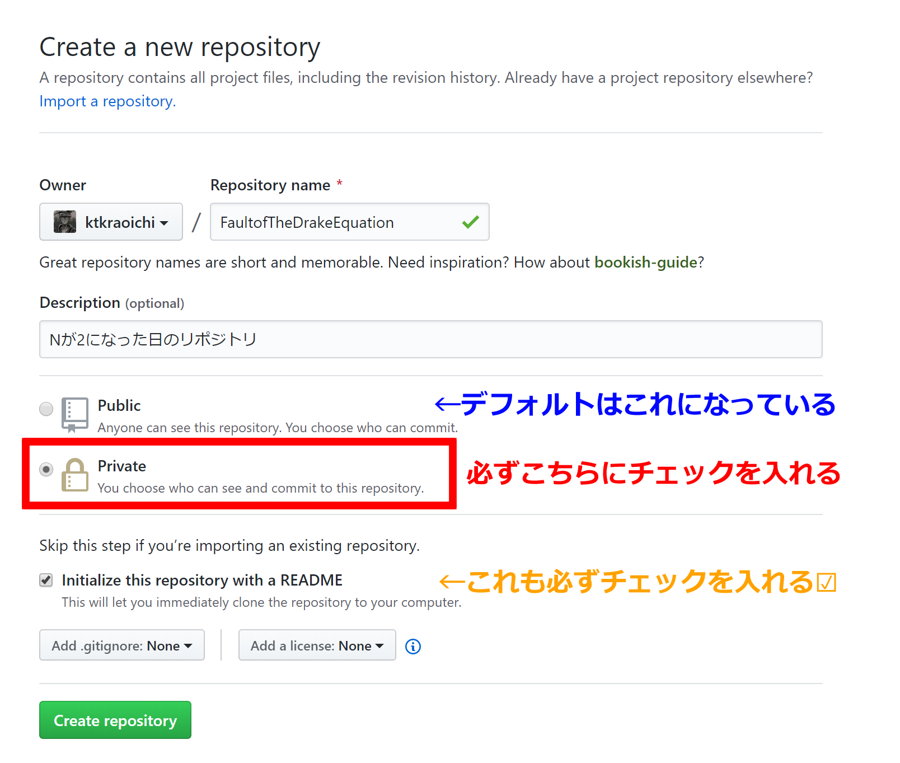
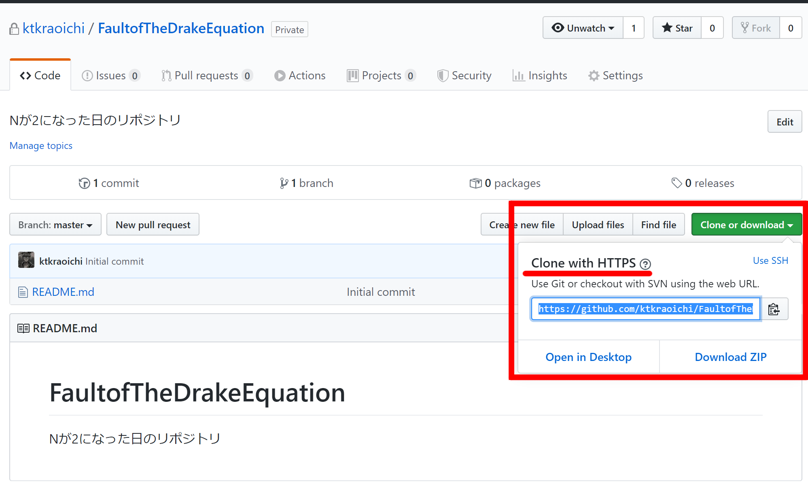

# 文章に関わる全ての人のための Git & GitHub 入門 1-2「コミットを積み上げる」

この連載はこんな人に向けて書かれています。

- 小説作家さん
- 編集者さん
- 校正さん
- ライターさん
- 発注者さん

要するに、文章を扱う全ての人々です。

## 1. 今回のゴール

1. GitHub にプライベートリポジトリを作ってクローンする
2. ローカルリポジトリにコミットを積み上げる
3. プライベートリポジトリにローカルリポジトリの内容をプッシュする

以上です。ここまでできれば、あなたはとてもとてもスゴい。

どんどんローカルリポジトリにコミットしていきましょう。\
あのときに戻りたくなったらいつでも戻れるようにしましょう。

プライベートリポジトリにプッシュしておけば PC が爆発しても大丈夫。\
卒論とか修論とかを書いているそこのあなた、いまからでも遅くないですよ。\
いやマジでマジで。

## 2. `fetch` と `pull` をしてみよう

いきなり今回のゴールから逸れますが、前回の記事で `clone` した「GitLecture4Writer」のローカルリポジトリを更新してみましょう。

fixme: 以降の章を書いてから `fetch` と `pull` をしてもらう。\
fixme: 狙いは「こんな感じになることを目指そうな」という遠いゴールを示すこと。

最終的に、皆さんがこのような樹形図を作り、内容を理解できるようになることが、この記事の目標です。

安心してください、片倉はひととおり覚えるまでに4ヶ月かかりました。\
早い人は1ヶ月かからないでしょうが、学ぶペースは人それぞれです。\
ゆっくりとやっていきましょう。

## 3. GitHub にプライベートリポジトリを作ってクローンする

それでは本題のゴールへ向かいましょう。

これから作成するプライベートリポジトリは、**あなただけ**がアクセスできるリポジトリです。\
外部の誰かに見られることはありません。安心して使ってください。

まず、プライベートリポジトリにどんなファイルを置くか決めましょう。\
Git を利用した管理に向くのは、何度も変更がかかるテキストデータです。

書きかけの原稿がある？　**それです**。それを置くことにしましょう。書きかけの原稿は Git で管理したいテキストデータ第一位です。

特に決まっていない？　では、試しに議事録を置いてみてはどうでしょうか。議事録を回覧すると「そういう意図じゃない」ということで元の内容から変更がかかることがあります。誰の意図で変更がかかったのかも含めて残しておくと、責任の所在を明確にできます。

プライベートリポジトリに置くものが決まったら、 [GitHub のトップページ](https://github.com/)にアクセスしましょう。

「Repositories」のすぐ隣にある「**New**」をクリックします。


新しいリポジトリの作成画面が表示されます。



- Repository name\
  適切なリポジトリ名を入力してください。
- Description\
  簡単な説明を入れておくと「何のリポジトリだっけ」を防げます。
- Public or Private\
  **Private にしてください**。デフォルトでは Public になっています。
- Initialize this repository with a README\
  「クローンして使うならここにチェック入れてね」と書いてあります。**今回は必ずチェックを入れてください**。

もういちど入力内容をチェックしてください。\
大丈夫そうなら **Create repository** ボタンをクリックしてください。

じきにこんな画面が出てきます。


それではこのリモートリポジトリをローカルリポジトリにクローンしましょう。\
ブラウザはそのままにしておいてくださいね。

### 3.1. Sourcetree で操作する人

Sourcetree を起動してください。

CLI で操作する人は以下まで飛んでください。\
[3.2. CLI で操作する人](###-32-cli-で操作する人)

Sourcetree では新しいタブを作成します。\
下図の「＋」ボタンをクリックしてください。


新しいリポジトリを登録する画面が出てきます。\
Clone ボタンをクリックすると、見覚えのある画面になります。


「元のパス/URL:」の欄に、先ほど作成したプライベートリポジトリの URL を貼りつけます。\
ブラウザに切り替えて、先ほど作成した GitHub のプライベートリポジトリのページに行きましょう。



**Clone with HTTPS** になっていることを確認してください。\
もし **Clone with SSH** になっていたら、 Use HTTPS と書かれたリンクをクリックしてください。

緑色のボタン、 **Clone or download** をクリックすると、プライベートリポジトリのURLが表示されます。\
青色でハイライトされた文字列がプライベートリポジトリの URL です。\
クリップボードにコピーするボタンをクリックするか、ハイライトを選択して `Ctrl + C` でクリップボードにコピーしてください。

「元のパス/URL:」の欄に、コピーしたプライベートリポジトリの URL を貼りつけます。


適当に欄外をクリックすると Sourcetree がぐるぐる動き始め…


GitHub の認証画面が出てきます。\
※環境によって画面の細部が違う可能性があります。片倉は Windows10 Pro 64bit と Google Chrome を使用しています。

GitHub に登録したユーザー名とパスワードを入力しましょう。\
プライベートリポジトリへアクセスするためには、 GitHub アカウントの認証を通す必要があります。


2要素認証を設定している人は、ワンタイムパスワードを入力する画面も出てきます。2要素認証、設定しましょうね。

無事に認証が通るとこんな画面になります。


「クローン」ボタンを押しましょう。

無事にクローンが完了すると、こんな画面になります。


クローンしたばかりでファイルを編集したりしていないので、なにもありません。

左側のカラムにある「History」をクリックすると、こんな画面になります。


**Initial commit** （最初のコミット）があることを確認できましたか？\
右下の README.md の内容は、リモートリポジトリにある README の内容と一致していますか？

無事に一致していたなら、おめでとうございます！\
これでリモートリポジトリとローカルリポジトリを繋ぐことができました。

前回、リモートリポジトリは「ローカルのデータを転送し、複数人で共有できる場所」と説明しました。\
一人で運用する場合、リモートリポジトリは「オンライン上にローカルのバックアップを作成する場所」と考えてください。\
ローカルでヤベー操作をしても、お使いのパソコンが爆発しても、リモートリポジトリが残っていれば大丈夫。もういちどクローンすれば元通りになります。

それでは次の\
[4. ローカルリポジトリにコミットを積み上げる](##-4-ローカルリポジトリにコミットを積み上げる)\
まで飛びましょう。

### 3.2. CLI で操作する人

GitBash かターミナルを起動して、リポジトリをクローンするフォルダへ移動してください。\
前回と同様、 Documents フォルダに作成するなら以下のコマンドです。

`cd Documents`

移動したら、ブラウザに切り替えて先ほど作成した GitHub のプライベートリポジトリのページに行きましょう。


**Clone with HTTPS** になっていることを確認してください。\
もし **Clone with SSH** になっていたら、 Use HTTPS と書かれたリンクをクリックしてください。

緑色のボタン、 **Clone or download** をクリックすると、プライベートリポジトリのURLが表示されます。\
青色でハイライトされた文字列がプライベートリポジトリの URL です。\
クリップボードにコピーするボタンをクリックするか、ハイライトを選択して `Ctrl + C` でクリップボードにコピーしてください。

以下のコマンドでクローンします。

`git clone "さっきコピーしたURL"`

例： `git clone https://github.com/ktkraoichi/FaultofTheDreakEquation.git`

クローン作業が始まり…


GitHub の認証画面が出てきます。\
※環境によって画面の細部が違う可能性があります。片倉は Windows10 Pro 64bit と Google Chrome を使用しています。

GitHub に登録したユーザー名とパスワードを入力しましょう。\
プライベートリポジトリへアクセスするためには、 GitHub アカウントの認証を通す必要があります。


2要素認証を設定している人は、ワンタイムパスワードを入力する画面も出てきます。2要素認証、設定しましょうね。

無事に認証が通ると、ターミナルの表示はこんな感じになります。

```bash
Ktkr@KtkrPC MINGW64 ~
$ cd Documents

Ktkr@KtkrPC MINGW64 ~/Documents
$ git clone https://github.com/ktkraoichi/FaultofTheDreakEquation.git
Cloning into 'FaultofTheDreakEquation'...
remote: Enumerating objects: 3, done.
remote: Counting objects: 100% (3/3), done.
remote: Compressing objects: 100% (2/2), done.
remote: Total 3 (delta 0), reused 0 (delta 0), pack-reused 0
Unpacking objects: 100% (3/3), done.

Ktkr@KtkrPC MINGW64 ~/Documents
$
```

クローンしたリポジトリに移動して、内容を確認しましょう。

```bash
Ktkr@KtkrPC MINGW64 ~/Documents
$ cd FaultofTheDreakEquation
@
Ktkr@KtkrPC MINGW64 ~/Documents/FaultofTheDreakEquation (master)
$ ls -a
.  ..  .git  README.md

Ktkr@KtkrPC MINGW64 ~/Documents/FaultofTheDreakEquation (master)
$
```

`vim README.md`

と入力して、 README.md の内容がリモートリポジトリの内容と一致していることを確認してみましょう。\
※ vim は GitBash や Mac OS X に標準でインストールされているテキストエディタです。

```vim
# FaultofTheDreakEquation
Nが2になった日の原稿管理リポジトリ
~
~
~
~
~
~
~
~
~
~
~
~
~
README.md [unix] (12:51 17/02/2020)                                                                                                                 1,1 全て
"README.md" [unix] 2L, 77C                          
```

こんな感じです。

確認できたら `:q` と入力して vim を終了しましょう。\
※ vim の詳細な使い方についてはググってください。この連載では最低限の操作だけ記述します。

無事にクローンできたなら、素晴らしい！\
これでリモートリポジトリとローカルリポジトリを繋ぐことができました。

前回、リモートリポジトリは「ローカルのデータを転送し、複数人で共有できる場所」と説明しました。\
一人で運用する場合、リモートリポジトリは「オンライン上にローカルのバックアップを作成する場所」と考えてください。\
ローカルでヤベー操作をしても、お使いのパソコンが爆発しても、リモートリポジトリが残っていれば大丈夫。もういちどクローンすれば元通りになります。

それでは次の\
[4. ローカルリポジトリにコミットを積み上げる](##-4-ローカルリポジトリにコミットを積み上げる)\
に進みましょう！

## 4. ローカルリポジトリにコミットを積み上げる

リモートリポジトリとローカルリポジトリの準備ができたら、ローカルリポジトリに作業内容をコミットしていきます。\
コミット、覚えてますか？

コミット（`commit`）とは、ある時点におけるフォルダとファイルのセーブデータです。\
セーブデータを作ることを「コミットする（`git commit`）」と言います。

初稿の執筆段階では、書き進めた原稿をコミットしていくことで進捗状況を記録できます。


こんな感じです。\
**この記事**の執筆履歴です。\
図の右下、赤いハイライトは削った部分、緑のハイライトは書き加えた部分です。\
fixme が消えて、本文が書かれています。

図の真ん中、樹形図のエリアも見てみましょう。\
「説明」という列に書かれているテキストを「コミットメッセージ」と呼びます。\
コミットメッセージは、いわばセーブデータに付け加えるメモ書きです。どんな作業をしたのかを書いておくと、履歴を見渡すときに便利です。

必要に応じて「何をした」「何字書いた」とコミットメッセージに書けば、より具体的な進捗状況を記録できます。\
※「何字書いた」というのは、ちょっと工夫すると自動的にコミットメッセージへ追加できます。できますが、設定ファイルをいじる必要があるので今回は見送ります。

校正・校閲の段階では、修正の概要と理由をコミットメッセージに記載することで、その修正を検討したり、元に戻したりできます。

いまはまだ学び始めたばかりです。\
あまり難しいことはせず、ひたすらコミットを積んでいきましょう。

### 4.1 実際にコミットを作ろう

それでは、あなたの手でコミットを作成しましょう。

…と言いたいところなのですが、まず確認したいことがひとつ。\
あなたが準備した原稿ファイルは、広義のテキストファイルですか？

Git は中身がテキストであるファイル（広義のテキストファイル）を扱うのに向いています。\
中身がテキストではないファイル（バイナリファイル）を扱うのは苦手です。具体的には拡張子が .docx とか .jtd とか .pages とかになっているファイルです。

特に理由がない限り、まずは原稿ファイルの形式をプレーンテキストファイル（.txt）にするのがいいでしょう。\
もちろんレイアウトや書式情報（メタデータ）は持てませんが、レイアウトや書式は組版の段階で考えればいいことです。\
原稿本文を執筆するときは本文の内容、つまりテキストに集中しましょう。

…といっても、日本語の小説では、ルビ、圏点、縦中横といった最低限の装飾は必要になりますね。\
青空文庫記法か、マークダウン記法を拡張した「でんでんマークダウン」で、装飾のための目印を付けておきましょう。\
[青空文庫作業マニュアル【入力編】](https://www.aozora.gr.jp/aozora-manual/index-input.html#markup)\
[電書ちゃんのでんでんマークダウン - でんでんマークダウン](https://conv.denshochan.com/markdown)

ライターの人には見出しやリストが必要でしょう。\
見出しやリストを含む記事を執筆するなら、マークダウン記法（.md）で記述するのがオススメです。\
マークダウン記法とは、手軽に文章を装飾できる書き方です。\
参考：[Markdown記法 &middot; 日本語Markdownユーザー会](https://www.markdown.jp/syntax/)

テキストデータを準備したら、クローンしたリポジトリに放り込みましょう。

fixme: SSSprint に放り込むテキストデータを作ってスクショを撮影

fixme: CLI 操作の人は `git status` を手癖にするように指導。これは GUI でいまの状態がどうなっているのか確認するのと同じこと。

### 4.2 いつコミットすればいいのか（コミット粒度）

fixme: コミット粒度については詳しめに解説します

fixme: --amend オプションも解説していいかも（Sourcetree にあれば）

## 5. プライベートリポジトリにローカルリポジトリの内容をプッシュする

fixme: プッシュ（`git push`）について書きます

fixme: https だと `push` のたびに GitHub 認証を通す必要があります。何度も認証を通すのは面倒なので、 SSH について多めに紙幅を割きます。

fixme: SSH についてはざっくり「鍵穴（公開鍵）」と「鍵（秘密鍵）」という感じで説明します。鍵を見せたり無くしたりするのは絶対ダメですよ、ということも含めます。RSAで作成して、長さは4096にしておけばいいでしょう。Sourcetree のSSH鍵管理ツールが 2048 だとダメって言ってた気がします。長さがダメなのかRSAがダメなのかは検証します。

fixme: 当分はいい感じのところでコミットしてリモートにぽいぽいするだけで十分ということを書きましょう

## 6. 次回予告

fixme: やれる方針が3つくらいあるので、どうしようか悩み中

1. GitHub で簡単な校正校閲をする
   1. issue に原稿へのパーマリンクを貼って議論する、という形が無難か
   2. Contributor の設定とかにも言及する
   3. もちろん Pull request で議論するほうが良いが、まだブランチの説明をしていないので無理
2. `restore`, `rebase` など、履歴の活用について解説する
   1. master にひたすら積む間も、この2つのコマンドは使うことが多いだろう
   2. いずれにせよ Sourcetree で使える機能に絞る（Sourcetree のヘビーユーザーにちょっと話を聞かせてもらう？）
   3. `stash` はブランチを切り替えるときの一時退避として使うイメージ、そもそも多用するコマンドではないと考える
   4. とりあえず `commit` しておいて、後で `rebase` したほうがいい
3. 既存のフォルダを Git 管理下に置いてリモートに投げる、というのもアリ？
   1. つまり `git init` です
   2. `git init` するなら `git config` にも触れたいよね
   3. Sourcetree ならローカルフォルダを指定するだけで勝手に色々やってくれそう（やったことがない）

## 7. 付録

### 7.1 「クライアントが Word 提出を希望しているんだが」という人へ

ご安心ください。\
マークダウンで書いたファイルは Word ファイル（.docx）に変換できます。\
Pandoc という強力なドキュメント変換ツールを使いましょう。\
Pandoc については多くの方が使い方を紹介しています。ググってください。

- Qiita の先達\
  [多様なフォーマットに対応！ドキュメント変換ツールPandocを知ろう
](https://qiita.com/sky_y/items/80bcd0f353ef5b8980ee)
- 先達による「Pandoc User’s Guide」の日本語訳\
  [Pandoc ユーザーズガイド 日本語版 - Japanese Pandoc User's Association](http://sky-y.github.io/site-pandoc-jp/users-guide/)

fixme: `git status` は手癖にしなさい、という話とか（とても大事）

## 監修

@acple@github

- C#チョットデキル
- Git完全に理解している
