# 文章に関わる全ての人のための Git & GitHub 入門 1-3「コミットを理解して活用する」

皆さん、今日もローカルにコミットしてますか？（言いたかっただけ）

この連載は（中略）文章を扱う全ての人を対象にしています。\
なんとなくで Git を覚えてしまっている人にもたぶん役立ちます。

- シリーズ記事一覧
  - [1-1「Git と GitHub を使うメリット」](https://qiita.com/ktkraoichi/items/6b31644e4832882310d8)
  - [1-2「コミットを積み上げる」](https://qiita.com/ktkraoichi/items/1c60e7eba1ec9c570518)
  - 1-3「コミットを理解して活用する」

## 1. 今回のゴール

1. コミットってなに？
2. コミットを書き換えたことにする
3. 過去のコミットからファイルを取り出す
4. 便利な比較差分ツールの紹介

今回はちょっとしたお勉強と、使えるようになると捗る Tips の紹介です。\
Tips はけっこうな頻度で使うので、実際に手を動かして覚えてくださいね。

## 2. コミットってなに？

今後、高度な Git 操作を行ううえでは、 Git の仕組みを理解しておくことが何より重要です。\
Git の仕組みを理解していないと

- 消すべきでないコミットを消してしまったり[^1]
[^1]: 厳密には消えません。 GC されてなければ `git reflog` で救出可。
- 本当は存在するのに、コミットが存在しないと言って騒いだり
- もっと適切な操作があるのに面倒でミスしやすい操作をしたり

します。

察しの良い方はお気づきですね。筆者の僕は全部やりました。

では本題。\
コミットとは、コミットを作ったときのフォルダの状態を記録した、**ひとかたまりのデータ**のことです。

そこ、諦めないように。まだ早い。\
ちゃんと噛み砕いて説明します。

この連載ではコミットをしばしば「セーブデータ」と言いかえています。\
セーブデータには、だいたい以下のような情報が含まれていますよね。

- ゲームの進行度
- キャラクターのパラメータ
- 持っているアイテムの数
- プレイ時間

ゲームのタイトルによって異なりますが、だいたいこんなところでしょう。

これを Git に置きかえます。\
コミットには、以下の情報が含まれています。

- コミット内容の権利者（Author）
- コミットが最初に作られた時間
- **フォルダとファイルの構造**
- **フォルダやファイルそのもの**

今回は下の二つが重要です。\
これらに加えて、コミットには以下2つの情報が含まれています。

- **自分の ID** [^2]
[^2]: 厳密にはハッシュ値ですが ID と呼ぶことにします。
- **親の ID**

例外的に、最初のコミット（Initial commit）だけは親の ID を持ちません。


上図はコミットログ、 Sourcetree でいえば樹形図に相当するもの、 CLI でいえば `git log` に相当するものを横向きに表したものです。\
左が古いもので、右に行くほど新しくなります。

それぞれのブロックは、ひとつのコミットです。\
ブロックを作成したときのファイルとフォルダの情報が全て入っています（重要）。\
また、それぞれのコミットは自分の ID と親の ID を持っています（重要）。

例えば、赤いブロックは a195 という ID を持っており、親の 95b1 という ID も持っています。\
上図において、最も新しいコミットはオレンジの 351f です。\
親をたどっていくと、やがて最初のコミットである 95b1 に行き着きます。

Git においては、今いるコミットさえわかれば、過去のコミットを芋づる式にたどることができます。\
**過去のコミットは芋づる式にたどることができるので、 Git は今いるコミットしか見ていません。**\
※master ブランチしか扱っていないのでこういう表現にしています

重要なので覚えておいてくださいね。

## 3. コミットを書き換えたことにする

それでは Tips を紹介していきましょう。\
まずは「コミットを書き換えたことにする」です。

コミットした後に\
「あ、誤字みつけた」\
「いや、やっぱりこっちの表現のほうがいいな」\
「げ、コミットメッセージを書き間違えた」\
ということは、しょっちゅうあります。

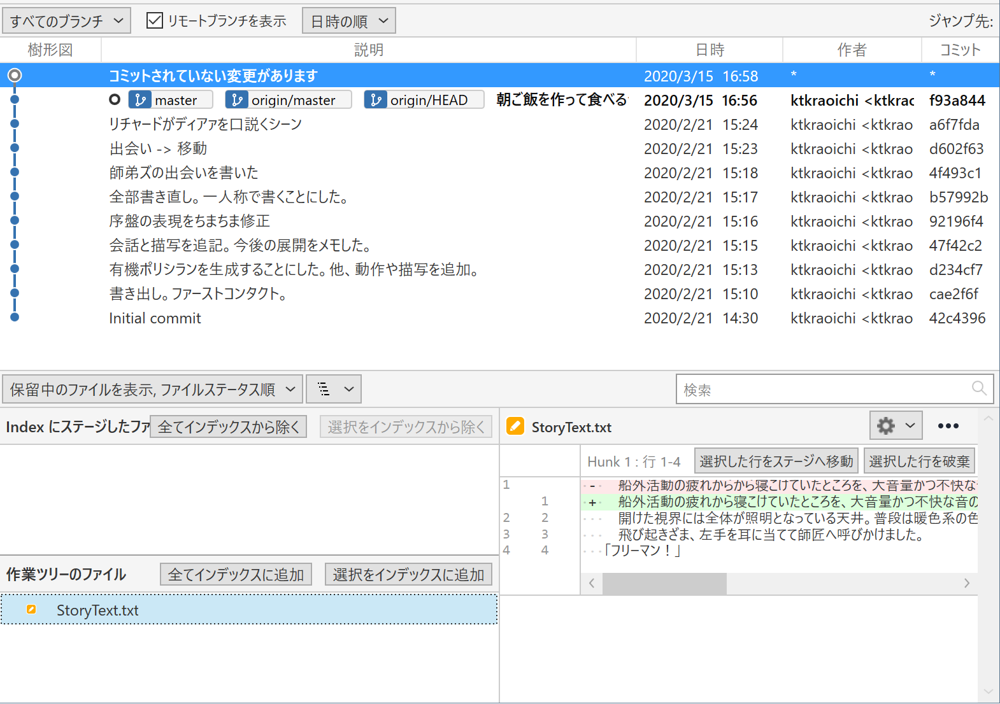
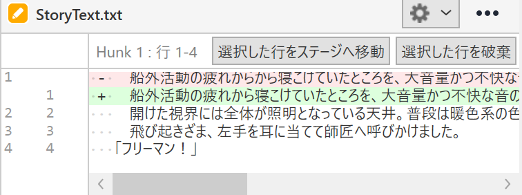

> 船外活動の疲れ**からから**寝こけていたところを、～～

という、よくあるミスを修正したところです。\
こういった「新しいコミットを作るほどでもないけれど、修正はしたい」というときに使えるのが「`--amend`」というオプション操作です。

Sourcetree で操作している人は「コミット」ボタンをクリックして、いつものコミットメッセージを入力する画面に移りましょう。\
コミットメッセージを入力する画面の右端に、こんなプルダウンメニューがあります。

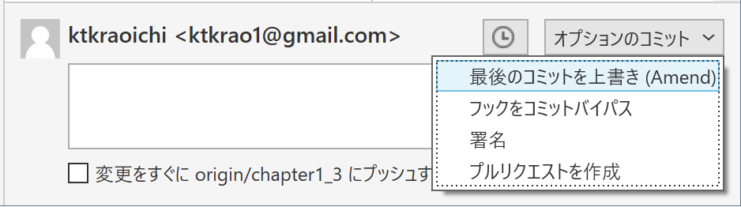

「最後のコミットを上書き(Amend)」とありますね。\
これを選択すると、次のようなメッセージウィンドウが出てきます。

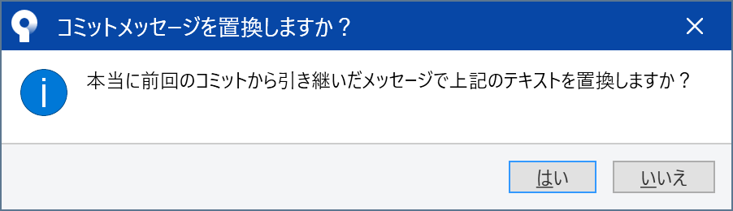

「はい」を選ぶと、いまある最新のコミットのコミットメッセージが入力しなおされます。

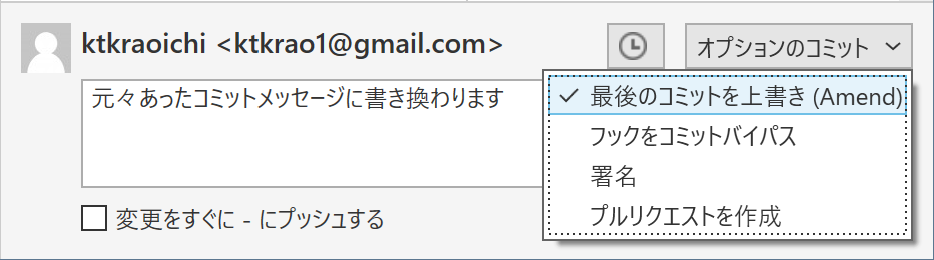

右側のプルダウンメニューを確認しましょう。「最後のコミットを上書き(Amend)」にチェックが入っていることを確認したら、コミットボタンをクリックします。\
普通にコミットすると新しいコミットが作成されますが、「Amend」のオプションにチェックを入れることで、既存のコミットを書き換えたことにできます。

CLI 操作の人は `git commit` に `--amend` というオプションを付けることで、同じ操作ができます。

まずは `git log --oneline` で、先頭のコミットがどうなっているか見てみましょう。\
特に先頭のコミットに付いている ID を覚えておいてください。

```bash
Ktkr@KtkrPC MINGW64 ~/Documents/FaultofTheDrakeEquation (master)
$ git log --oneline
f93a844 (HEAD -> master, origin/master, origin/HEAD) 朝ご飯を作って食べるシーン
a6f7fda リチャードがディアァを口説くシーン
d602f63 出会い -> 移動
4f493c1 師弟ズの出会いを書いた
b57992b 全部書き直し。一人称で書くことにした。
92196f4 序盤の表現をちまちま修正
47f42c2 会話と描写を追記。今後の展開をメモした。
d234cf7 有機ポリシランを生成することにした。他、動作や描写を追加。
cae2f6f 書き出し。ファーストコンタクト。
42c4396 Initial commit
```

先頭のコミットに付いている ID は f93a844 ですね。

次に `git status` で、現在の作業状態を確認しましょう。

```bash
Ktkr@KtkrPC MINGW64 ~/Documents/FaultofTheDrakeEquation (master)
$ git status
On branch master
Your branch is up to date with 'origin/master'.

Changes to be committed:
  (use "git restore --staged <file>..." to unstage)
        modified:   StoryText.txt
```

ファイルが変更されていることを確認したら `add` します。\

```bash
Ktkr@KtkrPC MINGW64 ~/Documents/FaultofTheDrakeEquation (master)
$ git add .
```

普段なら `git commit` とするところを `git commit --amend` とします。

```bash
Ktkr@KtkrPC MINGW64 ~/Documents/FaultofTheDrakeEquation (master)
$ git commit --amend
```

通常のコミットと同様に、 Git に設定したテキストエディタが起動します。\
通常のコミットと違い、書き換える対象のコミットに含まれていたコミットメッセージがすでに入力されています。\
必要であればコミットメッセージを書き直しましょう。\
エディタを閉じれば、コミットを書き換えたことにできます。

最後に、コミットログを確認してみましょう。\
Sourcetree で操作している人は History で樹形図を確認してください。\
CLI で操作している人はもう一度 `git log --oneline` を打ちましょう。

```bash
Ktkr@KtkrPC MINGW64 ~/Documents/FaultofTheDrakeEquation (master)
$ git log --oneline
4dbab1f (HEAD -> master) 朝ご飯を作って食べるシーン
a6f7fda リチャードがディアァを口説くシーン
d602f63 出会い -> 移動
4f493c1 師弟ズの出会いを書いた
b57992b 全部書き直し。一人称で書くことにした。
92196f4 序盤の表現をちまちま修正
47f42c2 会話と描写を追記。今後の展開をメモした。
d234cf7 有機ポリシランを生成することにした。他、動作や描写を追加。
cae2f6f 書き出し。ファーストコンタクト。
42c4396 Initial commit
```

先頭にあるコミットの ID が変わっていることを確認できましたか？\
確認できたなら、素晴らしい。

### 3.1. 「書き換えたことにできる」ってなにさ

Sourcetree では「コミットを上書き(Amend)」とありますし、世の中の記事もたいていは `--amend` オプションを「コミットを書き換える」と解説しています。

実際には、最終的に「書き換えたことに相当する結果が得られる」のであって、 Git が行っていることは「コミットの書き換え」ではありません。

Git において、一度作成したコミットは不変のものです。**コミットそのものは書き換えられません**。実際にやっているのは**コミットの置き換え**です。

`git commit` は\
「今いるコミットを親として、新しいコミットを作る」\
というコマンドです。

つまり、以下の状態から


以下の状態を作ります。

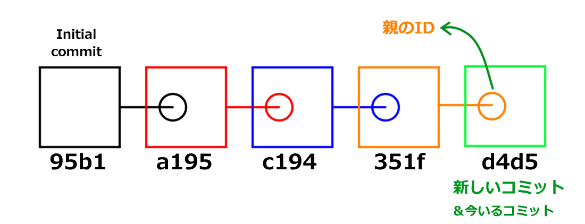

`--amend` オプションを付けることで\
「今いるコミットと**同じ親**を持つ、新しいコミットを作る」\
というコマンドに変化します。

つまり、以下の状態から


以下の状態を作ります。

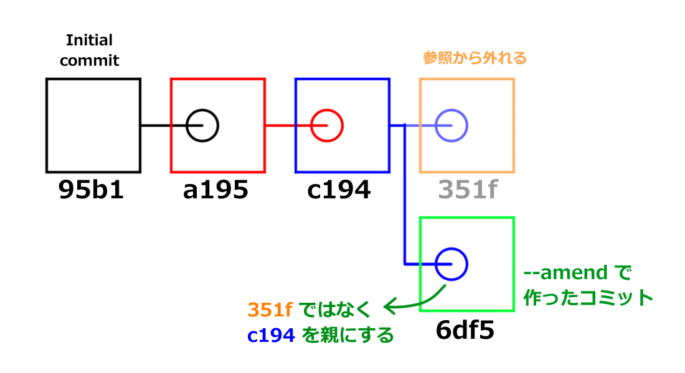

普通のコミットと `--amend` で作ったコミットを見比べてみましょう。


`--amend` が「今いるコミットの置き換え」であることがわかるでしょうか？

Git は `--amend` で新しく作成したコミットを、今いるコミットである、と認識します。

さて、 **Git は今いるコミットしか見ていない** という話を覚えていますか？\
過去のコミットは芋づる式にたどることができるので、 Git は今いるコミットしか見ていません。

つまり、 `-- amend` オプションで今いるコミットを置き換えると、元々あったコミットは原理的にたどることができなくなります。\
図を見返してみましょう。


緑色のブロック（コミット）は、青色のブロック（コミット）の ID を持っています。\
では、オレンジ色のブロックは？　どこからもたどることができません。\
どこからもたどれないため、存在しないことになります。\
人間から見れば「コミットを書き換えた」ことに相当します。

Q. じゃあ古いコミットはどこへいくの？\
A. [ガベージコレクション](#72-git-のガベージコレクション)という機能でお掃除されるまで、どこかを漂う。

どこかを漂っているコミットを拾い上げることもできますが、今回は扱いません。

`--amend` オプションを利用した修正は、いわば「セーブデータの上書き」です。\
あまりに `--amend` で書き換えまくると、変更履歴が残る、という Git の利便性が失われてしまいます。\
誤字脱字等のごく軽微な修正や、コミットメッセージの修正くらいにとどめましょう。

### 3.2 リモートにプッシュしようとしたらエラー出た

既にリモートリポジトリへプッシュしているコミットを `--amend` で置き換えてしまうと、再度プッシュするときエラーになります。\
前回「コミットと同時にプッシュという操作はしないほうがいい」と解説した理由のひとつが、このエラーを事前に回避するためです。

具体的にはこんなエラーです。

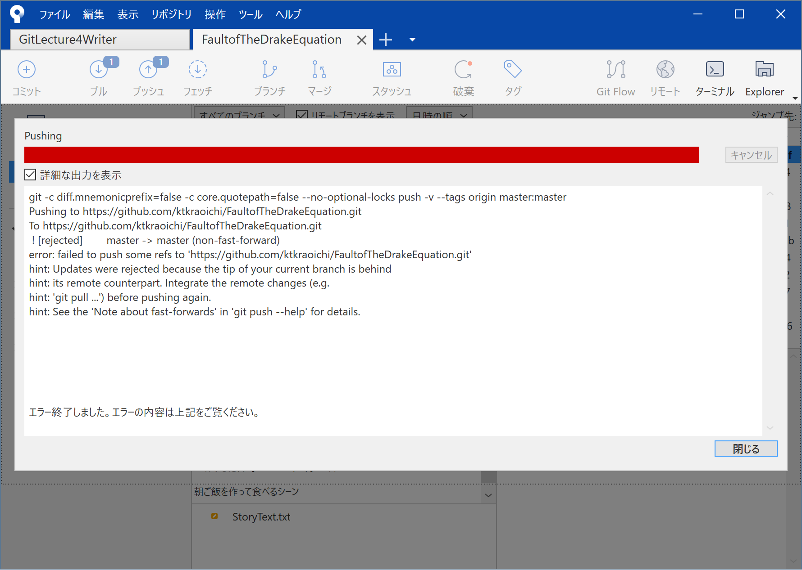

```bash
Ktkr@KtkrPC MINGW64 ~/Documents/FaultofTheDrakeEquation (master)
$ git push
To https://github.com/ktkraoichi/FaultofTheDrakeEquation.git
 ! [rejected]        master -> master (non-fast-forward)
error: failed to push some refs to 'https://github.com/ktkraoichi/FaultofTheDrakeEquation.git'
hint: Updates were rejected because the tip of your current branch is behind
hint: its remote counterpart. Integrate the remote changes (e.g.
hint: 'git pull ...') before pushing again.
hint: See the 'Note about fast-forwards' in 'git push --help' for details.
```

長い英語メッセージですね。\
読むのも嫌になるかもしれませんが、重要なのはこの一行です。

> ! [rejected] master -> master (non-fast-forward)

Git の「fast-forward」というのは「今いるコミットから、新しい履歴が先に伸びている状態になっている」という意味です。

そしてエラーメッセージの「non-fast-forward」は「fast-forwardではない」、つまり「今いるコミットから先に伸びている状態ではない」ということです。

Sourcetree で操作している人は樹形図をよく見てください。

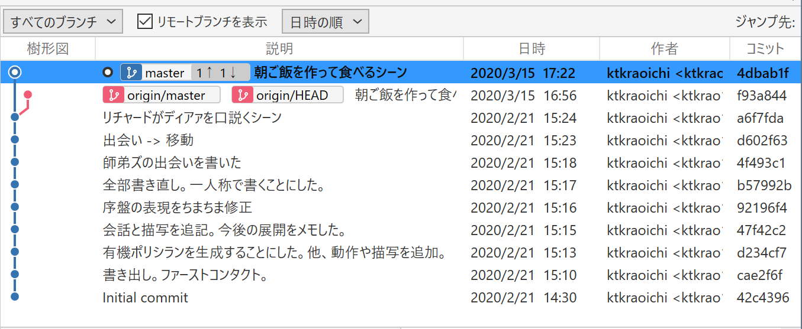

CLI 操作の人は `git log --oneline` だけだとちょっとわかりづらいので、さらに `--graph` というオプションと `--all` というオプションを付けましょう。

```bash
Ktkr@KtkrPC MINGW64 ~/Documents/FaultofTheDrakeEquation (master)
$ git log --oneline --all --graph
* 4dbab1f (HEAD -> master) 朝ご飯を作って食べるシーン
| * f93a844 (origin/master, origin/HEAD) 朝ご飯を作って食べるシーン
|/
* a6f7fda リチャードがディアァを口説くシーン
* d602f63 出会い -> 移動
* 4f493c1 師弟ズの出会いを書いた
* b57992b 全部書き直し。一人称で書くことにした。
* 92196f4 序盤の表現をちまちま修正
* 47f42c2 会話と描写を追記。今後の展開をメモした。
* d234cf7 有機ポリシランを生成することにした。他、動作や描写を追加。
* cae2f6f 書き出し。ファーストコンタクト。
* 42c4396 Initial commit
```

**分岐していますね**。\
これが「non-fast-forward」です。

プッシュ（`git push`）は「ローカルリポジトリに存在する**履歴の同期**」という操作です。

分岐している状態を同期すると、リモートの履歴が一部失われてしまいます。\
リモートリポジトリは本来、他の誰かと共有するための場所です。\
リモートの履歴が失われると、他の誰かとバージョンを共有する意味がなくなりますね。\
なので「ダメ」と拒否しているわけです。

解決策はいくつかありますが、現在の運用であれば強制的にプッシュしてしまうのが手っ取り早いでしょう。

Sourcetree の場合、（賢明なことに）デフォルトでは強制プッシュできないように設定してあります。

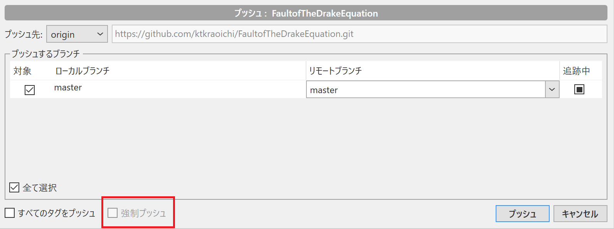

強制プッシュできるようにするためには、ツールバーから\
ツール -> オプション\
を選び、次のような設定画面を出します。

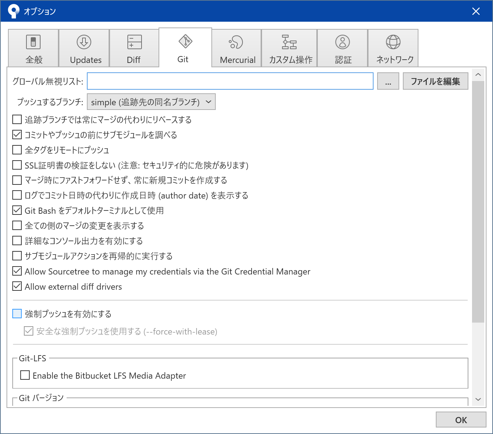

「強制プッシュを有効にする」と「安全な強制プッシュを使用する」の両方にチェックを入れてください。\
設定画面を閉じ、プッシュボタンを押すと…

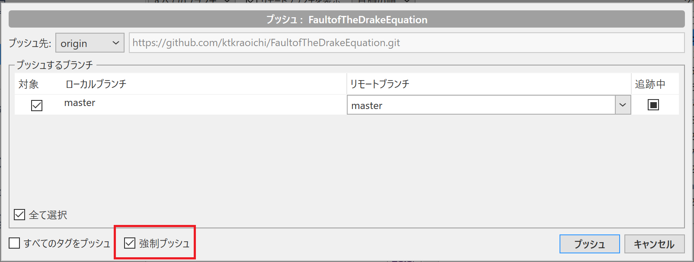

強制プッシュできるようになっています。\
プッシュしようとすると…

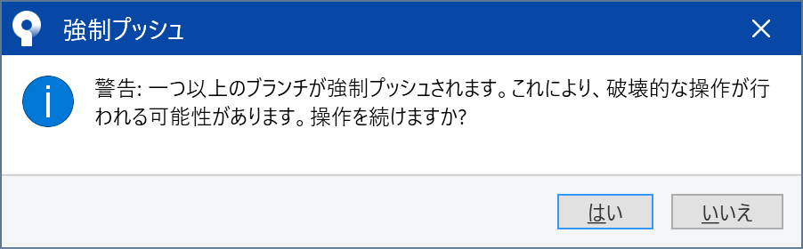

警告が表示されます。\
リモートに存在するコミットがたどれなくなる＝破壊的な操作をする\
ということです。\
本当によいのなら「はい」を押しましょう。\
プッシュが始まり、だいたいなにごともなく完了します。\
Sourcetree の樹形図で、ローカルの master ラベルとリモートの origin/master ラベルが同じコミットに付いていることを確認してください。

CLI 操作の人は `git push --force-with-lease` で強制プッシュします。\
CLI 操作の場合、 `--force-with-lease` オプションを付けても**特に警告などは出ません**。\
もう一度言います。\
`git push --force-with-lease` に限らず、 CLI 操作の場合、基本的に**事前の警告は期待できません**。

`--force-with-lease` オプションを明示的に付けている時点で\
「オッケー、操作の意味は分かってるってことだよな」\
というわけです。

だいたいなにごともなく完了します。\
`git log --oneline --all --graph` で、ローカルの master ラベルとリモートの origin/master ラベルが同じコミットに付いていることを確認してください。

最後に。\
強制プッシュ（`git push --force-with-lease`）は「履歴のバックアップを書き換える」という**かなり危険な操作**です。\
※オペレーションとして最適解な場合もあります

したがって、なるべく強制プッシュをしないで済むように気をつけてください。\
具体的には、プッシュ（`git push`）する前に微修正すべきことがないかどうか確認する、あるいはプッシュしたコミットは決して上書きしない、などの「自分ルール」を作りましょう。

ローカルにおける履歴の書き換えは、やらないにこしたことはありませんが、まだやり直しがききます。\
ですが、リモートの書き換えまでやるとなると、おおごとです。\
その書き換えが本当に必要かどうか、よく考えてから実行しましょう。

1. コミットした後に誤字を見つけた
2. その誤字は `--amend` で書き換えずにほうっておき、プッシュする
3. せっかくなので、ここまで書いた原稿に対して誤字脱字チェックをかける
4. 誤字脱字チェックをかけた内容をコミットする

のように、発想を切り替えてみるのもいいでしょう。

## 4. 過去のコミットからファイルを取り出す

fixme: restore について解説します

## 5. 便利な差分比較ツールの紹介

あちこちからご指摘を頂いていますが、文章を扱うという観点からすると、確かに Git の差分比較機能は見づらいです。\
Sourcetree の差分比較機能も Git と大差ありません。\
GitHub の差分比較機能はもう少しマシですが、日本語に対しては弱めです。

Q. じゃあどうする？
A. 便利な差分比較ツールを使えばいい

執筆はお好みのエディタで。
バージョン管理は Git で。\
共有と議論は GitHub で。
厳密な差分比較は差分比較ツールで。

一度設定してしまえばいいので、新しい操作を覚える必要はありません。

### 5.1. WinMerge

環境が Windows なら、おそらく [WinMerge](https://winmerge.org/?lang=ja) が現時点で最強のツールでしょう（異議は認めるのでコメント欄へどうぞ）。

fixme: WinMerge の使用感について、スクショを貼るなりして解説

Sourcetree では「外部 Diff ツール」を設定してあげることで、 WinMerge を利用した差分比較ができます。

fixme: WinMerge のインスコは省略\
fixme: WinMerge の指定方法を書く\
fixme: 実際にDiffを見る方法を書く（`Ctrl + D` でも起動できる）

CLI では Git の設定を変更することで、 WinMerge を利用した差分比較ができます。

fixme: WinMerge の設定方法を書く

### 5.2. Mac OS X 向けに何か

fixme: 何か

## 6. 次回予告

fixme: 次回どうしましょうね

## 7. 付録

### 7.1 セーブするたびに全ファイルを保存してたら容量ヤバいのでは

ご安心ください。 Git において、変更されていないファイルはコミットの間で「共有」されます。

例えば256個のコミットがあり、最初のコミットから全く変更されていない README.md ファイルがあったとします。\
この場合、256個のコミットは変更されていない README.md をいちいち保存しなおしたりしません。ひとつの README.md というファイルをコミットの間で「共有」します。

これにより容量を節約できますし、論理的にスマートな運用を実現しています。

もっと詳しく勉強したいかたは以下をどうぞ。

[Git - Gitオブジェクト](https://git-scm.com/book/ja/v2/Git%E3%81%AE%E5%86%85%E5%81%B4-Git%E3%82%AA%E3%83%96%E3%82%B8%E3%82%A7%E3%82%AF%E3%83%88)\
※技術文書なのでハードルは高いです。

### 7.2 Git のガベージコレクション

Git のガベージコレクション（GC）とは、 Git 内部の自動お掃除ロボットです。\
参照されなくなったコミットやファイルを、適当なタイミングで破棄してくれます。

逆に言えば、 `git commit --amend` などで参照されなくなったコミットやファイルも、 GC でお掃除されていなければ救出できます。\
おおむね数ヶ月は GC によるお掃除の対象にならないので、あまりに古いコミットでなければ基本的に救出できます。

うっかり `git reset --hard` しても、 `git reflog` で救出できます。\
とはいえ、うっかり `git reset --hard` しないことのほうが大事ですが。
