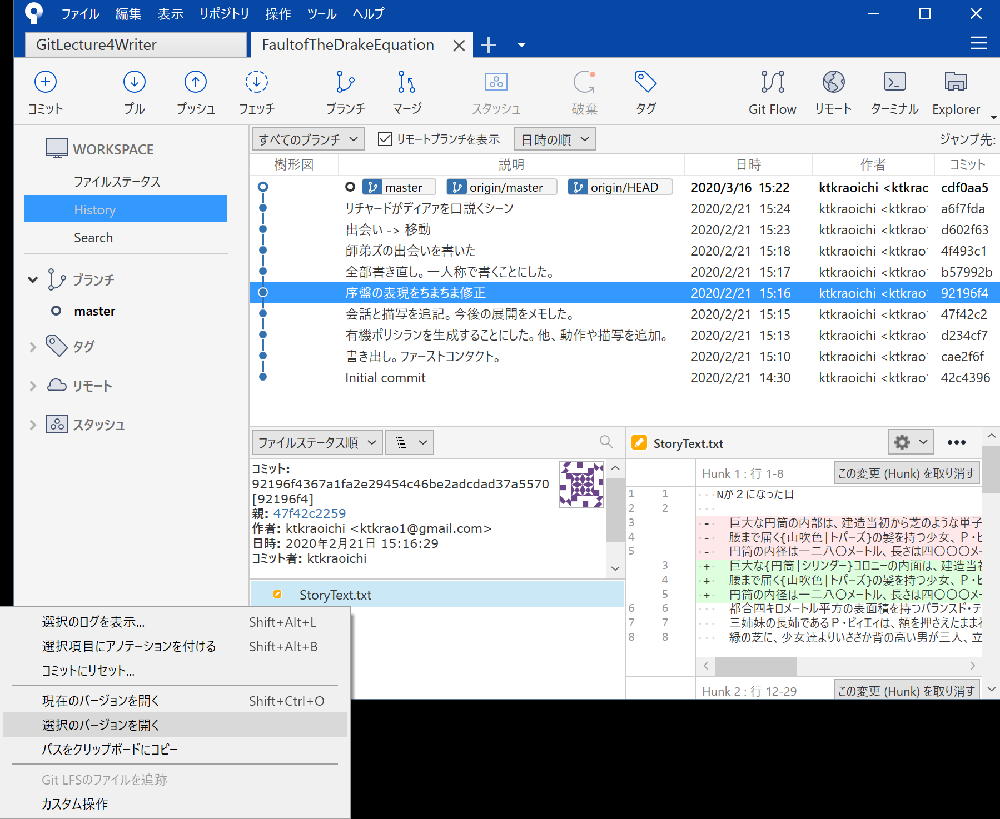
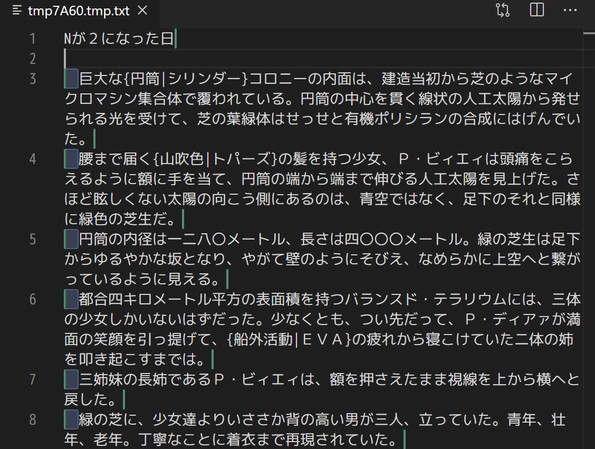
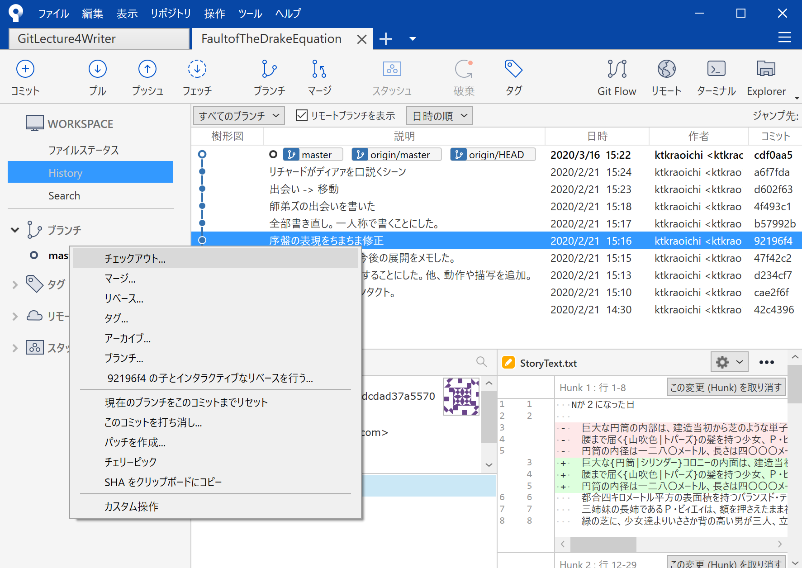
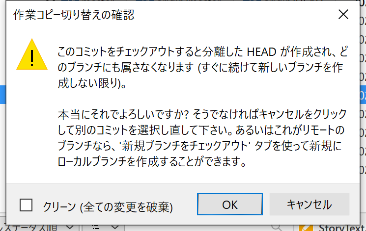
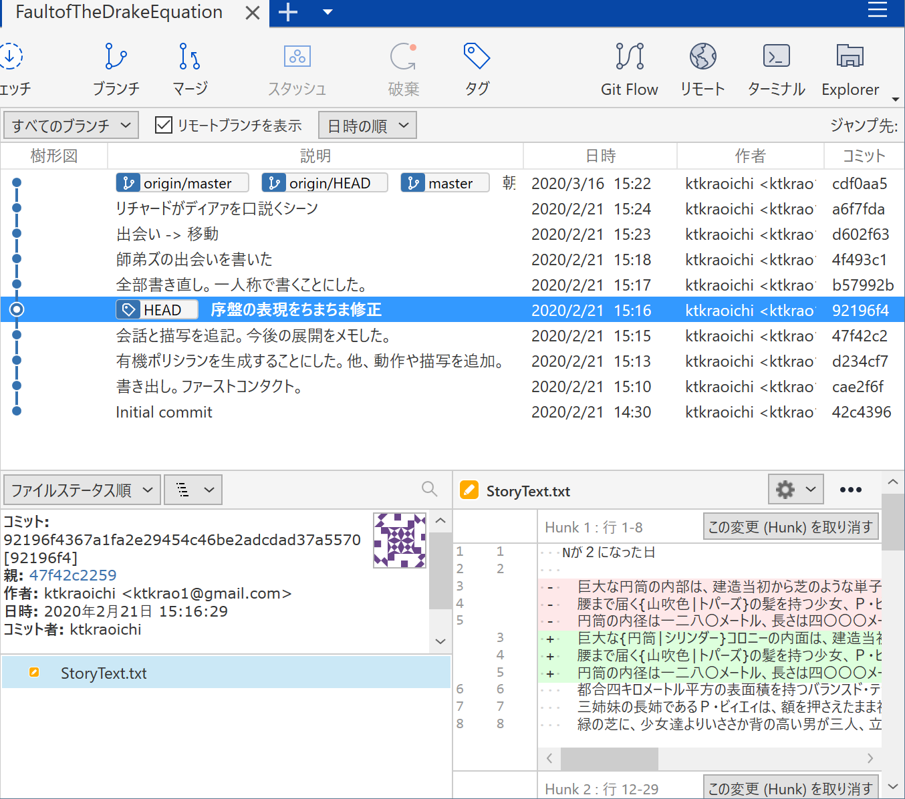
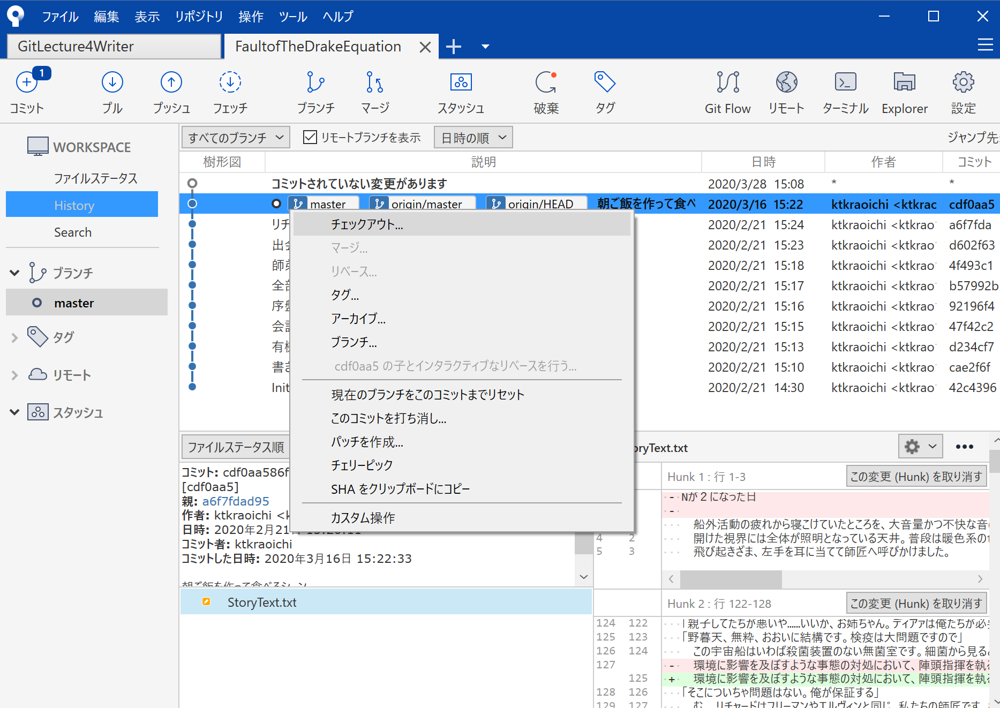
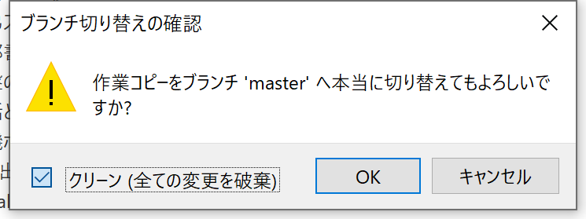
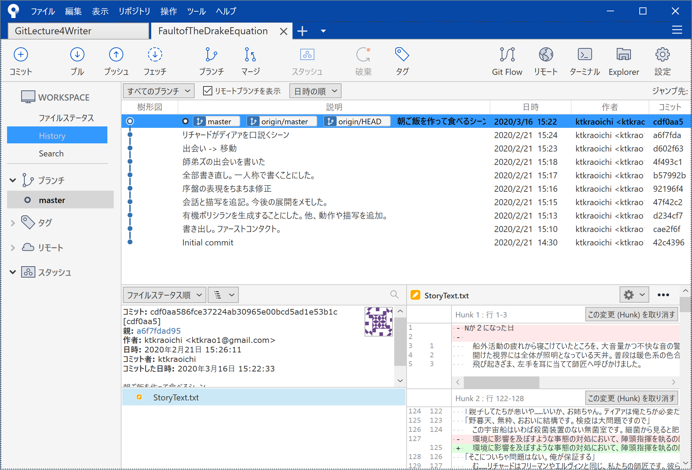
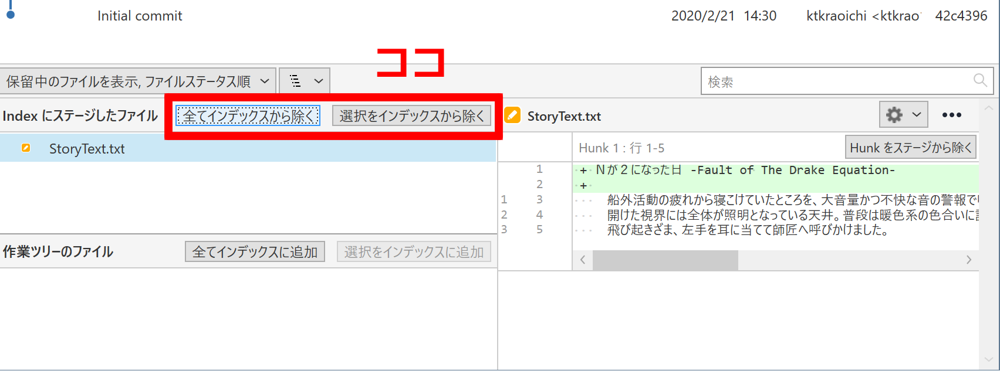

# 文章に関わる全ての人のための Git & GitHub 入門 1-3「コミットを理解して活用する」

皆さん、今日もローカルにコミットしてますか？（言いたかっただけ）

この連載は（中略）文章を扱う全ての人を対象にしています。\
なんとなくで Git を覚えてしまっている人にもたぶん役立ちます。

- シリーズ記事一覧
  - [1-1「Git と GitHub を使うメリット」](https://qiita.com/ktkraoichi/items/6b31644e4832882310d8)
  - [1-2「コミットを積み上げる」](https://qiita.com/ktkraoichi/items/1c60e7eba1ec9c570518)
  - 1-3「コミットを理解して活用する」

## 1. 今回のゴール

1. コミットってなに？
2. コミットを書き換えたことにする
3. 過去のコミットからファイルを取り出す
4. 編集中の内容やステージを取り消す
5. 便利な比較差分ツールの紹介

今回はちょっとしたお勉強と、使えるようになると捗る Tips の紹介です。\
Tips はけっこうな頻度で使うので、実際に手を動かして覚えてくださいね。

## 2. コミットってなに？

今後、高度な Git 操作を行ううえでは、 Git の仕組みを理解しておくことが何より重要です。\
Git の仕組みを理解していないと

- 消すべきでないコミットを消してしまったり[^1]
[^1]: 厳密には消えません。 GC されてなければ `git reflog` で救出可。
- 本当は存在するのに、コミットが存在しないと言って騒いだり
- もっと適切な操作があるのに面倒でミスしやすい操作をしたり

します。

察しの良い方はお気づきですね。筆者の僕は全部やりました。

では本題。\
コミットとは、コミットを作ったときのフォルダの状態を記録した、**ひとかたまりのデータ**のことです。

そこ、諦めないように。まだ早い。\
ちゃんと噛み砕いて説明します。

この連載ではコミットをしばしば「セーブデータ」と言いかえています。\
セーブデータには、だいたい以下のような情報が含まれていますよね。

- ゲームの進行度
- キャラクターのパラメータ
- 持っているアイテムの数
- プレイ時間

ゲームのタイトルによって異なりますが、だいたいこんなところでしょう。

これを Git に置きかえます。\
コミットには、以下の情報が含まれています。

- コミット内容の権利者（Author）
- コミットが最初に作られた時間
- **フォルダとファイルの構造**
- **フォルダやファイルそのもの**

今回は下の二つが重要です。\
これらに加えて、コミットには以下2つの情報が含まれています。

- **自分の ID** [^2]
[^2]: 厳密にはハッシュ値ですが ID と呼ぶことにします。
- **親の ID**

例外的に、最初のコミット（Initial commit）だけは親の ID を持ちません。


上図はコミットログ、 Sourcetree でいえば樹形図に相当するもの、 CLI でいえば `git log` に相当するものを横向きに表したものです。\
左が古いもので、右に行くほど新しくなります。

それぞれのブロックは、ひとつのコミットです。\
ブロックを作成したときのファイルとフォルダの情報が全て入っています（重要）。\
また、それぞれのコミットは自分の ID と親の ID を持っています（重要）。

例えば、赤いブロックは a195 という ID を持っており、親の 95b1 という ID も持っています。\
上図において、最も新しいコミットはオレンジの 351f です。\
親をたどっていくと、やがて最初のコミットである 95b1 に行き着きます。

Git においては、今いるコミットさえわかれば、過去のコミットを芋づる式にたどることができます。\
**過去のコミットは芋づる式にたどることができるので、 Git は今いるコミットしか見ていません。**\
※master ブランチしか扱っていないのでこういう表現にしています

重要なので覚えておいてくださいね。

## 3. コミットを書き換えたことにする

それでは Tips を紹介していきましょう。\
まずは「コミットを書き換えたことにする」です。

コミットした後に\
「あ、誤字みつけた」\
「いや、やっぱりこっちの表現のほうがいいな」\
「げ、コミットメッセージを書き間違えた」\
ということは、しょっちゅうあります。


> 船外活動の疲れ**からから**寝こけていたところを、～～

という、よくあるミスを修正したところです。\
こういった「新しいコミットを作るほどでもないけれど、修正はしたい」というときに使えるのが「`--amend`」というオプション操作です。

Sourcetree で操作している人は「コミット」ボタンをクリックして、いつものコミットメッセージを入力する画面に移りましょう。\
コミットメッセージを入力する画面の右端に、こんなプルダウンメニューがあります。


「最後のコミットを上書き(Amend)」とありますね。\
これを選択すると、次のようなメッセージウィンドウが出てきます。


「はい」を選ぶと、いまある最新のコミットのコミットメッセージが入力しなおされます。


右側のプルダウンメニューを確認しましょう。「最後のコミットを上書き(Amend)」にチェックが入っていることを確認したら、コミットボタンをクリックします。\
普通にコミットすると新しいコミットが作成されますが、「Amend」のオプションにチェックを入れることで、既存のコミットを書き換えたことにできます。

CLI 操作の人は `git commit` に `--amend` というオプションを付けることで、同じ操作ができます。

まずは `git log --oneline` で、先頭のコミットがどうなっているか見てみましょう。\
特に先頭のコミットに付いている ID を覚えておいてください。

```bash
Ktkr@KtkrPC MINGW64 ~/Documents/FaultofTheDrakeEquation (master)
$ git log --oneline
f93a844 (HEAD -> master, origin/master, origin/HEAD) 朝ご飯を作って食べるシーン
a6f7fda リチャードがディアァを口説くシーン
d602f63 出会い -> 移動
4f493c1 師弟ズの出会いを書いた
b57992b 全部書き直し。一人称で書くことにした。
92196f4 序盤の表現をちまちま修正
47f42c2 会話と描写を追記。今後の展開をメモした。
d234cf7 有機ポリシランを生成することにした。他、動作や描写を追加。
cae2f6f 書き出し。ファーストコンタクト。
42c4396 Initial commit
```

先頭のコミットに付いている ID は f93a844 ですね。

次に `git status` で、現在の作業状態を確認しましょう。

```bash
Ktkr@KtkrPC MINGW64 ~/Documents/FaultofTheDrakeEquation (master)
$ git status
On branch master
Your branch is up to date with 'origin/master'.

Changes to be committed:
  (use "git restore --staged <file>..." to unstage)
        modified:   StoryText.txt
```

ファイルが変更されていることを確認したら `add` します。\

```bash
Ktkr@KtkrPC MINGW64 ~/Documents/FaultofTheDrakeEquation (master)
$ git add .
```

普段なら `git commit` とするところを `git commit --amend` とします。

```bash
Ktkr@KtkrPC MINGW64 ~/Documents/FaultofTheDrakeEquation (master)
$ git commit --amend
```

通常のコミットと同様に、 Git に設定したテキストエディタが起動します。\
通常のコミットと違い、書き換える対象のコミットに含まれていたコミットメッセージがすでに入力されています。\
必要であればコミットメッセージを書き直しましょう。\
エディタを閉じれば、コミットを書き換えたことにできます。

最後に、コミットログを確認してみましょう。\
Sourcetree で操作している人は History で樹形図を確認してください。\
CLI で操作している人はもう一度 `git log --oneline` を打ちましょう。

```bash
Ktkr@KtkrPC MINGW64 ~/Documents/FaultofTheDrakeEquation (master)
$ git log --oneline
4dbab1f (HEAD -> master) 朝ご飯を作って食べるシーン
a6f7fda リチャードがディアァを口説くシーン
d602f63 出会い -> 移動
4f493c1 師弟ズの出会いを書いた
b57992b 全部書き直し。一人称で書くことにした。
92196f4 序盤の表現をちまちま修正
47f42c2 会話と描写を追記。今後の展開をメモした。
d234cf7 有機ポリシランを生成することにした。他、動作や描写を追加。
cae2f6f 書き出し。ファーストコンタクト。
42c4396 Initial commit
```

先頭にあるコミットの ID が変わっていることを確認できましたか？\
`--amend` で変更した内容はちゃんと反映されていますか？

確認できたなら、素晴らしい。

### 3.1. 「書き換えたことにできる」ってなにさ

Sourcetree では「コミットを上書き(Amend)」とありますし、世の中の記事もたいていは `--amend` オプションを「コミットを書き換える」と解説しています。

実際には、最終的に「書き換えたことに相当する結果が得られる」のであって、 Git が行っていることは「コミットの書き換え」ではありません。

Git において、一度作成したコミットは不変のものです。**コミットそのものは書き換えられません**。実際にやっているのは**コミットの置き換え**です。

`git commit` は\
「今いるコミットを親として、新しいコミットを作る」\
というコマンドです。

つまり、以下の状態から


以下の状態を作ります。


`--amend` オプションを付けることで\
「今いるコミットと**同じ親**を持つ、新しいコミットを作る」\
というコマンドに変化します。

つまり、以下の状態から


以下の状態を作ります。


普通のコミットと `--amend` で作ったコミットを見比べてみましょう。


`--amend` が「今いるコミットの置き換え」であることがわかるでしょうか？

Git は `--amend` で新しく作成したコミットを、今いるコミットである、と認識します。

さて、 **Git は今いるコミットしか見ていない** という話を覚えていますか？\
過去のコミットは芋づる式にたどることができるので、 Git は今いるコミットしか見ていません。

つまり、 `-- amend` オプションで今いるコミットを置き換えると、元々あったコミットは原理的にたどることができなくなります。\
図を見返してみましょう。


緑色のブロック（コミット）は、青色のブロック（コミット）の ID を持っています。\
では、オレンジ色のブロックは？　どこからもたどることができません。\
どこからもたどれないため、存在しないことになります。\
人間から見れば「コミットを書き換えた」ことに相当します。

Q. じゃあ古いコミットはどこへいくの？\
A. [ガベージコレクション](#72-git-のガベージコレクション)という機能でお掃除されるまで、どこかを漂う。

どこかを漂っているコミットを拾い上げることもできますが、今回は扱いません。

`--amend` オプションを利用した修正は、いわば「セーブデータの上書き」です。\
あまりに `--amend` で書き換えまくると、変更履歴が残る、という Git の利便性が失われてしまいます。\
誤字脱字等のごく軽微な修正や、コミットメッセージの修正くらいにとどめましょう。

## 4. 過去のファイルを取り出す

過去の原稿ファイルを掘り出したくなるとき、ありますよね。\
ごっそり削った文章を再利用したり、あるいはファイルごと消し去ったものを読み返したくなったり。

そんなときでも大丈夫。\
Git でコミットを積んでおけば、特定のコミットから特定のファイルを取り出すことができます。

なお、 Soucetree と CLI では、やれることが若干異なります。\
というのも、記事執筆時点での Sourcetree (Ver. 3.3.6) が、どうやら Git の最新バージョンで追加された機能に対応できていないみたいなのです。[^3]
[^3]:具体的には 2.23.0 からの `git restore` と `git switch` に対応できてない

似たような操作はできるので、うまく使っていきましょう。

では、CLI 操作の人は次まで飛んでください。\
[4.2. CLI で過去のファイルを取り出す](#42-cli-で過去のファイルを取り出す)

### 4.1 Sourcetree で過去のファイルを取り出す

Sourcetree で操作している人は、取り出したいファイルが含まれているコミットをクリックして選択します。\
次に、画面下部に表示されている「変更されたファイル」から、取り出したいファイルを選んで右クリックします。



「選択のバージョンを開く」をクリックすると、お使いの PC にデフォルト設定されているアプリケーションで一時的なファイルが開かれます。\
テキストファイルを選んだなら、デフォルトに設定されているテキストエディタで一時的なファイルが開かれます。



こんな感じです（筆者のエディタは例によって VSCode です）。\
ファイル名に「tmp」とある通り、このファイルは一時的に生成されたものです。\
特に設定をいじっていない Windows 環境なら、だいたい\
`C:\Users\あなたのユーザ名\AppData\Local\Temp\`\
というフォルダに一時的なファイルが生成され、保存されます。\
何も設定していなければ1週間くらいでファイルが消えていきます。\
どこかに別名で保存するといいでしょう。

一時的なファイルをいっぱい生成したくない、という人は「チェックアウト」を使いましょう。\
コミットに対して「チェックアウト」すると、そのコミットの内容を Git 管理下のフォルダに書き出すことができます。

まずは Sourcetree の樹形図にて「コミットされていない変更があります」というメッセージが**無い**ことを確認してください。\
コミットしていない変更があると、 Sourcetree ではチェックアウトできません。エラーになります。\
もし上記のメッセージがあったら、とりあえずローカルにコミットしてください。さっき覚えた `Amend` を使って、後からちゃんとしたコミットに置き換えればいいのです。

次に、取り出したいファイルが含まれているコミットを選択して右クリックします。



「チェックアウト」を選びます。デフォルト設定なら、コミットをダブルクリックすることでもチェックアウトが働きます。



警告が表示されます。\
いまのところは気にしなくて大丈夫です。\
そのうち解説する「ブランチ」の操作をするようになると、注意する必要があります。\
「OK」ボタンを押して、チェックアウトしましょう。



目的のコミットに HEAD というラベルが付いていれば、チェックアウトは完了です。\
Git 管理下のフォルダに、コミットの内容が書き出されています。\
樹形図の右上にある「Explorer」ボタンからローカルリポジトリを開いて、実際にファイルを取り出せていることを確認してみましょう。

ファイルを取り出せていることを確認できましたか？

確認できたら、最新のコミットにチェックアウトし直してください。\
必要であれば、先ほど取り出した古いファイルは別のフォルダへ退避させておいてください。\
最新の状態に戻すと、先ほど取り出したファイルも最新の状態に戻ってしまうからです。

「ブランチ」の操作を行うことで、古いファイルの内容を反映した新しいコミットを作ることもできますが、今回は扱いません。\
最新の状態にチェックアウトしたあと、退避させておいた古いファイルの内容を反映してコミットを作るといいでしょう。[^4]
[^4]: Sourcetree を利用して、 HEAD を動かさず特定のコミットが参照している tree や blob を working tree へ直接書き出す、という方法を筆者は知りません。あるなら誰か教えてください（切実）

それでは、 [5. 編集中の内容やステージを取り消す](編集中の内容やステージを取り消す)まで飛んでください。

### 4.2. CLI で過去のファイルを取り出す

CLI 操作で操作する場合、チェックアウト（`git checkout`）は使いません。\
`git checkout` というコマンドが持っていた機能は、2019年8月16日から `git switch` と `git restore` に分割されました。[^5]
[^5]:実際のところ初学者が `checkout` という字面からあれらの機能を想像するのは難しい…

`git checkout` を使うこともできますが、せっかくなので `git switch` と `git restore` を覚えましょう。

CLI で過去のファイルを取り出すときは `git restore --source <コミット ID> <ファイルパス>` というコマンドを使います。\
これは「現在の作業領域に対して、指定したコミットから指定したファイルを書き出す」というものです。

まずはどのコミットからファイルを取り出すのか確認しましょう。

```bash
Ktkr@KtkrPC MINGW64 ~/Documents/FaultofTheDrakeEquation (master)
$ git log --oneline
4dbab1f (HEAD -> master) 朝ご飯を作って食べるシーン
a6f7fda リチャードがディアァを口説くシーン
d602f63 出会い -> 移動
4f493c1 師弟ズの出会いを書いた
b57992b 全部書き直し。一人称で書くことにした。
92196f4 序盤の表現をちまちま修正
47f42c2 会話と描写を追記。今後の展開をメモした。
d234cf7 有機ポリシランを生成することにした。他、動作や描写を追加。
cae2f6f 書き出し。ファーストコンタクト。
42c4396 Initial commit
```

「全部書き直し。一人称で書くことにした」というコミットの直前、 92196f4 のコミットからファイルを取り出してみましょう。特定のコミットで変更されたファイルの一覧を見るためには、 `git show <コミット ID> --name-only` というコマンドを使います。

```bash
Ktkr@KtkrPC MINGW64 ~/Documents/FaultofTheDrakeEquation (master)
$ git show 92196f4 --name-only
commit 92196f4367a1fa2e29454c46be2adcdad37a5570
Author: ktkraoichi <ktkrao1@gmail.com>
Date:   Fri Feb 21 15:16:29 2020 +0900

    序盤の表現をちまちま修正

StoryText.txt
```

ログには

- コミット ID
- コミットの権利者（Author）
- コミット日時
- コミットメッセージ
- 内容が変更されたファイル名の一覧（パス付き）

が表示されています。

つまり、このコミットに存在する StoryText.txt を `git restore --source` で指定してあげればいいわけです。

やってみましょう。\
作業領域にファイルを書き出すので、まずはコミットしていない変更がないことを確認しましょう。\
`git restore` で上書きしてしまうと、コミットしていない内容は消えてしまいます。

覚えていますか？ `git status` ですよ。

```bash
Ktkr@KtkrPC MINGW64 ~/Documents/FaultofTheDrakeEquation (master)
$ git status
On branch master
Your branch is up to date with 'origin/master'.

Changes not staged for commit:
  (use "git add <file>..." to update what will be committed)
  (use "git restore <file>..." to discard changes in working directory)
        modified:   StoryText.txt

no changes added to commit (use "git add" and/or "git commit -a")
```

もし上記のようなメッセージがあったら、とりあえずローカルにコミットしてください。さっき覚えた `git commit --amend` を使って、後からちゃんとしたコミットに置き換えればいいのです。

```bash
Ktkr@KtkrPC MINGW64 ~/Documents/FaultofTheDrakeEquation (master)
$ git status
On branch master
Your branch is up to date with 'origin/master'.

nothing to commit, working tree clean
```

nothing to commit, working tree clean\
ならOKです。 `git restore --source <コミット ID> <ファイルパス>` を叩いてみましょう。

```bash
Ktkr@KtkrPC MINGW64 ~/Documents/FaultofTheDrakeEquation (master)
$ git restore --source 9219 StoryText.txt
```

「…何も起きないな」と思ったあなた、手癖が足りていません。\
もう一回 `git status` を叩いて状態を確認しましょう。

```bash
Ktkr@KtkrPC MINGW64 ~/Documents/FaultofTheDrakeEquation (master)
$ git status
On branch master
Your branch is up to date with 'origin/master'.

Changes not staged for commit:
  (use "git add <file>..." to update what will be committed)
  (use "git restore <file>..." to discard changes in working directory)
        modified:   StoryText.txt

no changes added to commit (use "git add" and/or "git commit -a")
```

「StoryText.txt というファイルが変更されたよ」と言われています。\
消したファイルを復活させた場合は

```bash
Untracked files:
  (use "git add <file>..." to include in what will be committed)
        ファイルパス
```

という項目も現れます。\
前回も言及したことですが、 CLI ではユーザーが明示的に状態（ステータス）を確認する必要があります。

さて、取り出したファイルの内容を確認してみましょう。\
目的のファイルは得られましたか？

「別のコミットを指定してたわ」「このファイルじゃないわ」というときは、頑張って探しましょう。\
目的のファイルを探す時はコミットメッセージが役に立ちます。意味のあるコミットメッセージを書きましょうね。

それらしいコミットの内容を簡易的に表示するなら `git show <コミット ID>` を叩くといいでしょう。

「さすがに消したファイルの名前は覚えてないわ」\
ああ…そりゃそうですね。\
以下のコマンドで、過去に消したファイルの名前と、消したときのコミットを探せます。ついでにファイル名を変更したケースも想定して探しておきましょう。

`git log --diff-filter=DR --summary`

サンプルを示します。

```bash
$ git log --diff-filter=DR --summary 
commit 2e9a4ec69d4daa9f278192cd210bc94b82f798e7
Author: ktkraoichi <ktkrao1@gmail.com>
Date:   Sat Jan 4 12:39:49 2020 +0900

    アイデアは雑記用のメモファイルにまとめる。整理は別途。

 delete mode 100644 Memorandum/20200112.md
 rename Memorandum/{20200101.md => Ideas.md} (79%)
```

これは「ファイルが無くなったコミット」です。つまり「ファイルが無くなったコミットの直前のコミット」に削除されたファイルが含まれています。\
あるコミットの直前のコミット、つまり親のコミットを指定するときは `<コミット ID>^` と指定します。コミット IDに `^` （ハット）記号を付けるのがポイントです。

上記の例だと

```bash
Ktkr@KtkrPC MINGW64 ~/Documents/OwnerlessDolls (memorandum)
$ git restore --source 2e9a^ Memorandum/20200112.md

Ktkr@KtkrPC MINGW64 ~/Documents/OwnerlessDolls (memorandum)
$ git status
On branch memorandum
Your branch is behind 'origin/memorandum' by 1 commit, and can be fast-forwarded.
  (use "git pull" to update your local branch)

Untracked files:
  (use "git add <file>..." to include in what will be committed)
        Memorandum/20200112.md

nothing added to commit but untracked files present (use "git add" to track)
```

となります。\
なお、コミット ID に`^` を付けないと…

```bash
Ktkr@KtkrPC MINGW64 ~/Documents/OwnerlessDolls (memorandum)
$ git restore --source 2e9a Memorandum/20200112.md
error: pathspec 'Memorandum/20200112.md' did not match any file(s) known to git
```

「ないです」と言われます。ないものはないです。

さて。\
`git restore --source` でファイルを取り出すと、 Git は「いま作業している内容に変更があった」と認識します。\
つまり、 `git restore --source` をしたら、次に示すふたつのうち、どちらかを実行する必要があります。

1. 取り出したファイルをコミットする
2. 取り出したファイルを破棄して最新のコミットに戻す

ファイルをコミットするのは、そんなに難しい操作ではありませんね。\
`git add` でステージして、 `git commit` でコミットを作ればOKです。

最新のコミットに戻すためには、新しい操作を覚える必要があります。\
次のステップで解説するので、そのまま進んでください。

## 5. 編集中の内容やステージを取り消す

- ファイルをステージした（`git add` した）後に修正点が見つかった。
- まだコミットしていないけど、執筆内容が気に入らないから破棄したい。
- `git restore --source` で取り出した過去のファイルを破棄して、最新コミットに戻したい。

ということは、わりとよくあります。\
特に `git restore --source` を使い、ファイルを上書きする形で取り出すと、元の状態へ戻す操作も必須になります。

Sourcetree なら画面をぽちぽちしていけば、上記の内容はわりと難しくありません。

CLI なら `git restore` と `git stash` の使い方を覚えましょう。\
大丈夫、そんなに難しい操作ではありません。\
忘れたらこの記事をまた読みに来てください。

### 5.1. コミットしていない編集内容を取り消す

コミットしていない編集内容を取り消す、ということは\
「Git が今見ているコミットの状態に戻す」\
ということです。

`git restore --source` でファイルを取り出したときは、特にこの操作が必須になります。

Sourcetree で操作している人は、最新のコミットを指定して「チェックアウト」することで、「Git が今見ているコミットの状態に戻す」ことができます。[^6]
[^6]:`git reset --hard` でも同じ結果が得られますが、 `git restore` に合わせています。

下図のように「コミットされていない変更があります」という状態で、最新のコミットを選択して右クリックします。



チェックアウトをクリックします。\
ダイアログが現れ…



クリーン（全ての変更を破棄）にチェックを入れて、OKボタンを押します。



コミットしていない編集内容を取り消すことができます。

CLI で操作している人は `git restore --worktree <ファイルパス>` で、指定したファイルを「Git が今見ているコミットの状態に戻す」ことができます。\
全てのファイルを戻したいなら、 .git フォルダがある場所で `git restore --worktree .` と叩けば、全てのフォルダとファイルが元通りになります。

サンプルは以下。

```bash
Ktkr@KtkrPC MINGW64 ~/Documents/FaultofTheDrakeEquation (master)
$ git status
On branch master
Your branch is up to date with 'origin/master'.

Changes not staged for commit:
  (use "git add <file>..." to update what will be committed)
  (use "git restore <file>..." to discard changes in working directory)
        modified:   StoryText.txt

no changes added to commit (use "git add" and/or "git commit -a")

Ktkr@KtkrPC MINGW64 ~/Documents/FaultofTheDrakeEquation (master)
$ git diff
diff --git a/StoryText.txt b/StoryText.txt
index 8e2cc57..d8399b5 100644
--- a/StoryText.txt
+++ b/StoryText.txt
@@ -1,3 +1,5 @@
+ほげ
+
 　船外活動の疲れから寝こけていたところを、大音量かつ不快な音の警報で叩き起こされました。驚いた手足がむやみに暴れてベッドから転がり落ちました。警報というのは当事者の頬をひっぱたくためのものですから、よく仕事をしたと褒めてあげたいところです。もちろん皮肉です。
 　開けた視界には全体が照明となっている天井。普段は暖色系の色合いに設定しているのですが、現在はわーにんわーにんと叫ぶ警報に同期して、真っ赤に明滅しています。
 　飛び起きざま、左手を耳に当てて師匠へ呼びかけました。

```

`git diff` で、編集中のファイルと最新のコミットを比較できます。\
サンプルでは単に「ほげ」とだけ追記していることが分かります。\
こんなくだらない追記は捨ててしまいましょう。

```bash
Ktkr@KtkrPC MINGW64 ~/Documents/FaultofTheDrakeEquation (master)
$ git restore --worktree .

Ktkr@KtkrPC MINGW64 ~/Documents/FaultofTheDrakeEquation (master)
$ git status
On branch master
Your branch is up to date with 'origin/master'.

nothing to commit, working tree clean
```

`--worktree` の直後に `<ファイルパス>` か `.` （ドット）を指定しましょうね。\
でないと以下のように怒られますよ。

```bash
Ktkr@KtkrPC MINGW64 ~/Documents/FaultofTheDrakeEquation (master)
$ git restore --worktree
fatal: you must specify path(s) to restore
```

### 5.2. ステージを取り消す

ファイルを一度ステージ（`git add`）した場合、明示的にステージを取り消す操作が必要です。

Sourcetree で操作している人は「**Index にステージしたファイル**」の欄を見てください。

「**作業ツリーのファイル**」欄に表示されているファイルを選び、「選択をインデックスから除く」ボタンをクリックすればステージを取り消せます。\
全てのファイルのステージを取り消すなら「全てインデックスから除く」ボタンをクリックすれば一発です。



CLI 操作の人は

`git restore --staged <ファイルやフォルダのパス>`

とすれば、指定したファイルのステージを取り消すことができます。\
フォルダを指定すれば、そのフォルダ以下のステージが全て取り消されます。

全てのファイルのステージを取り消すなら、 .git フォルダがある場所で

`git restore --staged .`

とすれば、全てのファイルのステージを取り消すことができます。\
`.` （ドット）を忘れないでくださいね。

フォルダやファイルのパスを指定してあげないと…

```bash
$ git restore --staged 
fatal: you must specify path(s) to restore
```

「パスを指定しなさい」\
と怒られます。

ステージ（`git add`）しそこねた修正を終えたら、再びステージ（`git add`）しましょう。

### 5.3. 一時的に編集内容を取り消す

「編集している内容は保持しておきたいけれど、編集前の内容は確認したい」\
というときには、スタッシュ（`git stash`）が便利です。\
スタッシュは、コミットしていない内容を「仮のコミット」として退避させておき、 Git が今見ているコミットの状態に戻すコマンドです。\
退避させた変更内容は必要に応じて元に戻す（`git stash pop`）ことができます。

Sourcetree で操作している場合は「スタッシュ」というボタンを利用します。\
CLI 操作の場合は `git stash` というコマンドを使います。\
それぞれ、使い方を解説します。

Sourcetree の場合は「**コミットされていない変更があります**」と表示されているとき、「スタッシュ」ボタンが有効になります。

fixme: スタッシュの一連の操作

CLI 操作の場合は `git stash` というコマンドで、現在の編集内容を「仮のコミット」として退避させられます。

```bash
Ktkr@KtkrPC MINGW64 ~/Documents/FaultofTheDrakeEquation (master)
$ git status
On branch master
Your branch is up to date with 'origin/master'.

Changes not staged for commit:
  (use "git add <file>..." to update what will be committed)
  (use "git restore <file>..." to discard changes in working directory)
        modified:   StoryText.txt

no changes added to commit (use "git add" and/or "git commit -a")

Ktkr@KtkrPC MINGW64 ~/Documents/FaultofTheDrakeEquation (master)
$ git stash
Saved working directory and index state WIP on master: cdf0aa5 朝ご飯を作って食べるシーン
```

`git stash` でどんな内容を退避させているか調べるときは `git stash list` と打つことで、退避させた内容の一覧を見られます。

```bash
$ git stash list
stash@{0}: WIP on master: cdf0aa5 朝ご飯を作って食べるシーン
stash@{1}: WIP on master: cdf0aa5 朝ご飯を作って食べるシーン
```

これは2つスタッシュした状態です。\
…どれがどれなのか全く分かりませんね。

そんなときは `git stash save <スタッシュの内容>` としてあげることで、そのスタッシュがどんな内容なのかメモしておけます。

```bash
Ktkr@KtkrPC MINGW64 ~/Documents/FaultofTheDrakeEquation (master)
$ git stash save タイトルに英名を付けるほう
Saved working directory and index state On master: タイトルに英名を付けるほう

Ktkr@KtkrPC MINGW64 ~/Documents/FaultofTheDrakeEquation (master)
$ git stash save タイトルに英名を付けないほう
Saved working directory and index state On master: タイトルに英名を付けないほう

Ktkr@KtkrPC MINGW64 ~/Documents/FaultofTheDrakeEquation (master)
$ git stash list
stash@{0}: On master: タイトルに英名を付けるほう
stash@{1}: On master: タイトルに英名を付けないほう
```

`git stash` で退避させた内容は `git stash pop` で取り出せます。\
単純に `git stash pop` と入力した場合、**最後にスタッシュした内容が取り出されます**。\
最初にスタッシュした内容ではありません。\
詳しい仕組みは「スタック」とか「後入れ先出し」とかでググってください。

いくつかスタッシュしていて、特定の内容を取り出したいときは\
`git stash pop stash@{<番号>}`\
とすることで、指定した番号に保管してある内容を取り出せます。

最後に。\
スタッシュ（`git stash`）は便利ですが、**あくまで一時的な退避です**。\
何も考えずにスタッシュへぽいぽい投げていると、スタッシュした内容のうち、どれを適用すればいいのか分からなくなります。\
つまり、バージョン管理ツールの運用としては失敗です。

スタッシュした内容はなるべく早めに戻して（`git stash pop`）、スタッシュには仮のコミットを溜め込まないようにしてください。

## 5. 便利な差分比較ツールの紹介

あちこちからご指摘を頂いていますが、文章を扱うという観点からすると、確かに Git の差分比較機能は見づらいです。\
Sourcetree の差分比較機能も Git と大差ありません。\
GitHub の差分比較機能はもう少しマシですが、日本語に対しては弱めです。

Q. じゃあどうする？
A. 便利な差分比較ツールを使えばいい

執筆はお好みのエディタで。
バージョン管理は Git で。\
共有と議論は GitHub で。
厳密な差分比較は差分比較ツールで。

一度設定してしまえばいいので、新しい操作を覚える必要はありません。

### 5.1. WinMerge

環境が Windows なら、おそらく [WinMerge](https://winmerge.org/?lang=ja) が現時点で最強のツールでしょう（異議は認めるのでコメント欄へどうぞ）。

fixme: WinMerge の使用感について、スクショを貼るなりして解説

Sourcetree では「外部 Diff ツール」を設定してあげることで、 WinMerge を利用した差分比較ができます。

fixme: WinMerge のインスコは省略\
fixme: WinMerge の指定方法を書く\
fixme: 実際にDiffを見る方法を書く（`Ctrl + D` でも起動できる）

CLI では Git の設定を変更することで、 WinMerge を利用した差分比較ができます。

fixme: WinMerge の設定方法を書く

### 5.2. Mac OS X 向けに何か

fixme: 何か

## 6. 次回予告

fixme: 次回どうしましょうね

## 7. 付録

### 7.1 セーブするたびに全ファイルを保存してたら容量ヤバいのでは

ご安心ください。 Git において、変更されていないファイルはコミットの間で「共有」されます。

例えば256個のコミットがあり、最初のコミットから全く変更されていない README.md ファイルがあったとします。\
この場合、256個のコミットは変更されていない README.md をいちいち保存しなおしたりしません。ひとつの README.md というファイルをコミットの間で「共有」します。

これにより容量を節約できますし、論理的にスマートな運用を実現しています。

もっと詳しく勉強したいかたは以下をどうぞ。

[Git - Gitオブジェクト](https://git-scm.com/book/ja/v2/Git%E3%81%AE%E5%86%85%E5%81%B4-Git%E3%82%AA%E3%83%96%E3%82%B8%E3%82%A7%E3%82%AF%E3%83%88)\
※技術文書なのでハードルは高いです。

### 7.2 Git のガベージコレクション

Git のガベージコレクション（GC）とは、 Git 内部の自動お掃除ロボットです。\
参照されなくなったコミットやファイルを、適当なタイミングで破棄してくれます。

逆に言えば、 `git commit --amend` などで参照されなくなったコミットやファイルも、 GC でお掃除されていなければ救出できます。\
おおむね数ヶ月は GC によるお掃除の対象にならないので、あまりに古いコミットでなければ基本的に救出できます。

うっかり `git reset --hard` しても、 `git reflog` で救出できます。\
とはいえ、うっかり `git reset --hard` しないことのほうが大事ですが。
