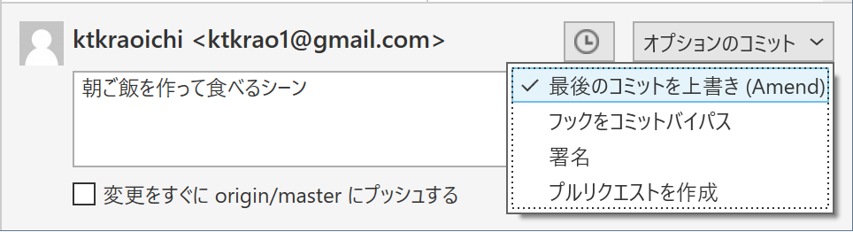

# 文章に関わる全ての人のための Git & GitHub 入門 1-3「コミットを理解して活用する」

皆さん、今日もローカルにコミットしてますか？（言いたかっただけ）

この連載は（中略）文章を扱う全ての人を対象にしています。\
なんとなくで Git を覚えてしまっている人にもたぶん役立ちます。

- シリーズ記事一覧
  - [1-1「Git と GitHub を使うメリット」](https://qiita.com/ktkraoichi/items/6b31644e4832882310d8)
  - [1-2「コミットを積み上げる」](https://qiita.com/ktkraoichi/items/1c60e7eba1ec9c570518)
  - 1-3「コミットを理解して活用する」

## 1. 今回のゴール

1. コミットってなに？
2. コミットを書き換えたことにする
3. 過去のコミットからファイルを取り出す
4. 便利な比較差分ツールの紹介

今回はちょっとしたお勉強と、使えるようになると捗る Tips の紹介です。\
Tips はけっこうな頻度で使うので、実際に手を動かして覚えてくださいね。

## 2. コミットってなに？

今後、高度な Git 操作を行ううえでは、 Git の仕組みを理解しておくことが何より重要です。\
Git の仕組みを理解していないと

- 消すべきでないコミットを消してしまったり[^1]
[^1]: 厳密には消えません。 GC されてなければ `git reflog` で救出可。
- 本当は存在するのに、コミットが存在しないと言って騒いだり
- もっと適切な操作があるのに面倒でミスしやすい操作をしたり

します。

察しの良い方はお気づきですね。筆者の僕は全部やりました。

fixme: ここ無くてもいい？\
ある程度テックに馴染みのある人は、ぶっちゃけ[この記事](https://qiita.com/acple@github/items/6e426281ecaaccf36cf0)をざっと読むのが一番早いと思います。

では本題。\
コミットとは、コミットを作ったときのフォルダの状態を記録した、**ひとかたまりのデータ**のことです。

そこ、諦めないように。まだ早い。\
ちゃんと噛み砕いて説明します。

この連載ではコミットをしばしば「セーブデータ」と言いかえています。\
セーブデータには、だいたい以下のような情報が含まれていますよね。

- ゲームの進行度
- キャラクターのパラメータ
- 持っているアイテムの数
- プレイ時間

ゲームのタイトルによって異なりますが、だいたいこんなところでしょう。

これを Git に置きかえます。\
コミットには、以下の情報が含まれています。

- コミットした人（コミッター）の情報
- コミットが作られた時間
- **Git の管理下にあるフォルダとファイルの構造**
- **内容が変わったフォルダやファイルそのもの**

下の二つが重要です。\
これらに加えて、コミットには以下2つの情報が含まれています。

- **自分のID** [^2]
[^2]: 厳密にはハッシュ値ですが ID と呼ぶことにします。
- **親のID**

例外的に、最初のコミット（Initial commit）だけは親のIDを持ちません。

fixme: 概念図を図示します\
fixme: ハッシュについて触れるかどうかは記事のボリュームを見て判断します

fixme: もう少し解説します

## 3. コミットを書き換えたことにする

それでは Tips を紹介していきましょう。\
まずは「コミットを書き換えたことにする」です。

コミットした後に\
「あ、誤字みつけた」\
「いや、やっぱりこっちの表現のほうがいいな」\
「げ、コミットメッセージを書き間違えた」
ということは、しょっちゅうあります。

fixme: 実際に微修正をかけた画面を出します

新しいコミットを作るほどでもないけれど、修正はしたい、というときに使えるのが「`amend`」というオプション操作です。

Sourcetree で操作している人は「コミット」ボタンをクリックして、いつものコミットメッセージを入力する画面に移りましょう。\
コミットメッセージを入力する画面の右端に、こんなプルダウンメニューがあります。


「最後のコミットを上書き(Amend)」とありますね。\
これを選択すると、次のようなメッセージウィンドウが出てきます。


「はい」を選ぶと、いまある最新のコミットのコミットメッセージが入力しなおされます。



右側のプルダウンメニューを確認しましょう。「最後のコミットを上書き(Amend)」にチェックが入っていることを確認したら、コミットボタンをクリックします。\
普通にコミットすると新しいコミットが作成されますが、「Amend」のオプションにチェックを入れることで、既存のコミットを書き換えたことにできます。

CLI 操作の人は `git commit` に `--amend` というオプションを付けることで、同じ操作ができます。

まずは `git log --oneline` で先頭のコミットがどうなっているか見てみましょう。

```bash

fixme: git log --oneline の結果を書く

```

```bash
Ktkr@KtkrPC MINGW64 ~/Documents/FaultofTheDrakeEquation (master)
$ git status
On branch master
Your branch is ahead of 'origin/master' by 9 commits.
  (use "git push" to publish your local commits)

Changes not staged for commit:
  (use "git add <file>..." to update what will be committed)
  (use "git restore <file>..." to discard changes in working directory)
        modified:   StoryText.txt

no changes added to commit (use "git add" and/or "git commit -a")

Ktkr@KtkrPC MINGW64 ~/Documents/FaultofTheDrakeEquation (master)
$ git add .

Ktkr@KtkrPC MINGW64 ~/Documents/FaultofTheDrakeEquation (master)
$ git commit --amend
```

ファイルが変更されていることを確認したら `add` します。\
普段なら `git commit` とするところを `git commit --amend` とします。

通常のコミットと同様に、 Git に設定したテキストエディタが起動します。\
通常のコミットと違い、書き換える対象のコミットに含まれていたコミットメッセージがすでに入力されています。\
必要であればコミットメッセージを書き直しましょう。\
エディタを閉じれば、コミットを書き換えたことにできます。

fixme: `git log` を確認してハッシュ値が変わっていることを確認してもらう

### 3.1. 「書き換えたことにできる」ってなにさ

Sourcetree では「コミットを上書き(Amend)」とありますし、世の中の記事もたいていは `--amend` オプションを「コミットを書き換える」と解説しています。

実際には、最終的に「書き換えたことに相当する結果が得られる」のであって、 Git が行っていることは「コミットの書き換え」ではありません。

Git において、一度作成したコミットは不変のものです。**コミットそのものは書き換えられません**。[^3]
[^3]: ハッシュ値が変わる以上「書き換える」ことにはならないという話。

`git commit` は\
「先頭のコミットを親とする、新しいコミットを作る」\
というコマンドです。\
（いまは master しかブランチがなく、HEADも動かしていないのでこの認識で OK です）

`--amend` オプションを付けることで\
「先頭のコミットと**同じ親**を持つ、新しいコミットを作る」\
というコマンドに変化します。

fixme: 図示します

Git は `--amend` で新しく作成したコミットを、最新のコミットと認識します。\
元々あった古いコミットは Git の認識（参照）から外れるため、存在しないことになります。\
古いコミットが Git から認識されなくなり、新しいコミットが認識されるようになるため、人間から見れば「コミットを書き換えた」ことに相当します。

Q. じゃあ古いコミットはどこへいくの？\
A. ガベージコレクションという機能でお掃除されるまで、どこかを漂う。

どこかを漂っているコミットを拾い上げることもできますが、今回は扱いません。\
`--amend` オプションを利用した修正は「誤字脱字等のごく軽微な修正」にとどめましょう。

## 4. 過去のコミットからファイルを取り出す

fixme: restore について解説します

## 5. 便利な差分比較ツールの紹介

あちこちからご指摘を頂いていますが、文章を扱うという観点からすると、確かに Git の差分比較機能は見づらいです。\
Sourcetree の差分比較機能も Git と大差ありません。\
GitHub の差分比較機能はもう少しマシですが、日本語に対しては弱めです。

Q. じゃあどうする？
A. 便利な差分比較ツールを使えばいい

執筆はお好みのエディタで。
バージョン管理は Git で。\
共有と議論は GitHub で。
厳密な差分比較は差分比較ツールで。

一度設定してしまえばいいので、新しい操作を覚える必要はありません。

### 5.1. WinMerge

環境が Windows なら、おそらく [WinMerge](https://winmerge.org/?lang=ja) が現時点で最強のツールでしょう（異議は認めるのでコメント欄へどうぞ）。

fixme: WinMerge の使用感について、スクショを貼るなりして解説

Sourcetree では「外部 Diff ツール」を設定してあげることで、 WinMerge を利用した差分比較ができます。

fixme: WinMerge のインスコは省略\
fixme: WinMerge の指定方法を書く\
fixme: 実際にDiffを見る方法を書く（`Ctrl + D` でも起動できる）

CLI では Git の設定を変更することで、 WinMerge を利用した差分比較ができます。

fixme: WinMerge の設定方法を書く

### 5.2. Mac OS X 向けに何か

fixme: 何か

### 5.3. GitLens いっちゃう？

fixme: VSCode を使っているならワンチャン
