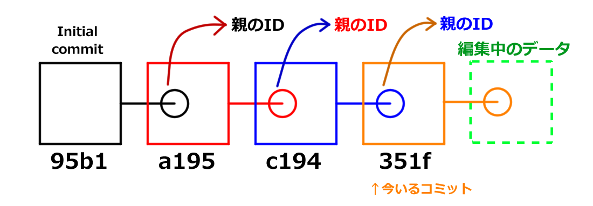
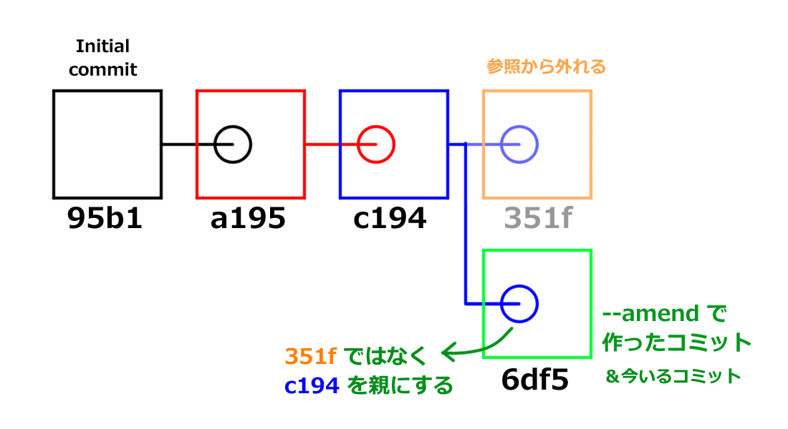

# 文章に関わる全ての人のための Git & GitHub 入門 1-3「コミットを理解して活用する」

皆さん、今日もローカルにコミットしてますか？（言いたかっただけ）

この連載は（中略）文章を扱う全ての人を対象にしています。\
なんとなくで Git を覚えてしまっている人にもたぶん役立ちます。

- シリーズ記事一覧
  - [1-1「Git と GitHub を使うメリット」](https://qiita.com/ktkraoichi/items/6b31644e4832882310d8)
  - [1-2「コミットを積み上げる」](https://qiita.com/ktkraoichi/items/1c60e7eba1ec9c570518)
  - 1-3「コミットを理解して活用する」

## 1. 今回のゴール

1. コミットってなに？
2. コミットを書き換えたことにする
3. 過去のコミットからファイルを取り出す
4. 編集中の内容やステージを取り消す
5. 便利な比較差分ツールの紹介

今回はちょっとしたお勉強と、使えるようになると捗る Tips の紹介です。\
Tips はけっこうな頻度で使うので、実際に手を動かして覚えてくださいね。

## 2. コミットってなに？

今後、高度な Git 操作を行ううえでは、 Git の仕組みを理解しておくことが何より重要です。\
Git の仕組みを理解していないと

- 消すべきでないコミットを消してしまったり[^1]
[^1]: 厳密には消えません。 GC されてなければ `git reflog` で救出可。
- 本当は存在するのに、コミットが存在しないと言って騒いだり
- もっと適切な操作があるのに面倒でミスしやすい操作をしたり

します。

察しの良い方はお気づきですね。筆者の僕は全部やりました。

では本題。\
コミットとは、コミットを作ったときのフォルダの状態を記録した、**ひとかたまりのデータ**のことです。

そこ、諦めないように。まだ早い。\
ちゃんと噛み砕いて説明します。

この連載ではコミットをしばしば「セーブデータ」と言いかえています。\
セーブデータには、だいたい以下のような情報が含まれていますよね。

- ゲームの進行度
- キャラクターのパラメータ
- 持っているアイテムの数
- プレイ時間

ゲームのタイトルによって異なりますが、だいたいこんなところでしょう。

これを Git に置きかえます。\
コミットには、以下の情報が含まれています。

- コミット内容の権利者（Author）
- コミットが最初に作られた時間
- **フォルダとファイルの構造**
- **フォルダやファイルそのもの**

今回は下の二つが重要です。\
これらに加えて、コミットには以下2つの情報が含まれています。

- **自分の ID** [^2]
[^2]: 厳密にはハッシュ値ですが ID と呼ぶことにします。
- **親の ID**

例外的に、最初のコミット（Initial commit）だけは親の ID を持ちません。



上図はコミットログ、 Sourcetree でいえば樹形図に相当するもの、 CLI でいえば `git log` に相当するものを横向きに表したものです。\
左が古いもので、右に行くほど新しくなります。

それぞれのブロックは、ひとつのコミットです。\
ブロックを作成したときのファイルとフォルダの情報が全て入っています（重要）。\
また、それぞれのコミットは自分の ID と親の ID を持っています（重要）。

例えば、赤いブロックは a195 という ID を持っており、親の 95b1 という ID も持っています。\
上図において、最も新しいコミットはオレンジの 351f です。\
親をたどっていくと、やがて最初のコミットである 95b1 に行き着きます。

Git においては、今いるコミットさえわかれば、過去のコミットを芋づる式にたどることができます。\
**過去のコミットは芋づる式にたどることができるので、 Git は今いるコミットしか見ていません。**\
※master ブランチしか扱っていないのでこういう表現にしています

重要なので覚えておいてくださいね。

## 3. コミットを書き換えたことにする

それでは Tips を紹介していきましょう。\
まずは「コミットを書き換えたことにする」です。

コミットした後に\
「あ、誤字みつけた」\
「いや、やっぱりこっちの表現のほうがいいな」\
「げ、コミットメッセージを書き間違えた」\
ということは、しょっちゅうあります。


> 船外活動の疲れ**からから**寝こけていたところを、～～

という、よくあるミスを修正したところです。\
こういった「新しいコミットを作るほどでもないけれど、修正はしたい」というときに使えるのが「`--amend`」というオプション操作です。

Sourcetree で操作している人は「コミット」ボタンをクリックして、いつものコミットメッセージを入力する画面に移りましょう。\
コミットメッセージを入力する画面の右端に、こんなプルダウンメニューがあります。


「最後のコミットを上書き(Amend)」とありますね。\
これを選択すると、次のようなメッセージウィンドウが出てきます。


「はい」を選ぶと、いまある最新のコミットのコミットメッセージが入力しなおされます。


右側のプルダウンメニューを確認しましょう。「最後のコミットを上書き(Amend)」にチェックが入っていることを確認したら、コミットボタンをクリックします。\
普通にコミットすると新しいコミットが作成されますが、「Amend」のオプションにチェックを入れることで、既存のコミットを書き換えたことにできます。

CLI 操作の人は `git commit` に `--amend` というオプションを付けることで、同じ操作ができます。

まずは `git log --oneline` で、先頭のコミットがどうなっているか見てみましょう。\
特に先頭のコミットに付いている ID を覚えておいてください。

```bash
Ktkr@KtkrPC MINGW64 ~/Documents/FaultofTheDrakeEquation (master)
$ git log --oneline
f93a844 (HEAD -> master, origin/master, origin/HEAD) 朝ご飯を作って食べるシーン
a6f7fda リチャードがディアァを口説くシーン
d602f63 出会い -> 移動
4f493c1 師弟ズの出会いを書いた
b57992b 全部書き直し。一人称で書くことにした。
92196f4 序盤の表現をちまちま修正
47f42c2 会話と描写を追記。今後の展開をメモした。
d234cf7 有機ポリシランを生成することにした。他、動作や描写を追加。
cae2f6f 書き出し。ファーストコンタクト。
42c4396 Initial commit
```

先頭のコミットに付いている ID は f93a844 ですね。

次に `git status` で、現在の作業状態を確認しましょう。

```bash
Ktkr@KtkrPC MINGW64 ~/Documents/FaultofTheDrakeEquation (master)
$ git status
On branch master
Your branch is up to date with 'origin/master'.

Changes to be committed:
  (use "git restore --staged <file>..." to unstage)
        modified:   StoryText.txt
```

ファイルが変更されていることを確認したら `add` します。\

```bash
Ktkr@KtkrPC MINGW64 ~/Documents/FaultofTheDrakeEquation (master)
$ git add .
```

普段なら `git commit` とするところを `git commit --amend` とします。

```bash
Ktkr@KtkrPC MINGW64 ~/Documents/FaultofTheDrakeEquation (master)
$ git commit --amend
```

通常のコミットと同様に、 Git に設定したテキストエディタが起動します。\
通常のコミットと違い、書き換える対象のコミットに含まれていたコミットメッセージがすでに入力されています。\
必要であればコミットメッセージを書き直しましょう。\
エディタを閉じれば、コミットを書き換えたことにできます。

最後に、コミットログを確認してみましょう。\
Sourcetree で操作している人は History で樹形図を確認してください。\
CLI で操作している人はもう一度 `git log --oneline` を打ちましょう。

```bash
Ktkr@KtkrPC MINGW64 ~/Documents/FaultofTheDrakeEquation (master)
$ git log --oneline
4dbab1f (HEAD -> master) 朝ご飯を作って食べるシーン
a6f7fda リチャードがディアァを口説くシーン
d602f63 出会い -> 移動
4f493c1 師弟ズの出会いを書いた
b57992b 全部書き直し。一人称で書くことにした。
92196f4 序盤の表現をちまちま修正
47f42c2 会話と描写を追記。今後の展開をメモした。
d234cf7 有機ポリシランを生成することにした。他、動作や描写を追加。
cae2f6f 書き出し。ファーストコンタクト。
42c4396 Initial commit
```

先頭にあるコミットの ID が変わっていることを確認できましたか？\
`--amend` で変更した内容はちゃんと反映されていますか？

確認できたなら、素晴らしい。

### 3.1. 「書き換えたことにできる」ってなにさ

Sourcetree では「コミットを上書き(Amend)」とありますし、世の中の記事もたいていは `--amend` オプションを「コミットを書き換える」と解説しています。

実際には、最終的に「書き換えたことに相当する結果が得られる」のであって、 Git が行っていることは「コミットの書き換え」ではありません。

Git において、一度作成したコミットは不変のものです。**コミットそのものは書き換えられません**。実際にやっているのは**コミットの置き換え**です。

`git commit` は\
「今いるコミットを親として、新しいコミットを作る」\
というコマンドです。

つまり、以下の状態から


以下の状態を作ります。


`--amend` オプションを付けることで\
「今いるコミットと**同じ親**を持つ、新しいコミットを作る」\
というコマンドに変化します。

つまり、以下の状態から


以下の状態を作ります。



普通のコミットと `--amend` で作ったコミットを見比べてみましょう。


`--amend` が「今いるコミットの置き換え」であることがわかるでしょうか？

Git は `--amend` で新しく作成したコミットを、今いるコミットである、と認識します。

さて、 **Git は今いるコミットしか見ていない** という話を覚えていますか？\
過去のコミットは芋づる式にたどることができるので、 Git は今いるコミットしか見ていません。

つまり、 `-- amend` オプションで今いるコミットを置き換えると、元々あったコミットは原理的にたどることができなくなります。\
図を見返してみましょう。


緑色のブロック（コミット）は、青色のブロック（コミット）の ID を持っています。\
では、オレンジ色のブロックは？　どこからもたどることができません。\
どこからもたどれないため、存在しないことになります。\
人間から見れば「コミットを書き換えた」ことに相当します。

Q. じゃあ古いコミットはどこへいくの？\
A. [ガベージコレクション](#72-git-のガベージコレクション)という機能でお掃除されるまで、どこかを漂う。

どこかを漂っているコミットを拾い上げることもできますが、今回は扱いません。

`--amend` オプションを利用した修正は、いわば「セーブデータの上書き」です。\
あまりに `--amend` で書き換えまくると、変更履歴が残る、という Git の利便性が失われてしまいます。\
誤字脱字等のごく軽微な修正や、コミットメッセージの修正くらいにとどめましょう。

## 4. 過去のコミットを復元する

過去の原稿ファイルを掘り出したくなるとき、ありますよね。\
ごっそり削った文章を再利用したり、あるいはファイルごと消し去ったものを読み返したくなったり。

そんなときでも大丈夫。\
Git でコミットを積んでおけば、過去のコミットを復元できます。\
つまり好きなセーブデータの状態に戻せる、ということです。

なお、 Soucetree と CLI では、操作の名前が違います。\
というのも、記事執筆時点での Sourcetree (Ver. 3.3.6) が、どうやら Git の最新バージョンで追加された機能に対応できていないみたいなのです。[^3]
[^3]:具体的には 2.23.0 から使えるようになった `git restore` と `git switch` に対応できていないようです。

では、CLI 操作の人は次まで飛んでください。\
[4.2. CLI で過去のコミットを復元する](#42-cli-で過去のコミットを復元する)

### 4.1 Sourcetree で過去のコミットを復元する

Sourcetree で操作している人は、復元したいコミットに対して「チェックアウト」すると、そのコミットの内容を Git 管理下のフォルダに書き出すことができます。

まずは Sourcetree の樹形図にて「コミットされていない変更があります」というメッセージが**無い**ことを確認してください。\
コミットしていない変更があると、 Sourcetree ではチェックアウトできません。エラーになります。\
もし上記のメッセージがあったら、とりあえずローカルにコミットしてください。さっき覚えた `Amend` を使って、後からちゃんとしたコミットに置き換えればいいのです。

次に、復元したいコミットを選択して右クリックします。


「チェックアウト」を選びます。デフォルト設定なら、コミットをダブルクリックすることでもチェックアウトが働きます。


警告が表示されます。\
いまのところは気にしなくて大丈夫です。\
そのうち解説する「ブランチ」の操作をするようになると、注意する必要があります。\
「OK」ボタンを押して、チェックアウトしましょう。


目的のコミットに HEAD というラベルが付いていれば、チェックアウトは完了です。\
Git 管理下のフォルダに、コミットの内容が書き出されています。\
樹形図の右上にある「Explorer」ボタンからローカルリポジトリを開いて、実際に過去のコミット（セーブデータ）になっていることを確認してみましょう。

確認できましたか？

確認できたら、最新のコミットにチェックアウトし直してください。\
必要であれば、古いセーブデータの中に含まれていたファイルを別のフォルダへ退避させておいてください。\
最新のコミットへチェックアウトし直すと、残しておきたいファイルがあったとしてもチェックアウトしたコミットの状態に戻ってしまうからです。

**ブランチ**の操作を行うことで、古いセーブデータの内容を反映した新しいコミットを作ることもできますが、今回は扱いません。\
最新の状態にチェックアウトしたあと、退避させておいた古いファイルの内容を反映してコミットを作るといいでしょう。[^4]
[^4]: `git restore` 使えって話なんですが、 Sourcetree に `git restore` に相当する操作が見当たりません。教えてください偉い人。

それでは、 [5. 編集中の内容やステージを取り消す](#5-編集中の内容やステージを取り消す)まで飛んでください。

### 4.2. CLI で過去のコミットを復元する

CLI 操作で操作する場合、チェックアウト（`git checkout`）は使いません。\
`git checkout` というコマンドが持っていた機能は、2019年8月16日から `git switch` と `git restore` に分割されました。[^5]
[^5]:実際のところ初学者が `checkout` という字面からあれらの機能を想像するのは難しい…

`git checkout` を使うこともできますが、せっかくなので `git switch` と `git restore` を覚えましょう。\
ここで覚えるのは `git switch` です。

CLI で過去のコミットを復元するときは `git switch -d <コミット ID>` というコマンドを使います。\
これは「現在の作業領域に対して、指定したコミットの内容を書き出す」というものです。

まずは、いまの作業領域において変更されたファイルが**無い**ことを確認してください。

覚えていますか？ `git status` ですよ。

```bash
Ktkr@KtkrPC MINGW64 ~/Documents/FaultofTheDrakeEquation (master)
$ git status
On branch master
Your branch is up to date with 'origin/master'.

Changes not staged for commit:
  (use "git add <file>..." to update what will be committed)
  (use "git restore <file>..." to discard changes in working directory)
        modified:   StoryText.txt

no changes added to commit (use "git add" and/or "git commit -a")
```

もし上記のようなメッセージがあったら、とりあえずローカルにコミットしてください。さっき覚えた `git commit --amend` を使って、後からちゃんとしたコミットに置き換えればいいのです。

コミットしていない変更がある状態で `git switch -d <コミット ID>` と叩くと、以下のようなエラーが表示されます。

```bash
Ktkr@KtkrPC MINGW64 ~/Documents/FaultofTheDrakeEquation (master)
$ git switch -d 9219
error: Your local changes to the following files would be overwritten by checkout:
        StoryText.txt
Please commit your changes or stash them before you switch branches.
Aborting
```

ちゃんとコミットしましょう。

変更内容をちゃんとコミットしたら、次にどのコミットを復元するのか確認しましょう。

```bash
Ktkr@KtkrPC MINGW64 ~/Documents/FaultofTheDrakeEquation (master)
$ git log --oneline
4dbab1f (HEAD -> master) 朝ご飯を作って食べるシーン
a6f7fda リチャードがディアァを口説くシーン
d602f63 出会い -> 移動
4f493c1 師弟ズの出会いを書いた
b57992b 全部書き直し。一人称で書くことにした。
92196f4 序盤の表現をちまちま修正
47f42c2 会話と描写を追記。今後の展開をメモした。
d234cf7 有機ポリシランを生成することにした。他、動作や描写を追加。
cae2f6f 書き出し。ファーストコンタクト。
42c4396 Initial commit
```

ここでは「全部書き直し。一人称で書くことにした」というコミットの直前、 92196f4 のコミットを復元してみましょう。

```bash
Ktkr@KtkrPC MINGW64 ~/Documents/FaultofTheDrakeEquation (master)
$ git status
On branch master
Your branch is up to date with 'origin/master'.

nothing to commit, working tree clean
```

nothing to commit, working tree clean\
なら復元できます。 `git switch -d <コミット ID>` を叩いてみましょう。

```bash
Ktkr@KtkrPC MINGW64 ~/Documents/FaultofTheDrakeEquation (master)
$ git switch -d 9219
HEAD is now at 92196f4 序盤の表現をちまちま修正
```

`HEAD is now at <コミット ID> コミットメッセージ` という表示が出ます。\
これは「Git が今見ているコミットは <コミット ID> ですよ」という意味です。

実際にどうなっているのか `git log --oneline` で確認してみましょう。

```bash
Ktkr@KtkrPC MINGW64 ~/Documents/FaultofTheDrakeEquation ((92196f4...))
$ git log --oneline
92196f4 (HEAD) 序盤の表現をちまちま修正
47f42c2 会話と描写を追記。今後の展開をメモした。
d234cf7 有機ポリシランを生成することにした。他、動作や描写を追加。
cae2f6f 書き出し。ファーストコンタクト。
42c4396 Initial commit
```

…おや？　92196f4 より新しいコミットが見えませんね。\
ご安心を。見えないだけでコミットが消えたわけではありません。

`git log --oneline --all` と打ってみましょう。

```bash
Ktkr@KtkrPC MINGW64 ~/Documents/FaultofTheDrakeEquation ((92196f4...))
$ git log --oneline --all
cdf0aa5 (origin/master, origin/HEAD, master) 朝ご飯を作って食べるシーン
a6f7fda リチャードがディアァを口説くシーン
d602f63 出会い -> 移動
4f493c1 師弟ズの出会いを書いた
b57992b 全部書き直し。一人称で書くことにした。
92196f4 (HEAD) 序盤の表現をちまちま修正
47f42c2 会話と描写を追記。今後の展開をメモした。
d234cf7 有機ポリシランを生成することにした。他、動作や描写を追加。
cae2f6f 書き出し。ファーストコンタクト。
42c4396 Initial commit
```

ちゃんと最新のコミットを含めて表示することができます。\
今見ているコミットは (HEAD) が付いているコミットです。

`git log` は「今見ているコミットからたどれるコミットを表示する」というコマンドです。\
`--all` というオプションを付けることで、 Git がたどれる全てのコミットを表示できます。

普段、 HEAD は最新のコミットにくっついています[^6]。
[^6]:厳密には今いるブランチの最新コミットですが、現在は master ブランチしか使っていないのでこういう表現にしています

`git switch -d` で「Git が今見ているコミット」を変更すると、 HEAD が指定したコミットに移動します。

それでは実際に、過去のコミット（セーブデータ）になっていることを確認してみましょう。\
ファイルエクスプローラからファイルを開いてもいいでしょう。\
せっかく CLI で操作しているのですから、\
`$ エディタ ファイルパス`\
と指定してファイルを開いてもいいでしょう。

確認できましたか？

「別のコミットを指定してたわ」というときは、頑張って探しましょう。\
目的のファイルを探す時はコミットメッセージが役に立ちます。意味のあるコミットメッセージを書きましょうね。

それらしいコミットの内容を簡易的に表示するなら `git show <コミット ID>` を叩くといいでしょう。

古いコミットの内容を確認できたら、最新のコミットに戻しましょう。

最新のコミットへ戻すためには `git switch master` と入力します。

```bash
Ktkr@KtkrPC MINGW64 ~/Documents/FaultofTheDrakeEquation ((92196f4...))
$ git switch master
Previous HEAD position was 92196f4 序盤の表現をちまちま修正
Switched to branch 'master'
Your branch is up to date with 'origin/master'.

Ktkr@KtkrPC MINGW64 ~/Documents/FaultofTheDrakeEquation (master)
$
```

「なぜ `コミット ID` ではなく `master` なのか」という点については、まだ**ブランチ**の解説をしていないので詳しく述べることができません。

今のところは

- 過去のコミットは `git switch -d <コミット ID>` で復元できる
- `git switch master` で最新の状態に戻す

とだけ覚えてください。

必要であれば、古いセーブデータの中に含まれていたファイルを別のフォルダへ退避させておいてください。\
最新のコミットへチェックアウトし直すと、残しておきたいファイルがあったとしてもチェックアウトしたコミットの状態に戻ってしまうからです。

**ブランチ**の操作を行うことで、古いセーブデータの内容を反映した新しいコミットを作ることもできますが、今回は扱いません。\
最新の状態にチェックアウトしたあと、退避させておいた古いファイルの内容を反映し、改めてコミットを作るといいでしょう。

## 5. 編集中の内容やステージを取り消す

- ファイルをステージした（`git add` した）後に修正点が見つかった。
- まだコミットしていないけど、執筆内容が気に入らないから破棄したい。

ということは、わりとよくあります。

Sourcetree なら画面をぽちぽちしていけば、上記の内容はわりと難しくありません。

CLI なら `git restore` の使い方を覚えましょう。\
大丈夫、そんなに難しい操作ではありません。\
忘れたらこの記事をまた読みに来てください。

### 5.1. コミットしていない編集内容を取り消す

コミットしていない編集内容を取り消す、ということは\
「Git が今見ているコミットの状態に戻す」\
ということです。

Sourcetree で操作している人は、最新のコミットを指定して「チェックアウト」することで、「Git が今見ているコミットの状態に戻す」ことができます。[^7]
[^7]:`git reset --hard` でも同じ結果が得られますが、 `git restore` に合わせています。

下図のように「コミットされていない変更があります」という状態で、最新のコミットを選択して右クリックします。


チェックアウトをクリックします。\
ダイアログが現れ…


クリーン（全ての変更を破棄）にチェックを入れて、OKボタンを押します。


これで、コミットしていない編集内容を取り消すことができます。

CLI で操作している人は `git restore --worktree <ファイルパス>` で、指定したファイルを「Git が今見ているコミットの状態に戻す」ことができます。\
全てのファイルを戻したいなら、 .git フォルダがある場所で `git restore --worktree .` と叩けば、全てのフォルダとファイルが元通りになります。

サンプルは以下。

```bash
Ktkr@KtkrPC MINGW64 ~/Documents/FaultofTheDrakeEquation (master)
$ git status
On branch master
Your branch is up to date with 'origin/master'.

Changes not staged for commit:
  (use "git add <file>..." to update what will be committed)
  (use "git restore <file>..." to discard changes in working directory)
        modified:   StoryText.txt

no changes added to commit (use "git add" and/or "git commit -a")

Ktkr@KtkrPC MINGW64 ~/Documents/FaultofTheDrakeEquation (master)
$ git diff
diff --git a/StoryText.txt b/StoryText.txt
index 8e2cc57..d8399b5 100644
--- a/StoryText.txt
+++ b/StoryText.txt
@@ -1,3 +1,5 @@
+ほげ
+
 　船外活動の疲れから寝こけていたところを、大音量かつ不快な音の警報で叩き起こされました。驚いた手足がむやみに暴れてベッドから転がり落ちました。警報というのは当事者の頬をひっぱたくためのものですから、よく仕事をしたと褒めてあげたいところです。もちろん皮肉です。
 　開けた視界には全体が照明となっている天井。普段は暖色系の色合いに設定しているのですが、現在はわーにんわーにんと叫ぶ警報に同期して、真っ赤に明滅しています。
 　飛び起きざま、左手を耳に当てて師匠へ呼びかけました。

```

`git diff` で、編集中のファイルと最新のコミットを比較できます。\
サンプルでは単に「ほげ」とだけ追記していることが分かります。\
こんなくだらない追記は捨ててしまいましょう。

```bash
Ktkr@KtkrPC MINGW64 ~/Documents/FaultofTheDrakeEquation (master)
$ git restore --worktree .
```

`--worktree` の直後に `<ファイルパス>` か `.` （ドット）を指定しましょうね。\
でないと以下のように怒られますよ。

```bash
Ktkr@KtkrPC MINGW64 ~/Documents/FaultofTheDrakeEquation (master)
$ git restore --worktree
fatal: you must specify path(s) to restore
```

さて、編集内容が破棄されているかどうか、実際にファイルを開いて目視で確認することもできます。\
ですが、せっかく Git を使っているのなら `git status` でサクッと確認してしまいましょう。

```bash
Ktkr@KtkrPC MINGW64 ~/Documents/FaultofTheDrakeEquation (master)
$ git status
On branch master
Your branch is up to date with 'origin/master'.

nothing to commit, working tree clean
```

nothing to commit, working tree clean\
と表示されていれば、ファイルの編集が破棄され、最新のコミットまで戻ったことは間違いありません。\
スマート。

### 5.2. ステージを取り消す

ファイルを一度ステージ（`git add`）した後、ファイルをさらに編集したとしましょう。\
このとき、ステージしたファイルの内容と、さらに編集したファイルの内容は別のものと見なされます。\
コミットに含まれるのは、あくまで「ステージしたファイルの内容」です。

ステージした後、さらに編集した内容をコミットに含めるなら、明示的にステージを取り消す操作が必要です。

Sourcetree で操作している人は「**Index にステージしたファイル**」の欄を見てください。

「**作業ツリーのファイル**」欄に表示されているファイルを選び、「選択をインデックスから除く」ボタンをクリックすればステージを取り消せます。\
全てのファイルのステージを取り消すなら「全てインデックスから除く」ボタンをクリックすれば一発です。


CLI 操作の人は

`git restore --staged <ファイルやフォルダのパス>`

とすれば、指定したファイルのステージを取り消すことができます。\
フォルダを指定すれば、そのフォルダ以下のステージが全て取り消されます。

全てのファイルのステージを取り消すなら、 .git フォルダがある場所で

`git restore --staged .`

とすれば、全てのファイルのステージを取り消すことができます。\
`.` （ドット）を忘れないでくださいね。

フォルダやファイルのパスを指定してあげないと…

```bash
$ git restore --staged 
fatal: you must specify path(s) to restore
```

「パスを指定しなさい」\
と怒られます。

ステージ（`git add`）するべき編集内容があるなら、ステージを取り消した後に改めて（`git add`）しましょう。

## 5. 便利な差分比較ツールの紹介

あちこちからご指摘を頂いていますが、文章を扱うという観点からすると、確かに Git の差分比較機能は見づらいです。\
Sourcetree の差分比較機能も Git と大差ありません。\
GitHub の差分比較機能はもう少しマシですが、日本語に対しては弱めです。

Q. じゃあどうする？
A. 便利な差分比較ツールを使えばいい

執筆はお好みのエディタで。
バージョン管理は Git で。\
共有と議論は GitHub で。
厳密な差分比較は差分比較ツールで。

一度設定してしまえばいいので、新しい操作を覚える必要はありません。

### 5.1. WinMerge

環境が Windows なら、おそらく [WinMerge](https://winmerge.org/?lang=ja) が現時点で最強のツールでしょう（異議は認めるのでコメント欄へどうぞ）。

fixme: WinMerge の使用感について、スクショを貼るなりして解説

Sourcetree では「外部 Diff ツール」を設定してあげることで、 WinMerge を利用した差分比較ができます。

fixme: WinMerge のインスコは省略\
fixme: WinMerge の指定方法を書く\
fixme: 実際にDiffを見る方法を書く（`Ctrl + D` でも起動できる）

CLI では Git の設定を変更することで、 WinMerge を利用した差分比較ができます。

fixme: WinMerge の設定方法を書く

### 5.2. Mac OS X 向けに何か

fixme: 何か

## 6. 次回予告

fixme: 次回どうしましょうね

## 7. 付録

### 7.1 セーブするたびに全ファイルを保存してたら容量ヤバいのでは

ご安心ください。 Git において、変更されていないファイルはコミットの間で「共有」されます。

例えば256個のコミットがあり、最初のコミットから全く変更されていない README.md ファイルがあったとします。\
この場合、256個のコミットは変更されていない README.md をいちいち保存しなおしたりしません。ひとつの README.md というファイルをコミットの間で「共有」します。

これにより容量を節約できますし、論理的にスマートな運用を実現しています。

もっと詳しく勉強したいかたは以下をどうぞ。

[Git - Gitオブジェクト](https://git-scm.com/book/ja/v2/Git%E3%81%AE%E5%86%85%E5%81%B4-Git%E3%82%AA%E3%83%96%E3%82%B8%E3%82%A7%E3%82%AF%E3%83%88)\
※技術文書なのでハードルは高いです。

### 7.2 Git のガベージコレクション

Git のガベージコレクション（GC）とは、 Git 内部の自動お掃除ロボットです。\
参照されなくなったコミットやファイルを、適当なタイミングで破棄してくれます。

逆に言えば、 `git commit --amend` などで参照されなくなったコミットやファイルも、 GC でお掃除されていなければ救出できます。\
おおむね数ヶ月は GC によるお掃除の対象にならないので、あまりに古いコミットでなければ基本的に救出できます。

うっかり `git reset --hard` しても、 `git reflog` で救出できます。\
とはいえ、うっかり `git reset --hard` しないことのほうが大事ですが。
