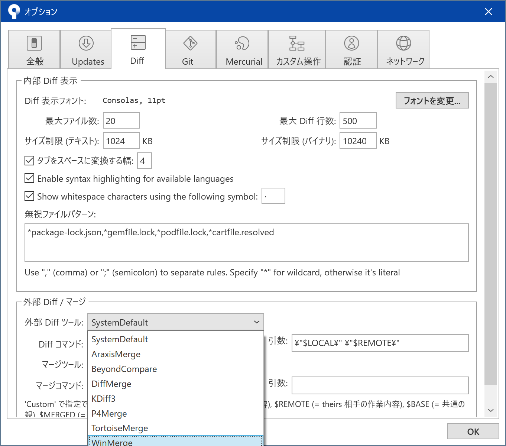
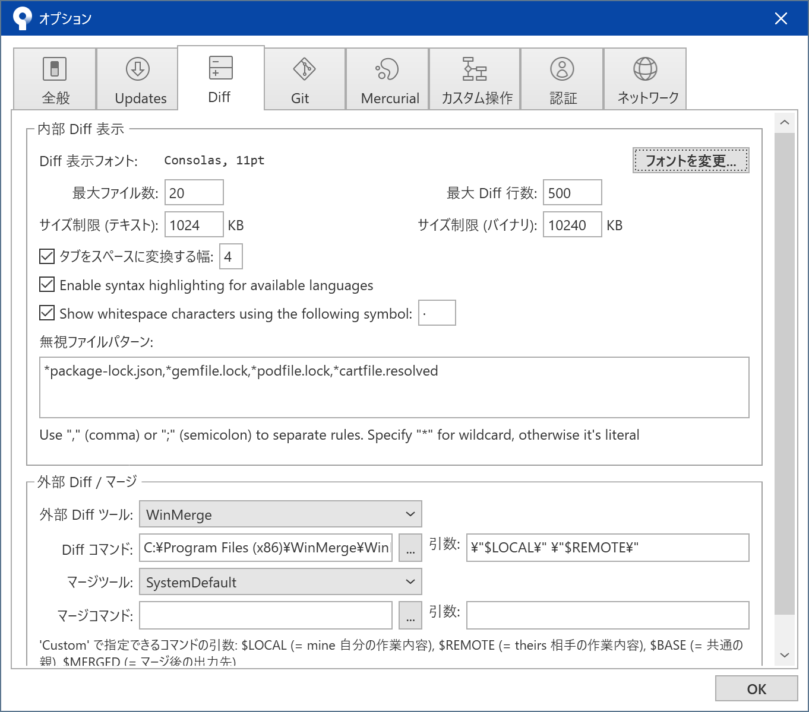
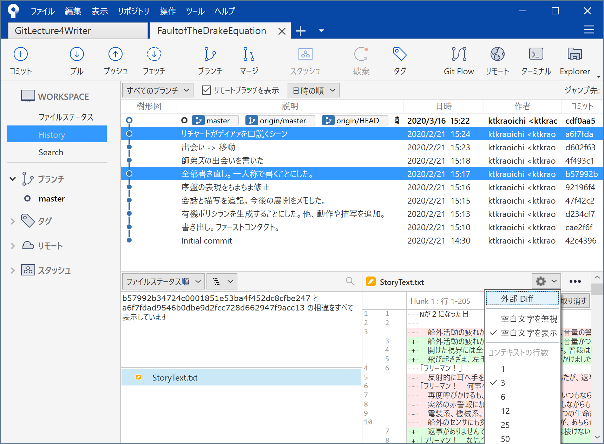
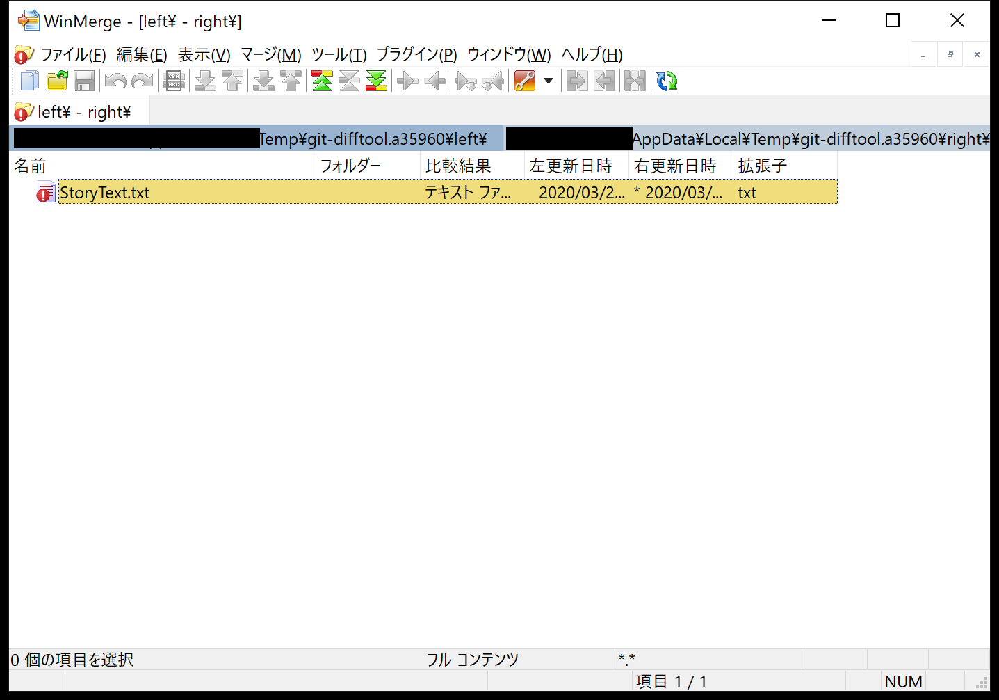
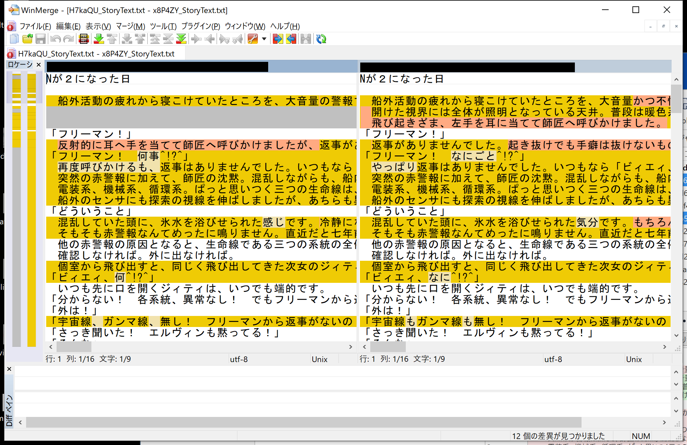
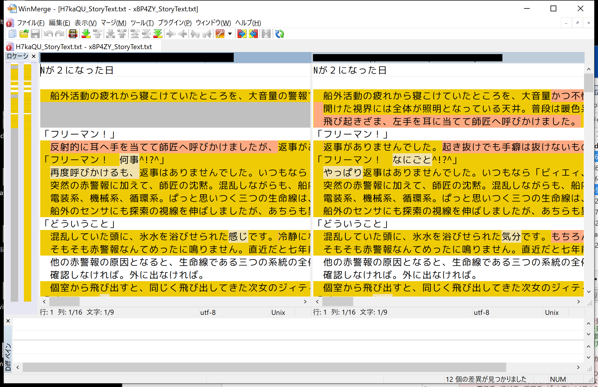
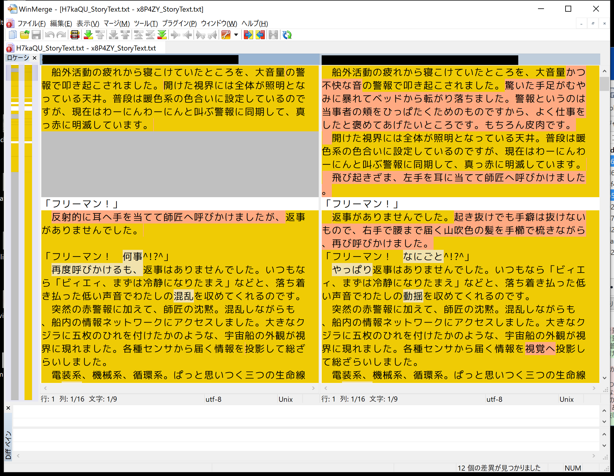

# 文章に関わる全ての人のための Git & GitHub 入門 1-3「コミットを理解して活用する」

皆さん、今日もローカルにコミットしてますか？（言いたかっただけ）

この連載は（中略）文章を扱う全ての人を対象にしています。\
なんとなくで Git を覚えてしまっている人にもたぶん役立ちます。

- シリーズ記事一覧
  - [1-1「Git と GitHub を使うメリット」](https://qiita.com/ktkraoichi/items/6b31644e4832882310d8)
  - [1-2「コミットを積み上げる」](https://qiita.com/ktkraoichi/items/1c60e7eba1ec9c570518)
  - 1-3「コミットを理解して活用する」

## 1. 今回のゴール

1. コミットってなに？
2. コミットを書き換えたことにする
3. 過去のコミットからファイルを取り出す
4. 便利な比較差分ツールの紹介

今回はちょっとしたお勉強と、使えるようになると捗る Tips の紹介です。\
Tips はけっこうな頻度で使うので、実際に手を動かして覚えてくださいね。

## 2. コミットってなに？

今後、高度な Git 操作を行ううえでは、 Git の仕組みを理解しておくことが何より重要です。\
Git の仕組みを理解していないと

- 消すべきでないコミットを消してしまったり[^1]
[^1]: 厳密には消えません。 GC されてなければ `git reflog` で救出可。
- 本当は存在するのに、コミットが存在しないと言って騒いだり
- もっと適切な操作があるのに面倒でミスしやすい操作をしたり

します。

察しの良い方はお気づきですね。筆者の僕は全部やりました。

では本題。\
コミットとは、コミットを作ったときのフォルダの状態を記録した、**ひとかたまりのデータ**のことです。

そこ、諦めないように。まだ早い。\
ちゃんと噛み砕いて説明します。

この連載ではコミットをしばしば「セーブデータ」と言いかえています。\
セーブデータには、だいたい以下のような情報が含まれていますよね。

- ゲームの進行度
- キャラクターのパラメータ
- 持っているアイテムの数
- プレイ時間

ゲームのタイトルによって異なりますが、だいたいこんなところでしょう。

これを Git に置きかえます。\
コミットには、以下の情報が含まれています。

- コミット内容の権利者（Author）
- コミットが最初に作られた時間
- **フォルダとファイルの構造**
- **フォルダやファイルそのもの（の場所）**

今回は下の二つが重要です。\
これらに加えて、コミットには以下2つの情報が含まれています。

- **自分の ID** [^2]
[^2]: 厳密にはハッシュ値ですが ID と呼ぶことにします。
- **親の ID**

例外的に、最初のコミット（Initial commit）だけは親の ID を持ちません。


上図はコミットログ、 Sourcetree でいえば樹形図に相当するもの、 CLI でいえば `git log` に相当するものを横向きに表したものです。\
左が古いもので、右に行くほど新しくなります。

それぞれのブロックは、ひとつのコミットです。\
ブロックを作成したときのファイルとフォルダの情報が全て入っています（重要）。\
また、それぞれのコミットは自分の ID と親の ID を持っています（重要）。

例えば、赤いブロックは a195 という ID を持っており、親の 95b1 という ID も持っています。\
上図において、最も新しいコミットはオレンジの 351f です。\
親をたどっていくと、やがて最初のコミットである 95b1 に行き着きます。

Git においては、今いるコミットさえわかれば、過去のコミットを芋づる式にたどることができます。\
**過去のコミットは芋づる式にたどることができるので、 Git は今いるコミットしか見ていません。**\
※master ブランチしか扱っていないのでこういう表現にしています

重要なので覚えておいてくださいね。

## 3. コミットを書き換えたことにする

それでは Tips を紹介していきましょう。\
まずは「コミットを書き換えたことにする」です。

コミットした後に\
「あ、誤字みつけた」\
「いや、やっぱりこっちの表現のほうがいいな」\
「げ、コミットメッセージを書き間違えた」\
ということは、しょっちゅうあります。


> 船外活動の疲れ**からから**寝こけていたところを、～～

という、よくあるミスを修正したところです。\
こういった「新しいコミットを作るほどでもないけれど、修正はしたい」というときに使えるのが「`--amend`」というオプション操作です。

Sourcetree で操作している人はいつものように変更したファイルを「全てインデックスに追加」しましょう。\
インデックスに追加したら「コミット」ボタンをクリックして、いつものコミットメッセージを入力する画面に移りましょう。\
コミットメッセージを入力する画面の右端に、こんなプルダウンメニューがあります。


「最後のコミットを上書き(Amend)」とありますね。\
これを選択すると、次のようなメッセージウィンドウが出てきます。


「はい」を選ぶと、いまある最新のコミットのコミットメッセージが入力しなおされます。


右側のプルダウンメニューを確認しましょう。「最後のコミットを上書き(Amend)」にチェックが入っていることを確認したら、コミットボタンをクリックします。\
普通にコミットすると新しいコミットが作成されますが、「Amend」のオプションにチェックを入れることで、既存のコミットを書き換えたことにできます。

CLI 操作の人は `git commit` に `--amend` というオプションを付けることで、同じ操作ができます。

まずは `git log --oneline` で、先頭のコミットがどうなっているか見てみましょう。\
特に先頭のコミットに付いている ID を覚えておいてください。

```bash
Ktkr@KtkrPC MINGW64 ~/Documents/FaultofTheDrakeEquation (master)
$ git log --oneline
f93a844 (HEAD -> master, origin/master, origin/HEAD) 朝ご飯を作って食べるシーン
a6f7fda リチャードがディアァを口説くシーン
d602f63 出会い -> 移動
4f493c1 師弟ズの出会いを書いた
b57992b 全部書き直し。一人称で書くことにした。
92196f4 序盤の表現をちまちま修正
47f42c2 会話と描写を追記。今後の展開をメモした。
d234cf7 有機ポリシランを生成することにした。他、動作や描写を追加。
cae2f6f 書き出し。ファーストコンタクト。
42c4396 Initial commit
```

先頭のコミットに付いている ID は f93a844 ですね。

次に `git status` で、現在の作業状態を確認しましょう。

```bash
Ktkr@KtkrPC MINGW64 ~/Documents/FaultofTheDrakeEquation (master)
$ git status
On branch master
Your branch is up to date with 'origin/master'.

Changes to be committed:
  (use "git restore --staged <file>..." to unstage)
        modified:   StoryText.txt
```

ファイルが変更されていることを確認したら `add` します。\

```bash
Ktkr@KtkrPC MINGW64 ~/Documents/FaultofTheDrakeEquation (master)
$ git add .
```

普段なら `git commit` とするところを `git commit --amend` とします。

```bash
Ktkr@KtkrPC MINGW64 ~/Documents/FaultofTheDrakeEquation (master)
$ git commit --amend
```

通常のコミットと同様に、 Git に設定したテキストエディタが起動します。\
通常のコミットと違い、書き換える対象のコミットに含まれていたコミットメッセージがすでに入力されています。\
必要であればコミットメッセージを書き直しましょう。\
エディタを閉じれば、コミットを書き換えたことにできます。

最後に、コミットログを確認してみましょう。\
Sourcetree で操作している人は History で樹形図を確認してください。\
CLI で操作している人はもう一度 `git log --oneline` を打ちましょう。

```bash
Ktkr@KtkrPC MINGW64 ~/Documents/FaultofTheDrakeEquation (master)
$ git log --oneline
4dbab1f (HEAD -> master) 朝ご飯を作って食べるシーン
a6f7fda リチャードがディアァを口説くシーン
d602f63 出会い -> 移動
4f493c1 師弟ズの出会いを書いた
b57992b 全部書き直し。一人称で書くことにした。
92196f4 序盤の表現をちまちま修正
47f42c2 会話と描写を追記。今後の展開をメモした。
d234cf7 有機ポリシランを生成することにした。他、動作や描写を追加。
cae2f6f 書き出し。ファーストコンタクト。
42c4396 Initial commit
```

先頭にあるコミットの ID が変わっていることを確認できましたか？\
確認できたなら、素晴らしい。

### 3.1. 「書き換えたことにできる」ってなにさ

Sourcetree では「コミットを上書き(Amend)」とありますし、世の中の記事もたいていは `--amend` オプションを「コミットを書き換える」と解説しています。

実際には、最終的に「書き換えたことに相当する結果が得られる」のであって、 Git が行っていることは「コミットの書き換え」ではありません。

Git において、一度作成したコミットは不変のものです。**コミットそのものは書き換えられません**。実際にやっているのは**コミットの置き換え**です。

`git commit` は\
「今いるコミットを親として、新しいコミットを作る」\
というコマンドです。

つまり、以下の状態から


以下の状態を作ります。


`--amend` オプションを付けることで\
「今いるコミットと**同じ親**を持つ、新しいコミットを作る」\
というコマンドに変化します。

つまり、以下の状態から


以下の状態を作ります。


普通のコミットと `--amend` で作ったコミットを見比べてみましょう。


`--amend` が「今いるコミットの置き換え」であることがわかるでしょうか？

Git は `--amend` で新しく作成したコミットを、今いるコミットである、と認識します。

さて、 **Git は今いるコミットしか見ていない** という話を覚えていますか？\
過去のコミットは芋づる式にたどることができるので、 Git は今いるコミットしか見ていません。

つまり、 `--amend` オプションで今いるコミットを置き換えると、元々あったコミットは原理的にたどることができなくなります。\
図を見返してみましょう。


緑色のブロック（コミット）は、青色のブロック（コミット）の ID を持っています。\
では、オレンジ色のブロックは？　どこからもたどることができません。\
どこからもたどれないため、存在しないことになります。\
人間から見れば「コミットを書き換えた」ことに相当します。

Q. じゃあ古いコミットはどこへいくの？\
A. [ガベージコレクション](#72-git-のガベージコレクション)という機能でお掃除されるまで、どこかを漂う。

どこかを漂っているコミットを拾い上げることもできますが、今回は扱いません。

`--amend` オプションを利用した修正は、いわば「セーブデータの上書き」です。\
あまりに `--amend` で書き換えまくると、変更履歴が残る、という Git の利便性が失われてしまいます。\
誤字脱字等のごく軽微な修正や、コミットメッセージの修正くらいにとどめましょう。

## 4. 過去のコミットからファイルを取り出す

fixme: restore について解説します

## 5. 便利な差分比較ツールの紹介

あちこちからご指摘を頂いていますが、文章を扱うという観点からすると、確かに Git の差分比較機能は見づらいです。\
Sourcetree の差分比較機能も Git と大差ありません。\
GitHub の差分比較機能はもう少しマシですが、日本語に対しては弱めです。

Q. じゃあどうする？
A. 便利な差分比較ツールを使えばいい

執筆はお好みのエディタで。
バージョン管理は Git で。\
共有と議論は GitHub で。
厳密な差分比較は差分比較ツールで。

一度設定してしまえばいいので、新しい操作を覚える必要はありません。

### 5.1. WinMerge

環境が Windows なら、おそらく [WinMerge](https://winmerge.org/?lang=ja) が現時点で最強のツールでしょう（異議は認めるのでコメント欄へどうぞ）。

#### 5.1.1. Sourcetree の設定

Sourcetree では「外部 Diff ツール」を設定してあげることで、 WinMerge を利用した差分比較ができます。

fixme: WinMerge のインスコは省略\
fixme: WinMerge の指定方法を書く\
fixme: 実際にDiffを見る方法を書く（`Ctrl + D` でも起動できる）

CLI では Git の設定を変更することで、 WinMerge を利用した差分比較ができます。

fixme: WinMerge のインスコ手順は…書かなくてもいいか？

Sourcetree を使っている人は ツールバー -> ツール -> オプション を開いてください。



「Diff」というタブを選択します。\
画面下部に「外部 Diff / マージ」という欄がありますね。\
この「外部 Diff ツール」に、先ほどインストールした WinMerge を指定します。



「Diffコマンド」には `WinMergeU.exe` がある場所をフルパスで指定します。\
引数には `\"$LOCAL\" \"$REMOTE\"` を指定します。

WinMergeをデフォルト設定でインストールしたなら、おそらく「Diffコマンド」と「引数」は自動的に入力してくれます。

Sourcetree の設定は以上です。\
[5.1.3. WinMerge で差分を見てみよう](#513-WinMerge-で差分を見てみよう)まで飛びましょう。

#### 5.1.2 CLI の設定

CLI で操作する場合も、外部 diff ツールを設定してあげれば WinMerge を利用できます。

Git の設定を変更するときは `git config --edit` コマンドを使います。\
今後、新しいリポジトリを作ったときのことも考えて、 `git config --global --edit` と指定しましょう。 `--global` オプションで指定した設定は、各リポジトリで個別に設定を上書きしない限り、デフォルトで適用されます。

`git config --global --edit` を叩くと、 `.gitconfig` というファイルが開かれます。\
こんな感じで、なにやら色々な設定項目が並んでいるのが見えます。

```
[alias]
	diffwm = difftool --tool=WinMerge -y -d
	graph = log --oneline --graph --decorate --all
[core]
	autocrlf = false
	quatepath = false
	editor = VIM
	safecrlf = true
	ignoreCase = false
[user]
	name = ktkraoichi
	email = ktkrao1@gmail.com
[difftool "WinMerge"]
	cmd = 'C:/Program Files (x86)/WinMerge/WinMergeU.exe' -f \"*.*\" -e -u -r \"$LOCAL\" \"$REMOTE\"
```

**下手にいじると Git が正常に動かなくなります。**\
以下の設定内容をファイルの末尾へ追記するだけにしておきましょう。

```vim
[difftool "WinMerge"]
	cmd = 'WinMergeU.exeのフルパス' -f \"*.*\" -e -u -r \"$LOCAL\" \"$REMOTE\"
```

※ 筆者の環境だと `cmd = "C:/Program Files (x86)/WinMerge/WinMergeU.exe" -f \"*.*\" -e -u -r \"$LOCAL\" \"$REMOTE\"` です

※インデントはスペースではなくタブ1つです。手で打ち込むよりコピペした方がいいでしょう。

設定が終わったら、以下のコマンドを叩くことで WinMerge を使えるようになります。

`git difftool --tool=WinMerge <古いコミットID> <新しいコミットID>`

ちょっとした裏技として「いま編集しているファイル」と「最新のコミット」との差分を比較したいときは、コミットIDを書くところに `@~` と書くことができます。

`git difftool --tool=WinMerge @~`

最後に。\
何度も `git difftool --tool=WinMerge <古いコミットID> <新しいコミットID>` と叩くのは、ぶっちゃけ面倒です。\
例えば `git diffwm <古いコミットID> <新しいコミットID>` とできたらいいな、と思いませんか？

**できます**。

「エイリアス（alias）」というショートカットのようなものを設定してあげればいいのです。\
エイリアスを設定するためには `.gitconfig` ファイルを設定します。

`git config --global --edit`

```
[alias]
	diffwm = difftool --tool=WinMerge -d
```

※インデントはスペースではなくタブ1つです。手で打ち込むよりコピペした方がいいでしょう。

と追記しましょう。\
もし既になにかエイリアスが設定されていたら `[alias]` の直下に\
`diffwm = difftool --tool=WinMerge -d`\
を書くだけでOKです。

これは\
「`diffwm`」という文字の塊は「`diffwm = difftool --tool=WinMerge -d`」に置き換えるよ。\
という意味です。

エイリアスは便利ですが、うっかり「Git のデフォルトに設定されているコマンド」を置き換えてしまう可能性もあります。\
エイリアスの設定は慎重に行いましょう。

#### 5.1.3. WinMerge で差分を見てみよう

それでは、実際に WinMerge を利用した差分比較をやってみましょう！\

Sourcetree を利用している人は
まずは差分比較したいファイルを選びます。\
Ctrl キーを押しながら2つのコミットを選ぶと、直前のコミットでなくてもファイルの差分を比較できます。



比較したいファイルを選んで「外部 Diff」をクリックすると、 WinMerge が起動します。

CLI で操作する人は、先ほども述べたように `git difftool --tool=WinMerge <古いコミットID> <新しいコミットID>` でフォルダの差分を比較できます。

実行してみましょう。

```bash
Ktkr@KtkrPC MINGW64 ~/Documents/FaultofTheDrakeEquation (master)
$ git status
On branch master
Your branch is up to date with 'origin/master'.

nothing to commit, working tree clean

Ktkr@KtkrPC MINGW64 ~/Documents/FaultofTheDrakeEquation (master)
$ git log --oneline
cdf0aa5 (HEAD -> master, origin/master, origin/HEAD) 朝ご飯を作って食べるシーン
a6f7fda リチャードがディアァを口説くシーン
d602f63 出会い -> 移動
4f493c1 師弟ズの出会いを書いた
b57992b 全部書き直し。一人称で書くことにした。
92196f4 序盤の表現をちまちま修正
47f42c2 会話と描写を追記。今後の展開をメモした。
d234cf7 有機ポリシランを生成することにした。他、動作や描写を追加。
cae2f6f 書き出し。ファーストコンタクト。
42c4396 Initial commit

Ktkr@KtkrPC MINGW64 ~/Documents/FaultofTheDrakeEquation (master)
$ git difftool --tool=WinMerge b579 a6f7
```

今回は「一人称で書き直すことにした」というターニングポイントだったコミットに含まれるテキストと、しばらく書き進めたあとのコミットに含まれるテキストを比較してみました。

CLI で操作している人は、ここで比較したいファイルを選ぶ画面が出てきます。



Story.txt を選びます。

差分比較の画面が出てきますが…



**見づらい**。

フォントはお好みのものに変えましょう。\
ツールバー -> 表示 -> フォントの選択 でフォントを変えられます。\
参考までに、筆者は「[Rounded-L Mgen+ 1m](http://jikasei.me/font/rounded-mgenplus/)」というフォントを色々な環境で使っています。



**右端で折り返されてない**。

ツールバー -> 表示 -> 行を右端で折り返す で折り返せます。


さて、どうでしょう。



おお、良い感じですね。

左側に表示されているのが古いテキスト、右側に表示されているのが新しいテキストです。

背景が真っ白な部分は「何も変更されていない部分」です。\
オレンジ色でハイライトされた行は「何かの変更がかかった行」です。\
ピンク色でハイライトされた箇所は「文章が挿入された箇所」です。\
薄黄色でハイライトされた箇所は「文章が変更された箇所」です。

これで「差分比較機能が弱いから…」という理由で Git を導入しない理由がなくなりましたね！\
外部ツールを「設定」してあげるだけで、こんなに便利になります。

※コンフリクト時のマージ作業も WinMerge を利用して実行できますが、今回は扱いません。

### 5.2. Mac OS X 向けに何か

fixme: 何か

## 6. 次回予告

fixme: 次回どうしましょうね

## 7. 付録

### 7.1 セーブするたびに全ファイルを保存してたら容量ヤバいのでは

ご安心ください。 Git において、変更されていないファイルはコミットの間で「共有」されます。

例えば256個のコミットがあり、最初のコミットから全く変更されていない README.md ファイルがあったとします。\
この場合、256個のコミットは変更されていない README.md をいちいち保存しなおしたりしません。ひとつの README.md というファイルをコミットの間で「共有」します。

これにより容量を節約できますし、論理的にスマートな運用を実現しています。

もっと詳しく勉強したいかたは以下をどうぞ。

[Git - Gitオブジェクト](https://git-scm.com/book/ja/v2/Git%E3%81%AE%E5%86%85%E5%81%B4-Git%E3%82%AA%E3%83%96%E3%82%B8%E3%82%A7%E3%82%AF%E3%83%88)\
※技術文書なのでハードルは高いです。

### 7.2 Git のガベージコレクション

Git のガベージコレクション（GC）とは、 Git 内部の自動お掃除ロボットです。\
参照されなくなったコミットやファイルを、適当なタイミングで破棄してくれます。

逆に言えば、 `git commit --amend` などで存在しないことになったコミットやファイルも、 GC でお掃除されていなければ救出できます。\
おおむね数ヶ月は GC によるお掃除の対象にならないので、あまりに古いコミットやファイルでなければ何とかなります。
